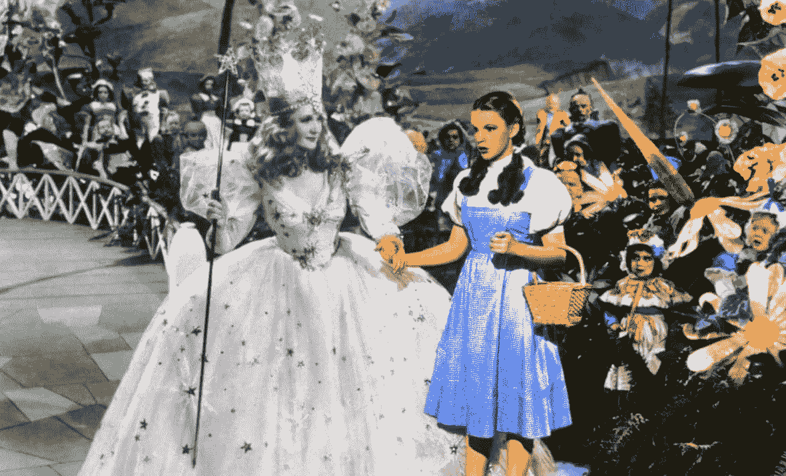

# 你做梦是彩色的吗？

> 原文：<https://medium.com/swlh/do-you-dream-in-color-370333a42c5a>

黑白梦的奇妙历史

Billie Burke as Glenda the Good Witch and Judy Garland as Dorothy in the Wizard of Oz (Image source: Rex/Everett Collection. Image manipulation: author)

问题“你做梦是彩色的吗？”是我们大多数人可能都被问过或者在某个时候考虑过的问题。如果有，你会怎么回答？你记得你的梦看起来像什么吗？它们是彩色的还是黑白的？如果你仔细想想，这个问题及其隐含的假设有点奇怪。换句话说，为什么我们会…