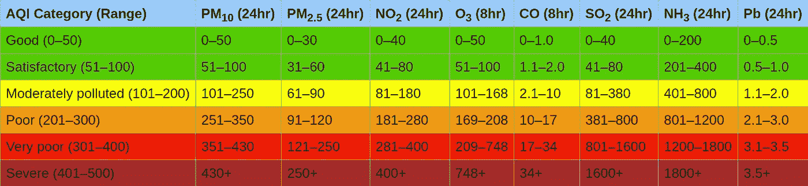

# 你住在二氧化碳穹顶下吗？

> 原文：<https://medium.com/swlh/do-you-live-under-the-co2-dome-458091c8794f>

许多城镇都处于危险地带！

Illustration of a CO2 dome

如上图所示，我们有时会遇到大气中二氧化碳含量大幅增加的情况。这种情况发生在特定的天气条件下，那里几乎没有风，也没有雨。空气流通不畅，因此无法与更清洁的空气进行交换。这些同样的条件也导致了我们所说的烟雾。一些城镇更容易出现这种穹顶。位于山谷中的城镇有更高的空气污染风险，因为它们的位置就像一个可以收集空气污染的碗。山丘挡风的城镇也处于危险之中。

由于二氧化碳是我们大气中最重的成分之一，二氧化碳将留在地球表面附近，形成所谓的二氧化碳穹顶。例如，在巴黎，今天大气中的二氧化碳含量有时已经达到 950 ppm(百万分之一)。这是大气中二氧化碳正常水平的两倍多，目前二氧化碳正常水平略高于 400 ppm。

令人惊讶的是，在我们的星球上，二氧化碳只在很少的地方被测量到，而且很少是实时的。这是由于一些不幸的情况，其中:

1.  二氧化碳被认为是大气的自然组成部分
2.  二氧化碳水平实际上很难精确测量
3.  二氧化碳没有毒性

由于上述原因，世界气象组织(WMO)定义的气象学所需测量标准中不包括 CO2。

试着看一下[“空气质量指数”](https://en.wikipedia.org/wiki/Air_quality_index) (AQI)。

**AQI Category, Pollutants and Health Breakpoints. Source:** [**Wikipedia**](https://en.wikipedia.org/wiki/Air_quality_index)

*注意到什么了吗？*

*二氧化碳不是被测量的成分之一。*

在互联网上搜索，人们很快就会发现，当地的二氧化碳测量值不像 AQI 中的测量值那样广泛可用。

然而，更详细的测量和更广泛公开的可用数据将使我们能够分析二氧化碳水平对我们日常生活的影响。就像美国国家经济研究局的一项研究发现温度对学习和测试结果有影响一样，如果数据可用，科学家可以使用统计方法来分析二氧化碳的影响。

例如，可以回答以下一些问题:

*   疾病和二氧化碳有关联吗？
*   学校的测试结果和二氧化碳有关系吗？
*   经济产出和二氧化碳之间有关联吗？

# 二氧化碳对我们的健康和智力有影响

我们大多数人都经历过呆在通风不良的房间里。一段时间后，你开始感到疲倦，在极端情况下，我们甚至可能会头痛。已经有[项研究表明，二氧化碳水平升高和认知能力下降之间存在联系](https://www.ncbi.nlm.nih.gov/pmc/articles/PMC4892924/)。由于室内的 CO2 水平相对高于室外的 CO2 水平，CO2 穹顶的影响在室内甚至更强。

[我写了另一篇文章，通过比较酒精对身体的影响，总结了二氧化碳水平升高的影响。](/swlh/does-co2-harm-your-body-d20b4a0d03c1?source=friends_link&sk=08bf49f518c08ef8a41c7f55e2f2a7f0)幸运的是，真正严重的影响只有在二氧化碳浓度非常高的情况下才会出现。然而，从我的调查中，我发现我们的知识中存在灰色地带，当孩子在二氧化碳水平增加的环境中长大时，这种情况会对他们产生长期影响。

[Does CO2 harm your body?](/swlh/does-co2-harm-your-body-d20b4a0d03c1?source=friends_link&sk=08bf49f518c08ef8a41c7f55e2f2a7f0)

# 较高的室外二氧化碳水平导致能源使用量增加

除了可以研究的更抽象的问题之外，更高的大气二氧化碳水平还会带来更直接的后果。许多建筑物的通风系统设定的当前极限是 1000 ppm。因此，当室内测量的二氧化碳水平超过 1000 ppm 时，通风系统将开始循环空气。室外空气中的 CO2 水平越高，需要循环的空气就越多，以使室内空气低于 1000 ppm。在外部空气实际上可能达到 1000 ppm 的情况下，通风系统将永远不会停止，即使建筑物中没有人，因此不需要交换空气。

一些增加的二氧化碳水平也只是暂时的。举一个例子，一栋建筑坐落在交通高峰期的一条道路旁边。在高峰时间，二氧化碳水平可能会急剧增加，导致通风系统使用额外的能源。如果同一栋建筑在高峰时间前通风，然后在高峰时间后再通风，室内空气质量总体上会更好，而系统仍然会使用更少的能源。

更多的测量和数据将使连接的通风系统能够优化通风周期的时间安排，从而降低能耗。由于能源是有成本的，这意味着获得二氧化碳数据可以转化为商机。

# 新鲜空气穹顶也存在吗？

二氧化碳穹丘是由特定的天气条件造成的。但是，如果这些天气条件出现在有很多森林和很少人类活动的地区会怎么样呢？这些地区的二氧化碳水平会更低吗？

今天我们不知道，因为我们没有足够的测量点。

我当然想知道是否存在这样的地点。这难道不是下次和家人一起度假的好去处吗？

# 我们开始测量吧！

为了理解并潜在地减轻二氧化碳水平升高最有可能产生的影响，我们必须开始测量这些东西，更精细、更广泛地测量。

今天已经有许多测量空气质量的开源硬件和软件项目。如果这些项目也包括二氧化碳传感器，而不仅仅是一氧化碳、微粒、氮氧化物等，那就太好了。

这类数据中也有商机。我们将能够节省通风系统的能源，旅游业可以利用这一信息使目的地更具吸引力。

# 参考

[大气的构成，科学细节](https://www.engineeringtoolbox.com/air-composition-d_212.html)

[维多利博士和贾沃伊博士，2003 年。巴黎大气 CO2 的碳同位素组成。*地球与行星科学快报***215**:289–298。](https://www.researchgate.net/publication/223364600_The_carbon_isotope_composition_of_atmospheric_CO2_in_Paris)

[空气质量指数 AQI](https://en.wikipedia.org/wiki/Air_quality_index)

[温度影响学习和测试结果](https://scholar.harvard.edu/files/joshuagoodman/files/w24639.pdf)

[CO2 对身体有害吗？](/swlh/does-co2-harm-your-body-d20b4a0d03c1?source=friends_link&sk=08bf49f518c08ef8a41c7f55e2f2a7f0)

[办公室工作人员认知功能评分与二氧化碳、通风和挥发性有机化合物暴露的关系:绿色和传统办公室环境的对照暴露研究](https://www.ncbi.nlm.nih.gov/pmc/articles/PMC4892924/)