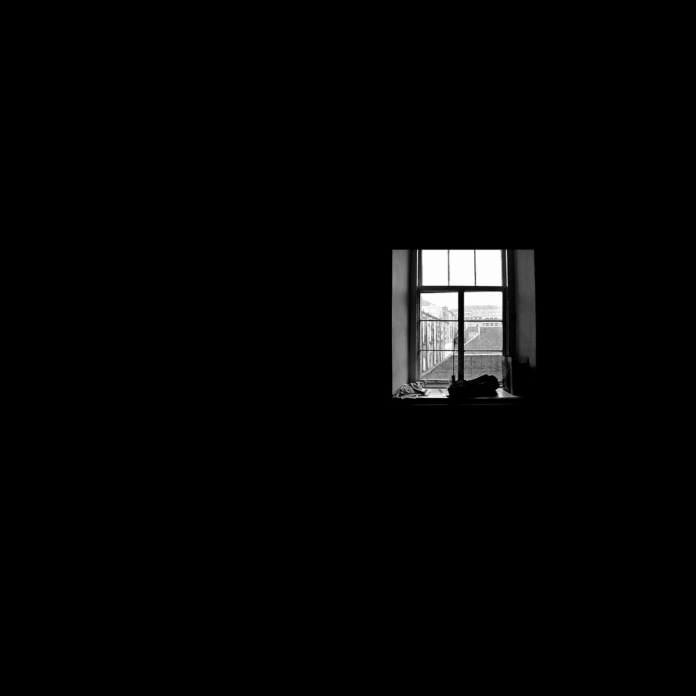

# 你需要独处的时间来创作吗？

> 原文：<https://medium.com/swlh/do-you-need-alone-time-to-create-fc9bcef46f86>

## 是也不是…

Photo by [Josh Nuttall](https://unsplash.com/@jjnuttall?utm_source=medium&utm_medium=referral) on [Unsplash](https://unsplash.com?utm_source=medium&utm_medium=referral)

> "没有极度的孤独，就不可能有严肃的工作."巴勃罗·毕加索

毫无疑问，在这个高度互联的世界里，找时间真正集中注意力而不受干扰从来没有像现在这样困难。在我的桌子上，现在我有我的笔记本电脑(那是我写作的主要部分)，我的 iPhone，和我的 iPad，当我…