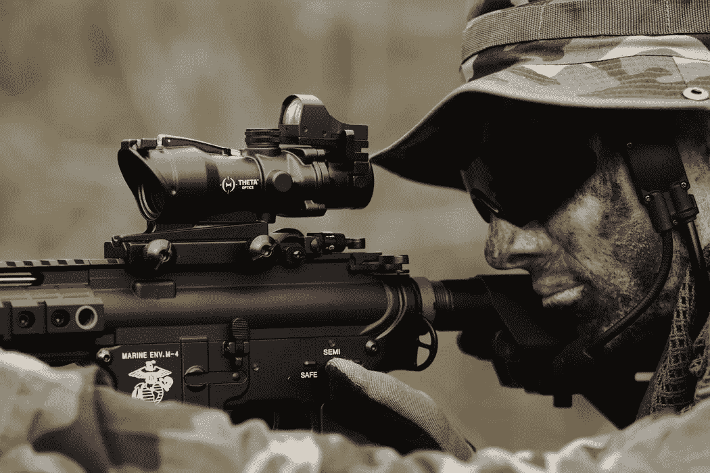

# 你是用狙击枪还是散弹枪来分享反馈？

> 原文：<https://medium.com/swlh/do-you-use-a-sniper-rifle-or-a-shotgun-to-share-feedback-48d5dca7d41f>

## 分享反馈很难，但不要采取懦夫的方式。

Photo Credit: [Specna Arms](https://unsplash.com/photos/h78GMtJr4Ks) on [Unsplash](http://unsplash.com)

你有没有听说过一个经理给整个团队提供反馈，但你知道反馈是给团队中某个特定的人的？

如果是这样，你已经见证了给予反馈的“散弹枪方法”——喷一点…