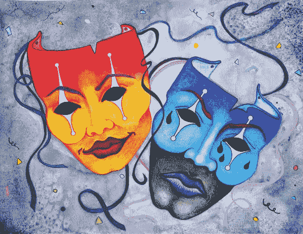

# 你写作是出于痛苦还是快乐？

> 原文：<https://medium.com/swlh/do-you-write-from-pain-or-joy-ab1b88b413e3>

—或者两者都有？

deviantart.com

我有许多作家朋友。一些作家被更轻松、更轻松、更幸福的故事所吸引。有些人写游记、喜剧小品或小说。

其他人写的是更深刻、更黑暗、令人心痛、更黑暗的灵魂故事……比如回忆录。

*我必须承认我两样都喜欢。*