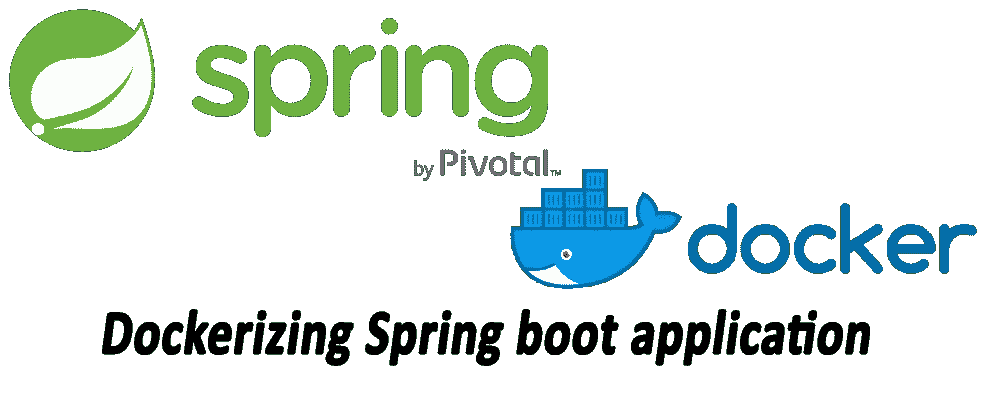

# 对接弹簧靴应用

> 原文：<https://medium.com/swlh/dockerizing-spring-boot-application-df5ae7dd1e37>

嗨我将在**dockering Spring boot app 中给出一个快速指南。**

## 首先让我们看看什么是

**为了理解这个 dockerizing 过程，我们需要了解容器或 ***应用程序容器化*****

## **[应用容器化(app 容器化)](https://searchitoperations.techtarget.com/definition/application-containerization-app-containerization)**