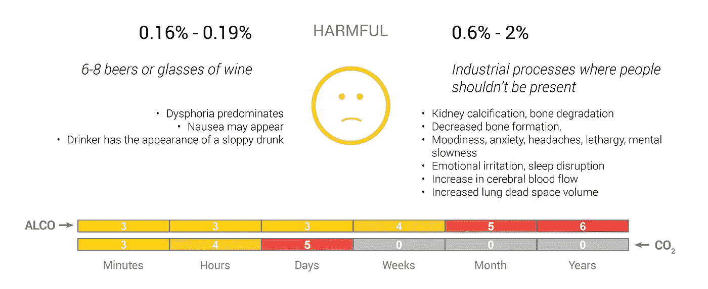

# 二氧化碳对你的身体有害吗？

> 原文：<https://medium.com/swlh/does-co2-harm-your-body-d20b4a0d03c1>

与酒精的比较。

许多成年人都经历过酒精的影响。但是没有多少人经历过二氧化碳对身体的影响，对吗？不对！事实上，我们大多数人都在通风不良的会议室里。首先你变得越来越不集中。然后我们开始感到疲劳。我们中的一些人甚至会打瞌睡。在一些罕见的情况下，房间的通风状况可能非常糟糕，以至于我们甚至开始头疼。所有这些影响都与二氧化碳水平升高有关。

在这篇文章中，我将展示二氧化碳对你身体的影响。从低浓度的无害，到引起头痛，到增加肾脏钙化，再到高浓度的致命。此外，我将这与酒精的影响进行了比较，这是大多数人都能理解的。

# 二进制模拟转换(Binary-Analog Conversion)

血液中的酒精含量(血液酒精含量或 BAC)是以百分之十、百分之一甚至千分之一来衡量的。有大量的文件证明酒精对血液中行为变化的影响。即使宿醉不是一件令人愉快的事情，幸运的是，一旦我们停止饮酒，酒精的影响在大约 48 小时内再次消失。一旦去除了较高的暴露水平，CO2 的影响也是如此。

然而，人们每天饮酒也会产生长期影响。每日剂量越高，对身体的伤害越大。

酒精剂量可以用酒精当量来描述。例如，一个单位是一瓶 0.33 毫升的啤酒，酒精含量为 5%。

根据性别和体重的不同，有可能大致计算出饮用一定量酒精单位时你的血液酒精浓度会上升多少。

一组示例公式(Widmark)如下:

**BAC =[摄入的酒精克数/(体重克数* r)]* 100；女性 r = 0.55，男性 r = 0.68。**

一杯美国标准饮料含有 14 克酒精，相当于:1.5 盎司杜松子酒或威士忌(40%)，12 盎司啤酒(5%)，5 盎司葡萄酒(12%)。关于如何计算 BAC 的详细解释可以在[这里](https://m.wikihow.com/Calculate-Blood-Alcohol-Content-(Widmark-Formula))找到。

# 二氧化碳

实际上，二氧化碳的含量也是以类似于酒精含量的方式来测量的。看到缩写 ppm 是很正常的，代表百万分率。

为了说明这一点，图片 1.000.000 球，这代表了我们的大气层的组成。这些球中大约有 780.800 个是氮气。209.400 是氧气。大约 9.300 是氩。只有大约 400%是二氧化碳。其余的是其他气体，如甲烷、二氧化氮和其他气体，含量非常低。

截至 2019 年 4 月，我们大气中二氧化碳的当前水平为 413 ppm，或转化为百分比 0.0413%。

在许多密闭空间，如教室、会议室甚至通风不良的卧室，CO2 水平可能会上升到 3.000 ppm 或 0.3%的水平。

和酒精一样，暴露在高浓度二氧化碳中的时间也很重要。然而，较高水平的二氧化碳暴露的长期影响并不像酒精暴露的长期影响那样有据可查。关于二氧化碳浓度增加对儿童发育的影响的数据也很少。

# 想象酒精对二氧化碳的影响

在下面的插图中，我试图想象酒精和二氧化碳对人体的短期和长期影响。我将这些影响分为以下 7 个不同的类别:

Categories of impact on health

请注意，这些插图中的层次和效果是个别的，而不是绝对的。

在你深入研究这些插图之前，我想对长期效应(几周、几个月和几年)的含义做一个简短的说明。对于酒精，人们应该想到一个人在提到的时间里，每天消耗提到的剂量。至于二氧化碳的长期影响，人们应该考虑暴露在二氧化碳的水平下，在这些长时间内没有休息。

让我们从健康的生活方式开始，呼吸新鲜空气，几乎不喝酒:

Health impact of no alcohol and fresh air on the human body

下图显示了适度饮酒和室内二氧化碳水平的影响。我认为这种情况在西方世界很正常。当着眼于长期效果(几个月、几年)时，大多数拥有健康生活方式的人不属于这些类别。我们确实会停下来喝点酒，出去呼吸一下新鲜空气。

Health impact of small amounts of alcohol and indoors CO2 levels

当酒精消耗量和二氧化碳水平进一步增加时，有害影响就会增加。尤其是在考虑长期影响的时候。虽然偶尔喝两杯啤酒或葡萄酒不会有害，但如果变成一种习惯，就更有害了。对于在潜艇或空间站中看到的增加的 CO2 水平，据报道这些会引起头痛和其他副作用。

Health impact of 2 glasses of beer versus CO2 levels in submarines or space stations

随着我们进一步增加酒精浓度，这种影响也会增加。对于长期处于这种水平的酒精消费，一个人将被归类为酗酒者。下图中描述的高二氧化碳水平是非常罕见的，只有少数人会暴露在如此高的二氧化碳水平下。

Health impact of 6–8 glasses of beer versus CO2 levels in industrial processes

一个人喝了下图中描述的一定量的酒就会被称为重度饮酒者，尤其是如果这种情况每天都发生的话。当在工作中不可避免地暴露在如此高的二氧化碳水平下时，暴露时间应保持在 15 分钟以下。

Health impact of 1.5–2 bottles of wine versus very high CO2 levels, not normally encountered

随着我们进一步增加剂量，即使暴露时间很短，影响也会变得越来越危险。

Health impact of 2–3 bottles of wine versus dangerously high CO2 levels

有害物质的剂量足够高，就会致命。

Deadly alcohol consumption, deadly CO2 levels

# 把所有的放在一起

在最后一幅插图中，我把上面所有的插图放在了一起，以便给出一个更简单的概述。

Overview of short term and long term exposure to alcohol and CO2 at different levels

# 结论

正如我试图展示的，酒精和二氧化碳的影响在某些方面是相似的，但在另一些方面是不同的。酒精对身体的影响更大，这可以从酒精的负面影响在较低剂量下就已经表现出来的事实中看出。二氧化碳不是有毒气体，但是我们呼吸的空气中二氧化碳含量的增加确实会对我们的身体产生负面影响。

幸运的是，我们可以选择避免酒精和二氧化碳的负面影响。因此，重要的是跟踪室内的 CO2 水平，并在需要时通风，以避免负面影响。人呼气时，CO2 浓度约为 4%。这意味着如果你把足够多的人放在一个房间里，二氧化碳浓度会上升得相当快。为了避免负面影响，在人们正常工作的地方，每人每小时应该用新鲜空气交换大约 2 到 3 立方米的空气。

一个令人惊讶的事实是，我找不到关于长期暴露于二氧化碳浓度增加的影响的信息。这是未来研究的一个领域。

# 参考

你可以在我的[网站和我的书](https://co2brains.org/)中读到更多关于这个主题的内容。

[二氧化碳健康危害信息表](https://www.fsis.usda.gov/wps/wcm/connect/bf97edac-77be-4442-aea4-9d2615f376e0/Carbon-Dioxide.pdf?MOD=AJPERES)

[二氧化碳毒性和气候变化:人类健康面临的重大风险。](https://www.researchgate.net/publication/311844520_Carbon_dioxide_toxicity_and_climate_change_a_serious_unapprehended_risk_for_human_health)

[酒精的生理&心理影响](https://www.alcohol.org/effects/)

[酒精的影响](https://www.alcoholrehabguide.org/alcohol/effects/)