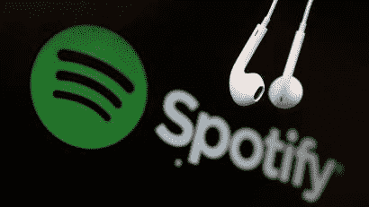

# Spotify 有定价权吗？

> 原文：<https://medium.com/swlh/does-spotify-have-pricing-power-153e52d7011b>

在这篇文章中，我们将探讨 Spotify 是否能够提价。我与网飞探讨了同样的概念(结果我们可能低估了他们的定价能力)，所以我想为什么不与音乐流媒体的领导者做同样的事情。

[Spotify 平台](https://en.wikipedia.org/wiki/Spotify)在不到十年前的 2008 年 10 月推出，此后已经发展成为一个音频内容的全球品牌。他们达到了 15…