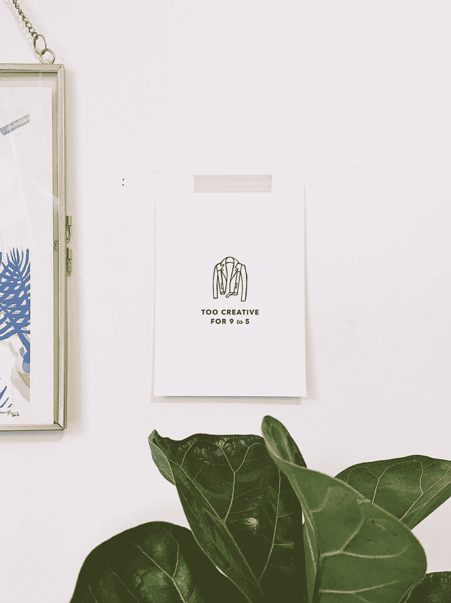

# 在数字时代，书面文字还重要吗？

> 原文：<https://medium.com/swlh/does-the-written-word-still-matter-in-the-digital-age-26e5efe2e1be>

当写作的欲望产生时，它通常伴随着其他的欲望。交流的欲望。分享的欲望。创造的欲望。然而，至少可以说，不断变化的世界让作家的生活变得混乱不堪。写作的人比以往任何时候都多。书店前段时间关门了。由于专门从事廉价写作劳动的平台，自由职业者多如牛毛。