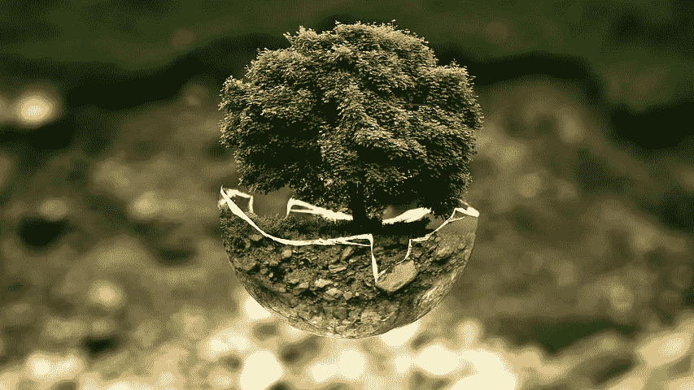

# 你的健身房会员资格需要升级吗？试着成长你的灵魂！

> 原文：<https://medium.com/swlh/does-your-gym-membership-need-an-upgrade-try-growing-your-soul-ab1b5d5d0094>

几年前，我的岳父患了中风——不是那种夺去我母亲生命的严重中风，但仍然是中风。几个月后，他的大部分症状都消失了。在与他的神经科医生的后续预约中，豪伊接受了一系列简单测试组成的检查——“摸摸你的鼻子。摸摸你的右膝盖，拉拉你的左耳。”他出色地通过了考试！没必要再去了。他的医生的临别建议是:“增长你的大脑。”考虑到豪伊已经 85 岁了，这似乎是一个了不起的建议。

许多美国人热衷于健身。自本世纪初以来，付费健身的人数翻了一番。今天，超过 6100 万人拥有健身房会员资格。对于增强体力和耐力，我们不会三思而行。

相比之下，直到最近，甚至神经学家也认为受损的脑细胞永远无法恢复。就在 20 年前，人们认为大脑在 25 岁后就已经完成了它的形成——之后就没什么新鲜的了。但是，包括洛桑大学医院功能神经外科主任 Jocelyne Bloch 博士在内的研究突破表明，大脑可以通过自我重组从创伤中恢复。

精神病学家丹尼尔·阿门(Daniel Amen)博士是《改变你的大脑，改变你的生活》(Change your Brain，Change your Life)的作者，使用大脑扫描(SPECT 或单光子发射计算机断层扫描)来检测由损伤、化学暴露或其他创伤引起的大脑空洞或死区。阿门将大脑空洞与精神疾病联系起来。

从某种意义上说，阿门的工作弥合了“身心”二元论。通过展示一个人的生理大脑的健康和一个人的思维运作之间的联系，他表明大脑与思维有因果联系，如果不是完全相同的话。看起来很直观吧？一个没有功能死区的大脑会导致思维失衡。豪伊的神经科医生实际上是在建议我的岳父通过开发大脑来增强他的智力。大脑的健身房？纵横字谜，数独练习和桥牌。

每个人都钦佩伟大的运动员。即使不关注拳击、足球或棒球的人也承认穆罕默德·阿里、汤姆·布拉迪和贝比·鲁斯的成就。无论是在奥运会上赢得金牌，还是将自己推向职业运动的巅峰(超级碗、世界杯或温布尔登)，这些运动员都令人钦佩。尽管我们中的大多数人永远也不会在体育方面有所成就，但我们不会被禁止去健身房，在跑步机上慢跑，或者带着我们的俱乐部去高尔夫球场。我们知道保持活跃对我们的身体有多重要。

同样，我们大多数人都非常尊敬黑格尔、爱因斯坦、马克斯·普朗克和斯蒂芬·霍金。这些伟大的思想家通过他们智慧的力量突破了已知的界限。我们在没有任何奥运金牌期望的情况下成长我们的肌肉，就像我们和我们的孩子在没有诺贝尔奖渴望的情况下成长我们的思想一样。我们对伟大思想家的钦佩并不妨碍我们送孩子上学，或者教学龄前儿童数数和加法。

我的灵魂呢？我不也应该努力去种吗？早在柏拉图之前，人们就相信灵魂包含了我们的本质，我们的灵魂将我们与神联系在一起。灵魂被认为是所有创造力的所在地。它包含了我们对他人的同情和慷慨。如果是这样的话，难道我不应该好好培养和充实自己的重要部分吗？

但出于某种原因，那些达到伟大灵魂高度的人——摩西、耶稣、佛陀、穆罕默德、老子、一行禅师——让我们大多数人觉得他们完全是另一种人，近乎神，值得崇拜，但不能模仿。“我绝不会那样做！”我们对自己说。

2006 年，库尔特·冯内古特在对一群 Xavier 高中学生的演讲中建议道:*“练习任何艺术、音乐、唱歌、跳舞、表演、素描、绘画、雕刻、诗歌、小说、散文、报告文学，无论好坏，不要为了获得金钱和名声，而是为了体验成才，发现你的内在，让你的灵魂成长。”*

在一段文字中，美国 20 世纪最有创造力的作家之一，在他生命的尽头，告诉下一代通过艺术创造性地表达自己来成长他们的灵魂。

癌症的幸存唤醒了我一种奇怪的感觉。就像圣诞节早晨的埃比尼泽·斯克罗吉一样，我发现“还不算太晚！”每一个新的一天都是我成长灵魂的下一个最佳机会。还有什么比在跑步机上跑步或练习填字游戏更重要的活动呢？站在别人的立场上走一英里，我能在同理心上成长吗？也许我可以通过为别人做些好事来增强自己的慷慨。每天，我能通过感谢别人的慷慨来表达我的感激之情吗？如果我向那些因粗心而伤害过我的人伸出手，说“我原谅你”，从而学会原谅，会怎么样？在别人悲伤和痛苦的时候和他们坐在一起，增强我的同情心怎么样？为什么不冥想、跳舞、唱歌或写首诗呢？

癌症没有结束我的生命，而是激励我利用剩下的时间来成长我的灵魂。在精神健身房投入时间和精力，我可能最终会发现我的灵魂变得更大了一点。