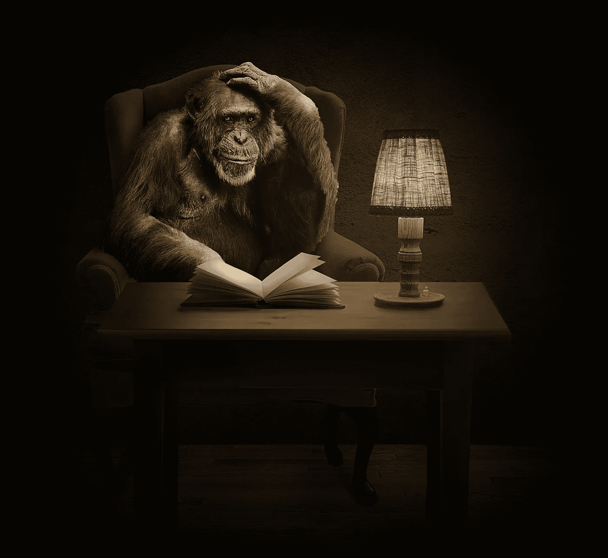

# 你的猴子思维会阻止你成为企业家吗？

> 原文：<https://medium.com/swlh/does-your-monkey-mind-stop-you-being-an-entrepreneur-a905dfef7ff9>

## 如何平息消极的自言自语

[Source](https://pixabay.com/photos/monkey-chimpanzee-book-thinking-1757972/)

想知道为什么许多想成为企业家的人不冒险一试吗？你可能会认为这是因为缺钱。然而，往往是消极阻止了他们。他们的猴子思维接管了一切，提供了堆积如山的自我批评，摧毁了他们的勇气和自尊。