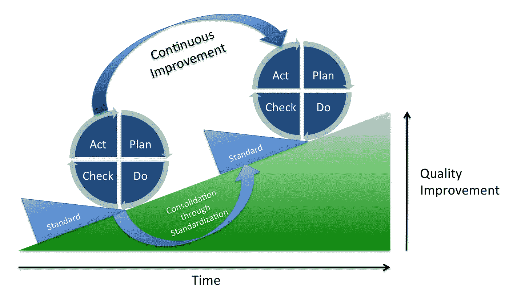

# 你的 PDCA 考虑技术了吗？

> 原文：<https://medium.com/swlh/does-your-pdca-include-technology-809b3f0c8469>

By Johannes Vietze — Own work, CC BY-SA 3.0, [https://commons.wikimedia.org/w/index.php?curid=26722308](https://commons.wikimedia.org/w/index.php?curid=26722308)

计划-执行-检查-行动循环是一种在组织中引入和维护持续质量改进计划的广为人知、久经考验的方法。它包括四个关键步骤:

## 计划

这是你决定什么是重要的地方。你做了什么承诺。你想达到什么结果。你想去的地方。然后你将如何到达那里。

## 做

在这一步中，您执行计划。如果这意味着一个过程的改变，这就是你把新的过程投入工作的地方。如果这意味着组织、环境、基础设施等的某种变化。“做”阶段就是发生这种情况的地方。在这一过程中，你正在获取信息，以便采取下一步行动。

## 支票

PDCA 在很大程度上是对这样一个事实的承认，即我们这些凡人并不真的擅长预测我们的计划会有多好。因此，在我们计划然后执行之后，我们检查、分析我们在执行步骤中收集的信息，尽我们所能得出关于计划效果的最佳结论。

## 行动(或调整)

一旦我们明白什么可行，什么不可行，我们就能更好地理解什么需要改变。行动步骤是我们发现和记录这些变化的地方。

PDCA 是一个持续的过程。理想情况下，每一次迭代，你都会越做越好。

在 PDCA 中有许多因素可能会因组织的不同而有很大差异。你多久骑一次自行车？谁在这个过程中扮演什么角色？组织范围是什么(团队、部门、分部等。)以及它如何适应平行或更大范围的 PDCA？

另一个容易忽视的因素是技术在流程中的位置。显然，技术可以成为支持PDCA 的有用工具。问题是:你会将技术*作为 PDCA*的一部分来谈论吗？

# 为什么技术可能超出范围

这可能不会发生，原因有很多。

*   那些参与 PDCA 的人可能觉得没有资格分析技术在他们日常工作中的作用
*   IT 投资被视为(在大多数情况下是正确的)战略决策，PDCA 参与者可能没有明确的渠道来影响这些决策
*   IT 组织本身可能不愿意或无法参与

然而，在许多情况下，这可能仅仅是因为任何人都没有想过这个问题。有时候，我们的技术感觉像一个不可移动的物体，像一座一直在那里的山，我们可以学习管理，但不敢渴望尝试移动。在很多情况下，事实就是如此。但是在某种程度上，我们可以对我们使用的工具施加一些控制，这种好处是值得努力的。

# 为什么技术应该成为焦点

我记得有一段时间(实际上我还没那么老),一名主管通常会抓起一叠绿条报告开始一天的工作，这些报告是由三班倒的计算机操作员打印出来的，由一名邮件员捡起，然后送到工作区附近的邮件箱。主管随后将视觉扫描绿条以寻找需要他们部门注意的项目，突出显示或标记这些项目，然后将标记的纸张分发给隔间中的工作人员。

然后，工作人员将使用某种绿屏终端对大型机上的数据库进行更改。如果工作人员需要更多的信息，他们可能会拿起桌上的电话，拨一个号码给某人打电话。如果他们不确定这个过程，他们可能会参考书架上一个精心设计的 4 英寸活页夹来获得指导，或者在他们的文件抽屉里寻找他们经理最近的政策备忘录。或者他们可能会起身走到某人的桌前，亲自询问。

今天，我们不再做这些事情了。我们使用电子邮件和即时消息进行交流。政策和程序在公司内部网上。工作项目是通过某种企业资源规划(ERP)或客户关系管理(CRM)系统提供的。进入办公室的纸张通常使用光学字符识别(OCR)进行扫描，并加载到某种成像系统中。活页夹(和书架)正在消失。你最后一次看到备忘录是什么时候？电话和面对面交流仍然存在，但现在它们通常被认为是紧急需求的最后手段，而不是他们曾经的默认交流方式。

我们现在比以往任何时候都更加依赖我们的技术。虽然企业资源规划系统、客户关系管理系统、成像系统、通信系统和内部网以及所有这些东西可以节省大量时间，但它们也可能是流程摩擦的来源。

也许这两个系统不能很好地协同工作，需要重复输入或者引入差异。也许新员工需要太长时间才能获得他们需要的访问权限。也许有一个特别常见和关键的功能需要 10 秒钟才能完成，但对系统稍加调整就可以在 3.5 秒内完成，每年节省数千小时的工作时间。如果我们不在 PDCA 中考虑这些事情，我们可能会错过许多重要的改进来源。

# 我们技术决策的后果

现代商业生活中的一个不幸事实是，即使是最好的战略技术决策也会产生意想不到的、往往是深远而长期的后果。即使一个公司有成熟的软件开发操作，令人遗憾的是，应用程序的架构和实现方式很难适应，或者用 PDCA 术语来说，很难操作。

如果您发现您的组织就是这种情况，那么您应该将其视为一种战略风险。难以改变的 IT 限制了增长。它扼杀创新。并且它会对您的过程改进工作造成严重的限制。如果您的 IT 是一个不可移动的对象，实际上在您的 PDCA 的范围之外，那么任何对 PDCA 感兴趣的利益相关者也应该对如何推进您的 IT 感兴趣，因为这两者是不可分割地联系在一起的。

另一方面，如果您正在考虑战略性 IT 投资，请仔细考虑产品或解决方案将如何随着您的业务发展而发展。以模块化、灵活的方式构建软件有一些成熟的技术。好的解决方案架构师和设计师会使用这些技术。无论你是与内部资源还是外部合作伙伴一起工作，确保他们分享你的优先事项并理解你的目标。

如果可以，作为 PDCA 工作的一部分，为技术的持续变化做预算。并确保 PDCA 的技术变革总是“摆在桌面上”。如果你不这样做(或者目前不能),你的持续改进将会缺少一个关键元素。它永远不会像它本来可以的那样成功。