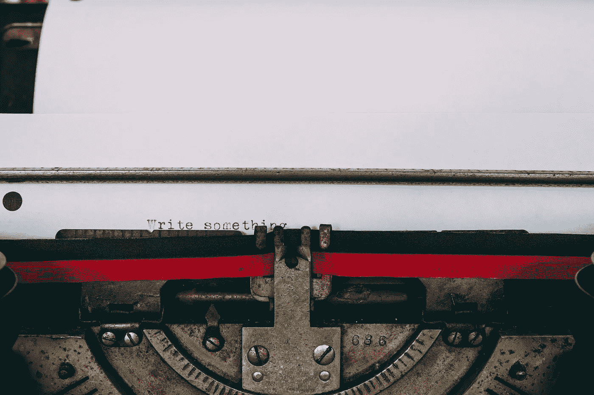

# 不要问自己写什么。这是个错误的问题

> 原文：<https://medium.com/swlh/dont-ask-yourself-what-to-write-it-s-the-wrong-question-1c7293662d9d>

*Photo by* [*Glenn Carstens-Peters*](https://unsplash.com/@glenncarstenspeters?utm_source=unsplash&utm_medium=referral&utm_content=creditCopyText) *on* [*Unsplash*](https://unsplash.com/search/photos/writing-on-a-train?utm_source=unsplash&utm_medium=referral&utm_content=creditCopyText)*.*

## 养成写*永远*和*处处*的习惯

作家们经常会纠结于*该写些什么。更好的问题是*什么时候*和*在哪里*写。答案是*永远*和*无处不在*。*

需要澄清的是，我并不是说你女儿的野营背包上的标签要求散文等同于…