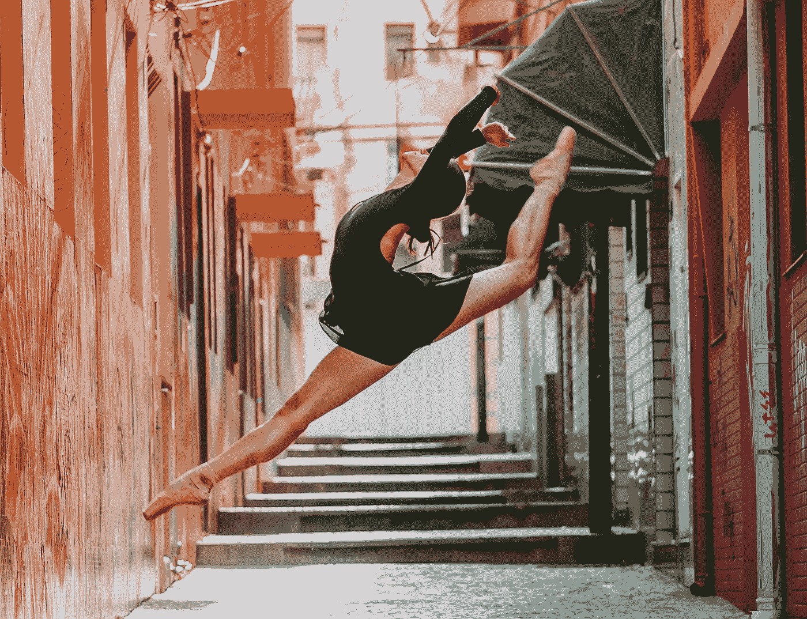

# 不要相信天赋

> 原文：<https://medium.com/swlh/dont-believe-in-natural-talent-4d2547349483>

[Image from here](https://www.pexels.com/photo/woman-doing-ballet-dance-in-pathway-1886907/)

## 天赋是一个神话。真正的是好奇心、动力和心态

我讨厌人们使用“天赋”这个词在过去的几年里，很多人都用这个词来形容我学习新事物的能力。虽然我知道他们都是出于好意，但听到这些总是让我感到有点不安。