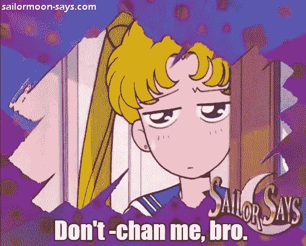

# 别-改变我，兄弟！——翻译中的敬语问题

> 原文：<https://medium.com/swlh/dont-chan-me-bro-the-problem-with-honorifics-in-translation-1a0f06ac99f0>

Don’t -chan me, bro.

我相信即使是最普通的日本文化爱好者也一定知道，敬语在日本是一件非常重要的事情。如此之大，事实上，你可以在某人的名字后面加上几十个选项，这取决于你在社会中的地位，他们在社会中的地位，你们的相互关系，或者三者的混合。