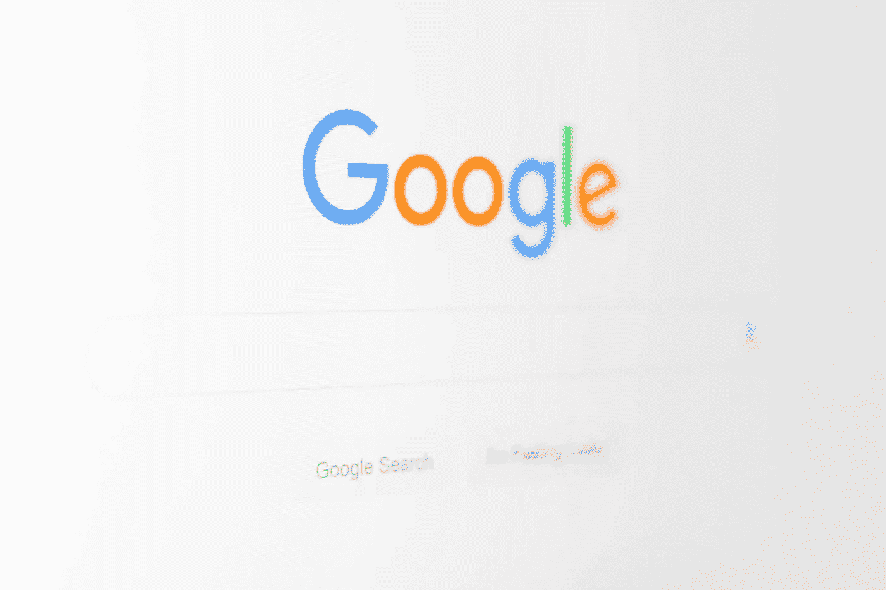

# 在看完这篇震撼的报道之前，不要做 SEO

> 原文：<https://medium.com/swlh/dont-do-seo-before-reading-this-shocking-report-776156743a1d>

## 了解为什么大多数大师不会告诉你这个秘密

Photo by [Christian Wiediger](https://unsplash.com/@christianw?utm_source=unsplash&utm_medium=referral&utm_content=creditCopyText) on [Unsplash](https://unsplash.com/search/photos/google?utm_source=unsplash&utm_medium=referral&utm_content=creditCopyText)

学习如何获得反向链接是最古老和最有效的搜索引擎优化策略之一。这也是影响你谷歌排名的首要因素。

但是建立谷歌喜欢的、不受惩罚的反向链接是最具挑战性的任务之一。