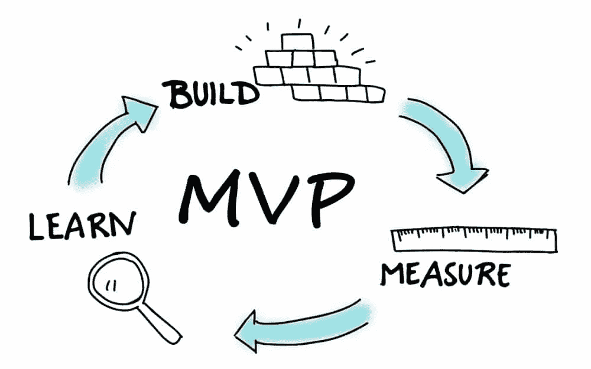

# 不要爱上你的原型

> 原文：<https://medium.com/swlh/dont-fall-in-love-with-your-prototype-a6af8572fd53>

> 改为一夜情。

说到原型，你必须从一开始就知道，你不能对它产生依恋，把它当作夏日之恋或一夜情。以下是如何不要沉迷于完美的原型，以及如何充分利用它。

# 定义你的商业目标

不要专注于头脑风暴功能，它们不是最终目标。你的 MVP 现在绝对不需要具备所有可能的特性。

相反，你应该确定在原型上投入时间和金钱会产生什么样的商业影响。

## 一些常见的业务影响目标:

*   获得风投/天使投资
*   验证产品与市场的契合度
*   吸引你的第一批 10-100 名客户
*   根据用户反馈采取行动，增加客户保留率
*   扩展您的产品以支持数百万客户

根据你的业务目标，你可能会有更多或更少的限制。

# 把它造得足够好，可以学习

**3 天原型，不是 3 个月**。你的原型不需要**完美到可以展示给客户**。完美会杀了你的 MVP。不要专注于细节，而是专注于你业务的核心。你希望能够向你的用户展示真实的东西。[实验](https://www.boardofinnovation.com/business-design/experimentation/)不是预测，而是让用户接触真实解决方案的模型，用最少的功能吸引他们的注意力和金钱。

# 原型是一次性的

你不是在制造最终产品。培养实验者的心态:尝试，尝试，再尝试。你只是在设计你的解决方案来测试你的假设。像过分关注细节、制作漂亮的界面和塑造品牌形象这样的事情对于实验来说是非常危险的，因为它们表明你已经过于依赖你的解决方案了。

# 创建您的 MVP 范围草案

想象一个用户试图实现你的产品提供的目标。以非常高的粒度绘制出每个步骤的流程和路径。

# 列出一个假设清单，反复缩小你的范围

浏览每个用例，对于每个操作/步骤，问自己以下问题:

*   这一步对于进行下一步是绝对必要的吗？
*   为什么有必要？
*   我能不能用更简单或者更直观的方式实现这一步的目标？
*   这一步可以分成更小、更细粒度的步骤吗？
*   在这一步中，用户希望看到什么？

每当你发现一个可以改变的步骤，再次检查每个用例，看看这如何改变整个路径，以及这种改变是否为进一步的改变引入了更多的灵活性。

# 将范围转化为技术

在评估采用哪种技术时，要考虑他们的关键依赖。采用一种技术比采用另一种技术有不同的限制和权衡。讨论与替代方案相比，这些技术选择的局限性是什么。获取许多意见，从高层次了解这些组件如何连接在一起，并决定实现您的主要目标的最简单的功能解决方案。

# 执行、评估、学习

根据您在第一步中定义的 KPI 和目标进行衡量。随着您获得更多关于目标进展的反馈，请注意哪些事情让您感到惊讶，哪些事情与预期不符。检查一下你做了哪些你不需要的东西，以及你可能错过了什么。

重要的是继续**测试，学习，测量，然后重新开始！**