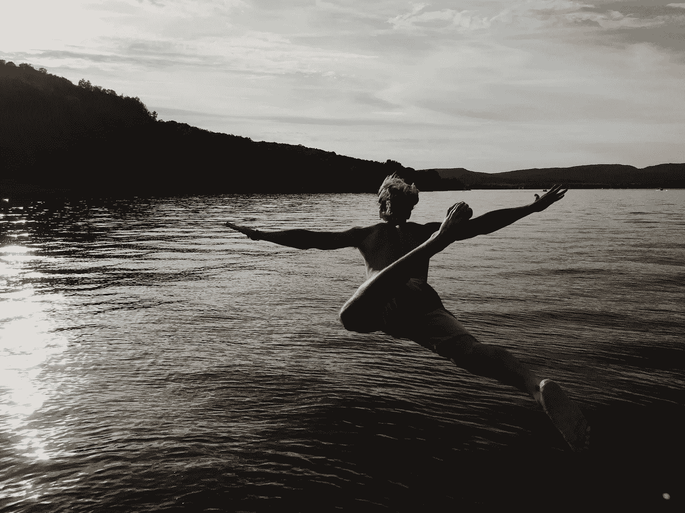

# 不要反抗，向它倾斜

> 原文：<https://medium.com/swlh/dont-fight-the-resistance-lean-into-it-14ebf7a4803c>

Photo by [Laurie-Anne Robert](https://unsplash.com/@laurieannerobert?utm_source=unsplash&utm_medium=referral&utm_content=creditCopyText) on [Unsplash](https://unsplash.com/?utm_source=unsplash&utm_medium=referral&utm_content=creditCopyText)

## 克服恐惧，做好工作

> “当你向我抱怨你感到阻力时，我并不为你感到难过。我很激动。我很兴奋，因为阻力不像扭伤脚踝或其他我们在锻炼时试图避免的疾病。反抗是艺术的影子。没有艺术，就没有反抗。”——塞思·戈丁