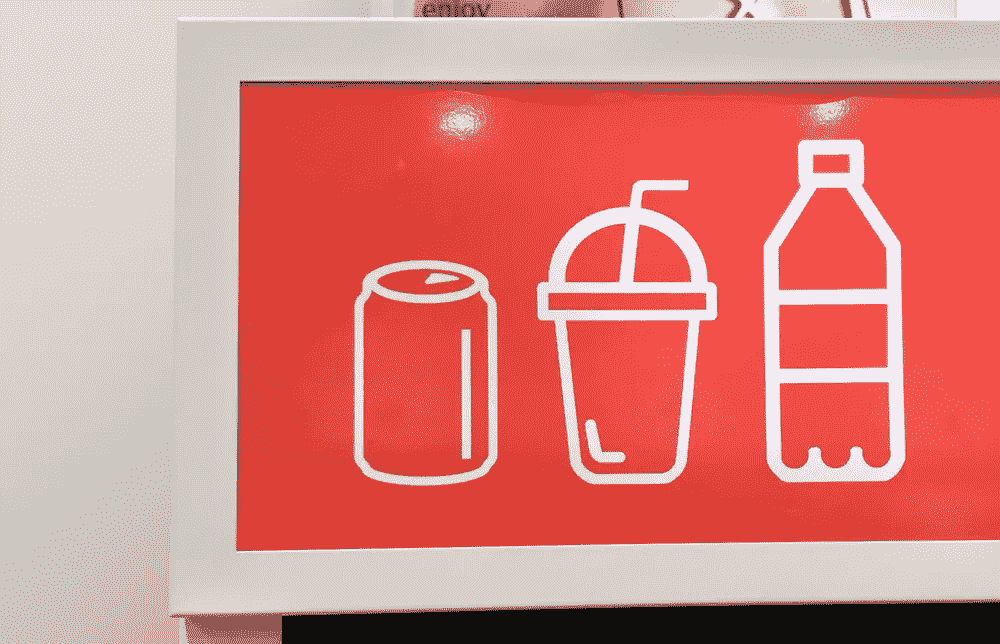
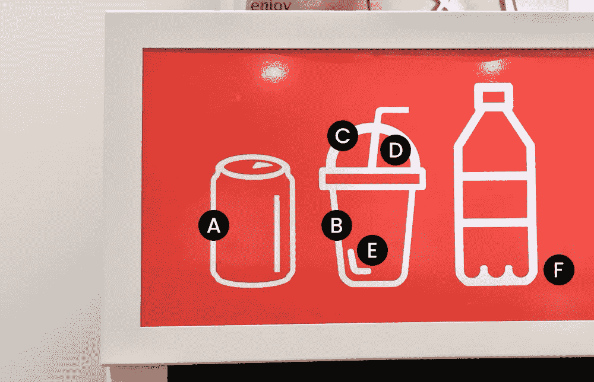
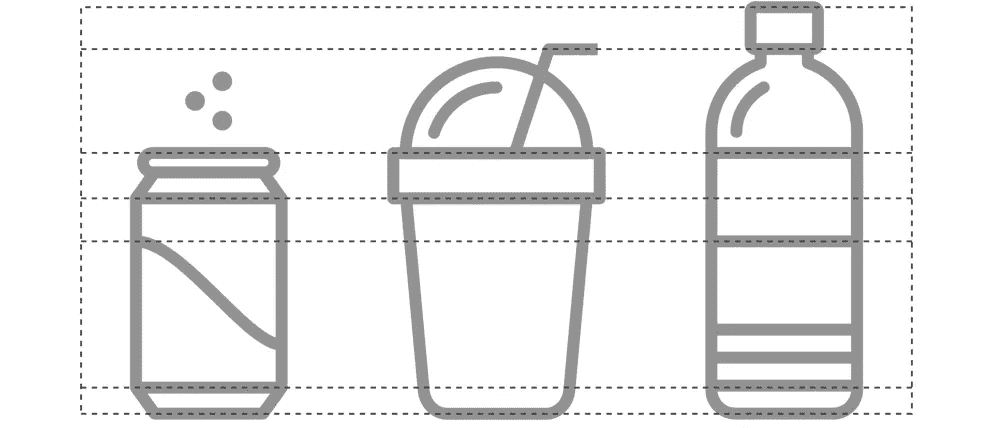
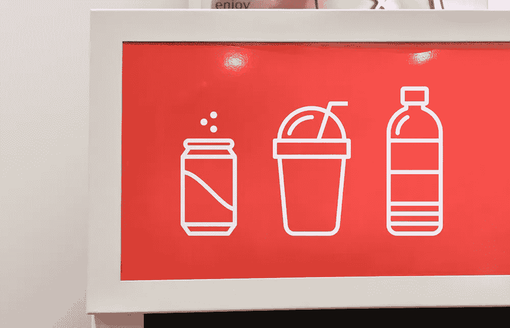
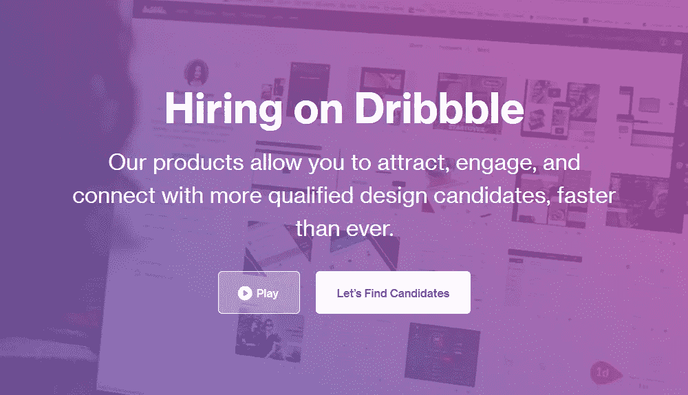

# 谈到品牌，不要忘记一些小事

> 原文：<https://medium.com/swlh/dont-forget-the-little-things-c96d9773c7d8>

不久前，我和一个好朋友参观了伊顿中心。当我们一起逛商场时，我注意到一家迷你商店。我赶紧把我的朋友拖进去探索。一进商店，我就注意到冰箱(他们存放冷饮的地方)上的一些图标引起了我的注意。

These icons appeared on a refrigerator inside of a Miniso store.

我把我的朋友拉到一边，指着那些有问题的图标。我问她是否注意到冰箱上的图标有什么奇怪的地方。“Sharic，”她开玩笑地说，“他们只是图标。”我笑了起来，意识到我的设计师大脑正在加班工作。

然后我指出了几个错误。她一脸迷惑，只是说:“嗯，我都没注意到。”现在你可能想知道图标有什么问题。这是我发现的:

The devil is in the details.

a)易拉罐(第一个图标)的视角与其他不同。易拉罐以 3D 视角展示，而其余部分则是 2D。另一方面，我不知道为什么这是必要的，因为易拉罐是世界公认的。

b)每个图标的笔画宽度不同。由于某种原因，从第一个图标到最后一个图标，宽度会变大。

c)说到笔画宽度，思乐冰的圆顶与其他部分相比具有最大的笔画宽度。

d)吸管的行程宽度开始时大，结束时小。也许他们想展示某种放大效果？

e)这条反光线(易拉罐上也有一条)位置巧妙，为图标提供了简单的细节。然而，这个和易拉罐上的不一致。你有没有注意到一个是圆边的，另一个是平边的？

f)水瓶底部波涛汹涌，建造不顺利。当某样东西看起来不合适时，它会影响你的品牌。

正如你从我友好的评论中看到的，这些图标有很多问题。如果你没有注意到什么，不要担心。大多数人也不会注意到。例如，如果 Miniso 在一个应用程序中使用这些图标，我敢肯定更多的人会想知道为什么这些图标看起来不一样。

我决定重新设计这些图标来修复所有不一致的地方。这样你可以直观地看到重新设计后的图标会产生什么样的影响。下面是所有三个重新设计的图标。

Redesigned icons.

在我重新设计图标后，我将它们 PS 到原始照片中，以展示重新设计的影响。

当你比较前后的照片时，你可以看到一致性、顺序和相似性的不同。在平面设计中，这些东西也被称为[格式塔](https://www.creativebloq.com/graphic-design/gestalt-theory-10134960)。通过将一些基本的设计原则应用到这些图标上，它们现在散发出一种令人赏心悦目的安静的精致感。

公平地说，这些图标只是 Miniso 整体品牌的一小部分。我敢肯定他们没有被创意总监放在首位。尽管如此，这些图标是一个很好的例子，说明小事情对你的品牌有多么重要。这些小东西可以让你通过以设计为中心的焦点脱颖而出，从而与竞争对手拉开距离。

那么，如果你没有良好的设计意识，你会怎么做呢？我建议与你所在地区的设计师合作。通过这种方式，你可以向他们咨询你的品牌，以确保不会遗漏任何细节。一个人如何找到一个设计师来帮助处理这些小事情？我推荐的一个地方是 [Dribbble](https://dribbble.com/) 。他们的网站上有许多设计师和其他有才华的创意人员。一次快速搜索就能找到你所在地区的设计师。(还有不，我不为 Dribbble 工作。)

The Dribbble website allows you to hire a designer.

“小事很重要”这句话以前已经说过无数次了。然而，这句简单的格言值得强调，以确保你的品牌保持一致和强大。这些小事情将建立你的品牌，并通过你对细节的关注赢得新客户，并最终赢得他们对创造优质产品或服务的信任。