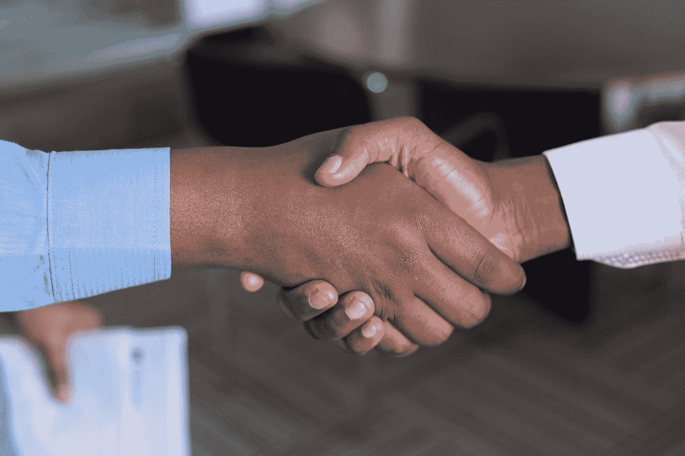

# 不要和你不信任的人做生意

> 原文：<https://medium.com/swlh/dont-go-into-business-with-someone-you-don-t-trust-d522bef02456>

## 我经历了惨痛的教训

Photo by [Adeolu Eletu](https://unsplash.com/@adeolueletu?utm_source=medium&utm_medium=referral) on [Unsplash](https://unsplash.com?utm_source=medium&utm_medium=referral)

全坦白:我不太懂业务。

作为一名 23 岁的新贵，我被雇佣在外国教商务英语，当学生问我某事是什么意思时，我的技巧是把它扔回课堂。“好问题！不知道有没有人能告诉我们*股东*是什么？”

(感谢我的高材生阿齐兹，他总是知道答案，并在许多场合让我免于失业。我一直没机会谢谢你，伙计。还有，我真的希望你给的答案是正确的。)

直到最近，我还在各种各样的临时工作中过着工作不稳定的生活——完全不知道带薪休假和退休储蓄的可能性。我有足够的退休金维持我退休后的一周(但这将是非常糟糕的一周)。

我从来不会被现实拖后腿，在涉足商务英语教学十年后，我成功地做了两件不太可能的事:找到一份金融文案的工作，并创办了自己的公司。我很感激前者教会了我很多如何去做后者。

当我为金融机构写付费博客时，从零开始创建一家公司比听起来要困难得多。我在纳税期间全职工作了两个月(围绕着我的另一份全职工作),只是为了在把账目交给会计之前把它们整理好(T2)。我学到了很多关于税务系统的知识，让我告诉你吧。

但我最大的教训是，在商业中最重要的是你和谁做生意的*。我犯了一个巨大的错误，有一个我甚至不喜欢的商业伙伴，更不用说信任了。*

Photo by [Cytonn Photography](https://unsplash.com/@cytonn_photography?utm_source=medium&utm_medium=referral) on [Unsplash](https://unsplash.com?utm_source=medium&utm_medium=referral)

我可以解释合作的原因，当时这是有意义的，我们似乎有共同的目标，我们似乎都对这个项目同样兴奋(也许阿齐兹可以告诉我，“兴奋”并不意味着“*承诺”*)——但所有这些都应该被一个事实抵消，即我知道这个人不值得信任。

公平地说，我不知道事情会变得多糟。不过，我有所怀疑。我们曾经是好朋友，后来闹翻了——这应该是第一个警告信号。也许我认为商业伙伴关系会治愈我们的友谊。这倒没有。

从事任何商业冒险都极具压力，而且会给任何关系增加压力。已经有裂缝的很可能会很快破裂。

经营一家企业还需要每个人投入大量的时间和精力。如果一方决定不做任何工作，那么另一方就不可避免地要承担更大的工作量。

当我反复告诉我的商业伙伴，如果他们继续对公司不闻不问，会有什么样的财务风险时，他们选择了无视我。这并不夸张，他们实际上失去了联系。有人*不得不*为企业不破产做工作——所以那个人就是我。

比没有回应的商业伙伴更糟糕的是，当我收到他们的消息时，我会受到近乎持续的辱骂。他们会打电话花一个小时(不是开玩笑，我记下了打电话的时间)痛斥我的“无能”——**，尽管我做了 100%的工作。**

我说附近的*是因为一连串的侮辱偶尔会被一条热情洋溢的短信打断，告诉我我做得有多棒(天哪，谢谢！)他们后来用这些信息作为证据，证明他们在我想退出的时候“把我举起来”——不知何故忘记了这样一个事实:正是他们的辱骂让我不顾一切地想离开。*

当他们发表类似“我们是如此好的朋友，我们可以对彼此说任何我们喜欢的话”(仿佛虐待=友谊)的评论时，我什么也没说。这也是我的错误，因为整整两年，我隐藏了我对他们的感觉，以及他们把我当作一种应对机制。我以为如果我支持他们的自我，事情会变得容易些。他们没有。

 [## 如何应对一个自恋者

### 因为试图改变它们是徒劳的。

medium.com](/@ClaireJHarris/how-to-cope-with-a-narcissist-ea6aff2178ec) 

可悲的是，我没有走开，我坚持到底，直到完成我们正在进行的项目。就像任何糟糕的关系一样，我觉得如果我放弃了，那么多年的虐待就完全白费了。

我的商业关系是我一生中最痛苦的三年，对我的自信和心理健康造成了永久性的伤害。当我想终止合作关系时，这场长达一年的法律战也达到了高潮。像许多施虐者一样，我的商业伙伴不想让我走。

我责备自己，因为我从一开始就知道。

我从我们以前的友谊中知道这个人有不良倾向，我只是不知道他们是一个十足的自恋狂。我忽视了我的直觉，因为我认为我能处理好。我确实处理了，但是个人付出了巨大的代价。

所以我可能对某些商业术语仍然只有一个模糊的概念(尽管我很自豪地说，现在不用阿齐兹的帮助，我就能告诉你什么是股东)。但是我知道做生意的一件事就是不要和你不信任的人做生意。我向你保证，情况不会好转，只会变得更糟。

这不值得。

不值得。

不值得。

查看[我的网站](https://www.clairejharris.com/)或者在[脸书](https://www.facebook.com/clairejharriswriter) / [推特](https://twitter.com/Claire_J_Harris) / [Instagram](https://www.instagram.com/clairejharris_writer/) 上关注我。