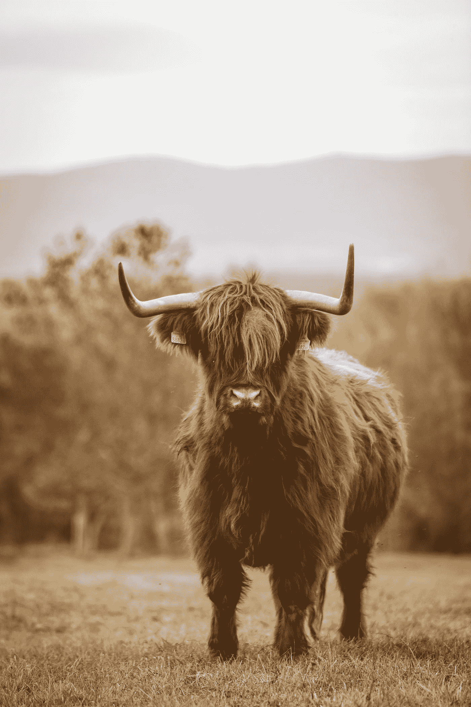

# 不要一直喝酸奶

> 原文：<https://medium.com/swlh/dont-keep-drinking-the-sour-milk-6f82e2c932d1>

## 如何不把事情看得太重，在你的余生里超级快乐

Photo by [Thomas Q](https://unsplash.com/@thomasq?utm_source=medium&utm_medium=referral) on [Unsplash](https://unsplash.com?utm_source=medium&utm_medium=referral)

有一个佛教故事，讲的是一个人被卖了一头牛——或者可能是一头牦牛，我不记得了。不管怎样，这牛奶或牦牛奶出来是又臭又酸的。那家伙很生气。“我被卖给了一头腐烂的母牛，”他说。“这牛奶酸了！”为了证明这一点，他喝了一小口…