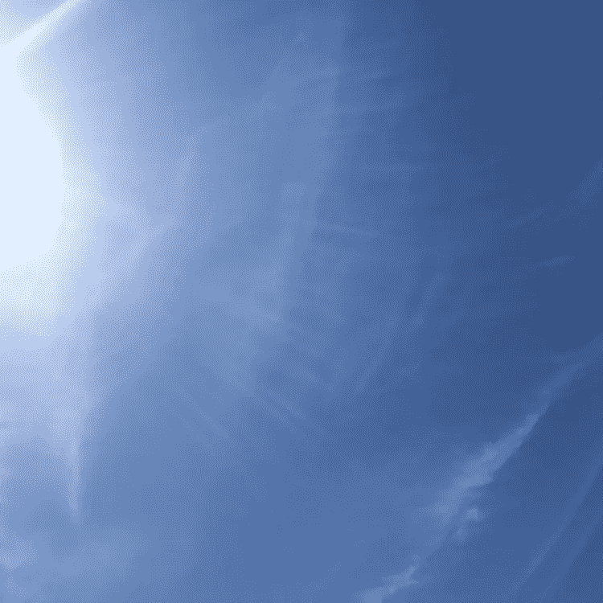

# 不要让死亡成为你唯一的警钟。

> 原文：<https://medium.com/swlh/dont-let-death-be-your-only-wake-up-call-e29134c2ed2>

我上个月为我的电子邮件时事通讯写了这篇文章，当时我正在处理我朋友在 3 月 31 日的突然死亡，并预测我父亲即将到来的死亡，他于上周 5 月 6 日不幸去世。朋友们问我分享我的信的方法，所以我把它贴在这里，带着爱和温柔。

我们中有许多人都经历过我们所爱的人的弥留之际，而我…