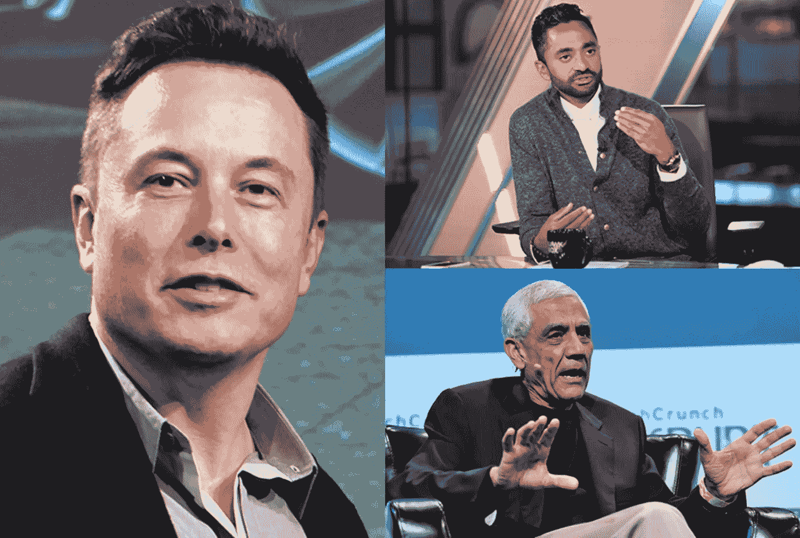

# 不要把你的一生都花在检查盒子上

> 原文：<https://medium.com/swlh/dont-spend-your-life-being-a-box-checker-5af79b00b7a6>

## ——以及我从查马斯·帕里哈皮提亚身上学到的其他经验

我一直是个完美的小书呆子。

Pretty much me if I was white

从三年级开始就参加天才和高级项目了？

✅支票。

在整个中学期间都参加了高等数学和科学课程。

✅Check.

痴迷于学习编码和制作自己的机器人？

✅支票。

我很想去大学读些计算机科学。编程和满足于一份工作在我的余生中整天坐在办公桌前敲键盘。

这就是成功，对吗？

一定是。对吗？

其他人都是这么做的，这是必然之路，这是生活的意义所在——对吗？

其他人都遵循完全相同的道路，所以我为什么要做不同的事情呢？一直都是:高中→大学→工作→家庭(可能)→退休(如果你已经存够钱的话)→死亡(可能，我听说现在有一些病态的长寿研究)。

但是到了高中，大概 11 年级左右，我就厌倦了学校。数学受挫。象棋很烂。对人着迷。令我惊讶的是，我可以坐在笔记本电脑前几个小时，敲几下键盘，制作下一个 Instagram。我加入了 TKS。我开始和 AI 合作。我去了硅谷一周。

我了解了查马斯·帕里哈皮提亚。

我从这一切中，尤其是从他身上，学到了最重要的东西:

**停止检查社会的他妈的盒子。**

# 查马斯的作案手法。

查马斯和我一点都不像。嗯，我们可能长得很像。但除此之外，我们的背景完全不同。

至于整个检查盒子的事情， **Chamath 指的是像盒子检查者一样盲目地遵循确定性路径的人。**我们社会的大部分都是这么做的。在哈佛而不是其他大学的人在那里是因为他们是更好的盒子检验者。他们更符合标准。但是他们不一定更聪明。他们只不过是更好的方格棋。更好的考生或运动员或作家。**不一定是更好的创新者或思想家。**

这是他的故事。

Maybe we are pretty similar…

查马斯曾在汉堡王工作，14 岁时靠福利生活。他后来成为脸书公司的早期高级主管，拥有 12 亿英镑的净资产💸。

他从一个 BK 汉堡店老板变成了一个资本 B 级的亿万富翁。这家伙非常聪明。

他就像那些成名的多伦多说唱歌手之一…如果多伦多说唱歌手玩职业扑克，创办像社会资本这样的风险投资公司，并拥有金州勇士队(今年 4 月的说唱🙌).

知道了这一切，我把查马斯看做是一个可信度超高的人。

另一个聪明人曾经告诉我，如果一个聪明人说一件事，而一千个愚蠢的人说相反的话，相信那个聪明人。如果你去听查马斯的任何一次演讲，他所说的都违背了 1000 多人的建议。对我来说，他的建议很有道理。

查马斯说的很多话都是以“我现在可以说了”开头的，这表明他对自己的建议深思熟虑过。他的建议得到了行动的支持。在人生的事业上，他的履历是层叠的。他有一定的可信度，这是因为他做过很多事情。他现在想做的是创造和激发改变。

> “如果你谈论所有的收益，所有的价值将在未来 50 年中在哪里被创造，那将是在那些艰难的事情上。这是因为这些空白区域非常开阔。”
> 
> “不可否认的是，我们人类将被迫集中精力，因为世界的某些部分将基本上被水淹没。我们没有足够的食物供应——这些都是确凿无疑的事实。**然而没有人真的在解决一个问题。部分原因是因为人们没有追求它的雄心。资本市场不会奖励这种决策。但是，如果有人能解决这个问题，你不认为从经济角度来看，他们是一个数万亿的富翁吗？**当然。”
> 
> 你认为食品配送是下一个他妈的重大突破的来源吗？就像，开什么玩笑！去看看 Crunchbase，看看所有那些得到资助做这种垃圾事情的低劣、无用、愚蠢的公司。对抗气候变化。想想看。”

花点时间去理解它。“没有人真的在解决一个问题。”这给我敲响了警钟:**我不能依靠任何人来解决世界上最重要的问题——必须是我自己。我必须让自己有所改变。以下是我从 Chamath 那里学到的关于如何到达那里的知识。**

1.  你不是不可战胜的。
2.  弄清楚你自己。
3.  去做吧。

# 我不是不可战胜的

正确被高估了——你要么在学习，要么没有。

查马斯自己也说过:

> “人们必须适应的最重要的一件事就是你在学习。你要么在乎，要么不在乎。”

说“我不知道”是多么令人振奋。这种说法背后有一定程度的自信和开放。如果你是一个无所不知的人，你就没有在学习。对我来说，这是摆脱我的能力和扩大我的圈子的幻想，这样我就可以专注于获得正确的答案，即使我最初是错的。即使在这里，我也愿意向 Chamath 和他的经历学习，尽管我最初不同意他的一些观点。🔑字体如果我认为我比世界上最聪明的人之一懂得更多，那我就太自大了。我知道我什么都不知道(对我的孩子苏格拉底说)。

查马斯声称，大多数成功人士都非常缺乏安全感，包括他自己。当他提出消极的自我对话并开始虐待所爱的人时，他会注意到自己的生活失去了平衡。最近，他和大学恋人离婚了，他在社会资本的合伙人也离开了。他远非不可战胜。他也知道。

但是我比他幸运。我有能力观察成功的、高功能的人，比如查马斯、科斯拉、马斯克等。我可以复制他们做的所有好事，同时避免所有坏事。

3 Legends in 1 Picture, all of whom I can learn mental models from 😍 😍

**摆脱我的无知，只说‘我不知道’和模仿聪明人真的给了我一种超能力。**用它做好事的时候到了。

# 了解我自己

如果我不是无敌的，那我是什么？我已经走过了 16 年的人生。其中至少有 12 人是清醒的。三年前，我开始独立思考。但不是真的因为**我仍然不知道我是谁。我只是觉得有点失落。**

我没有个人哲学。我不知道是什么驱使着我。我有一个武断的目标，那就是解决一些世界上最大的问题，或者产生影响，或者用我的生命做一些有意义的事情。但是那个连**都他妈的是什么意思**？

如果你也和我一样困惑，查马斯建议我们做一些不同的事情:

1.  对现在的自己感到不安，想要改善。积极提问，多学习。简单。
2.  打破社交媒体多巴胺反馈循环。我们从小就被灌输这样一种感觉:浏览人们的精彩片段，却看不到他们恐怖电影的剩余部分。每个人都宣称自己比你聪明。或者更漂亮。或者更富有。看着人们屈服将不会让你有所收获。独处让你明白什么对你来说是重要的。去散步。
3.  习惯于尖刺。如果你想解决困难的问题，你将不得不违背确定性的道路——被庇护和温顺的道路。只有[不讲理的人](https://www.goodreads.com/quotes/1036543-reasonable-people-adapt-themselves-to-the-world-unreasonable-people-attempt)才有结果(s/o 给我另一个男生 [Vinod](https://twitter.com/search?q=vinod%20khosla&src=typd) )。

*关于尖锐的补充说明:查马斯是我听过的最自由、最熟练使用“操”这个词的人之一。听* [*这段话*](https://www.youtube.com/watch?v=PMotykw0SIk&t=1606s) *(以 2 倍的速度)，每次他说的时候做 10 个俯卧撑。保证 30 分钟后你会被劫持。*

如果你想知道查马斯认为自己的成功是什么，他提到了 3 件事(看这里的模式？):

*   专业素养
*   社会资本——与周围人的归属感
*   深厚的关系(过去称他的同事为朋友，但他们不可能真正成为朋友，因为他付钱给他们)

我目前暂时不接触社交媒体，并试图在睡觉前花 5 分钟时间将白天学到的东西内在化。都是为了更好地认识自己(差点又一次 s/o 到苏格拉底，刚刚错过)。

# 就这么干吧

耐克可能会先说，但查马斯说得最好。

我从查马斯和其他聪明人那里学到的一个重要主题是，他们是逆向投资者。**非常规的成功走非常规的道路**(对我的导师 Nadeem 来说是一个巨大的 s/o)——我不能期待不同的结果，我只是在做和其他人一样的事情。如果我什么都不做，我什么都不能指望。我以前害怕做事的原因之一就是失败。

那么万能的查马斯对此有什么看法呢？

> 如果你在做一件非常困难的事情，你会经历很多失败。因为否则，你只是在做一堆愚蠢的、无风险的决定，而你知道这些决定很可能是正确的。但这只是意味着你无论如何都会失败。”
> 
> “想想获得诺贝尔奖的人。你觉得他们的流程是怎样的？他们在世界上创造了一些基础的东西，在 20-30 年后得到认可。但是从根本上说，他们是不得不面对失败、失败、失败的人。因为他们每次试图做实验时都是在冒险。我认为解决难题基本上需要这种心态。”

我现在试着让自己的思想适应失败。向自己证明你可以开始一件事并坚持到底。

他甚至概述了实际完成任务的流程:

创建一个计划→分解它→完成它→以它为荣→不要在意人们对它的评价。

现在我可以把它放大，在接下来的 10 年里解决一个难题，并不断迭代。不管我受到多少指责和嘲笑。对于大问题，这不是快速失败的问题——这种方法对真正重要的大问题不起作用，只在小型摩托车初创公司中。

Imagine if all of these were companies trying to solve cancer or affordable housing 😤 😤

对于重要的事情来说，它是关于失败，重新站起来，被一百万风投痛打一顿，最后找到答案。它是关于对一个问题的存在感到如此愤怒，以至于你无法想象把一个存在这个问题的世界交给你的孙辈。所以你得修好它。

我仍然在慢慢地弄清楚如何在我的日子里做越来越多的事情，实际上是 GSD(把事情做完)。但无论是开始一个新的人工智能项目(强化学习是一种痛苦)，还是试图在我比其他人年轻 5 到 20 岁的活动中与陌生人交谈，我都会认为根本没有尝试才是真正的失败。

我的个人外卖？**尝试失败总比不尝试好** (s/o 给我的头号男孩[撒马尔思](https://www.linkedin.com/in/samarth-athreya-1003b4147/))。

# 以下是停止勾选复选框的方法:

*   说“我不知道”，这样你就可以开始学习了
*   复制聪明、高功能的人的习惯。从这些开始。
*   离开社交媒体，花点时间独处，散散步
*   做一个激活者，问问题，做大多数人不会做的事情
*   ✔️，只管去做——把事情做完，解决难题，经常失败
*   重要的🔑:联系 LinkedIn
*   甚至少校-呃🔑:查看我的网站，了解我做过的其他很酷的事情

## 这篇文章发表在 [The Startup](https://medium.com/swlh) 上，这是 Medium 最大的创业刊物，拥有+419，678 名读者。

## 在此订阅接收[我们的头条新闻](http://growthsupply.com/the-startup-newsletter/)。

