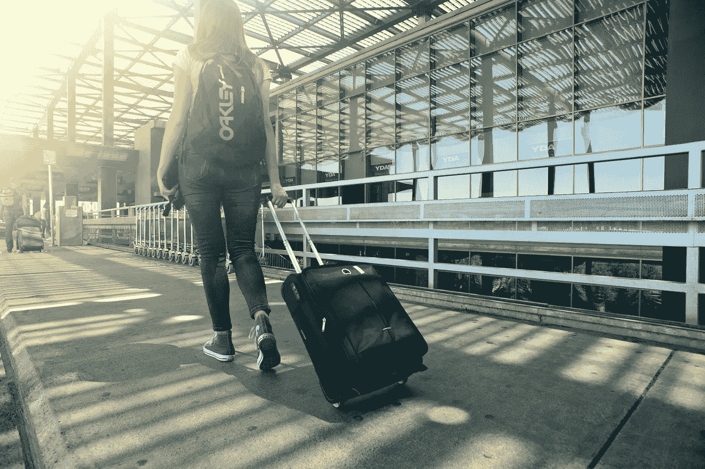

# 不要使用公共 USB 充电站，以及其他网络旅行建议

> 原文：<https://medium.com/swlh/dont-use-public-usb-charging-stations-and-other-cyber-travel-tips-6389e5371683>

Photo courtesy of Oleksandr Pidvalnyi from Pexels

每个人都熟悉旅行安全提示，如将贵重物品留在家中，并锁好酒店房间，但很少有人在旅行时考虑网络安全。然而，根据 [2019 IBM X-Force 威胁情报指数](https://newsroom.ibm.com/2019-02-26-IBM-X-Force-Report-Ransomware-Doesnt-Pay-in-2018-as-Cybercriminals-Turn-to-Cryptojacking-for-Profit)，交通行业现在在网络攻击方面排名第二，高于 2017 年的第十位。