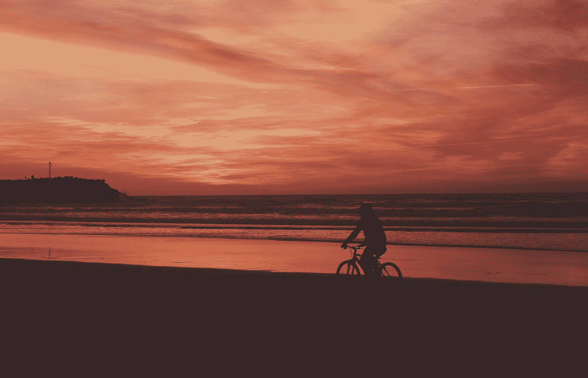

# 为什么死亡和悲剧会让我们想要改变我们的生活？

> 原文：<https://medium.com/swlh/dont-wait-for-death-and-tragedy-to-happen-before-you-live-life-to-the-fullest-d24ce0a96ca9>

Photo by [Aziz Acharki](https://unsplash.com/@acharki95?utm_source=medium&utm_medium=referral) on [Unsplash](https://unsplash.com?utm_source=medium&utm_medium=referral)

## 不要等到为时已晚。

我叔叔吉姆上周去世了。

他是一个随和、爱挖苦人的家伙，用智慧的话语给自己的故事添油加醋。他品味高雅，是白兰地、雪茄和高尔夫的鉴赏家。有时他晚餐吃甜点。因为，为什么不呢？