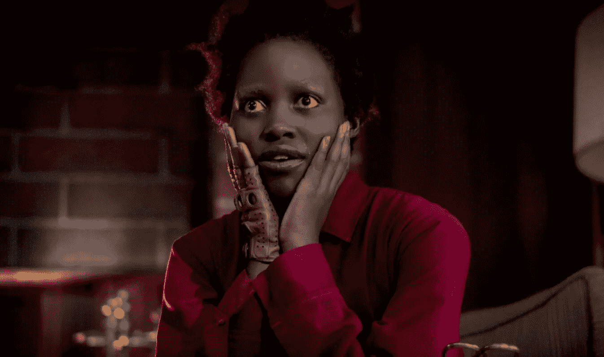

# 为什么现在恐怖电影这么受欢迎？

> 原文：<https://medium.com/swlh/dopamine-and-the-horror-renaissance-351d4c0b38ef>

## 多巴胺和其他恐怖电影大获成功的原因

乔丹·皮尔的《我们》创下了原创恐怖电影有史以来最大的首映票房，仅次于 2019 年的 T2 漫威电影。当然，这种新闻不应该再让我们感到惊讶了。好莱坞恐怖片正在[复兴。在过去的几年里，我们看过像《女巫》这样的电影…](https://mashable.com/article/horror-movies-2018/#Ibv_THkE9mqu)