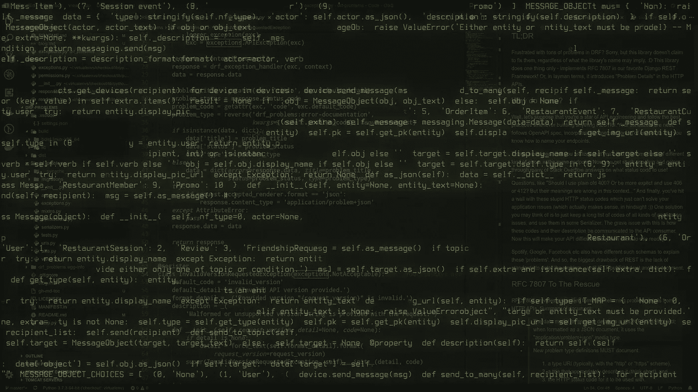

# RFC 问题:最终一个 Django 库实现了 RFC 7807！

> 原文：<https://medium.com/swlh/drf-problems-21f7bb4d4675>

Matrix effect with Python code (Source: Original)

# TL；速度三角形定位法(dead reckoning)

对 DRF 的一大堆问题感到沮丧？很抱歉，但是这个库并没有声称可以修复它们，不管这个库的名字意味着什么。:D 这个库只做一件事——在我们最喜欢的 Django REST 框架中实现 RFC 7807。或者，通俗地说，它在 HTTP APIs 中引入了“问题细节”。