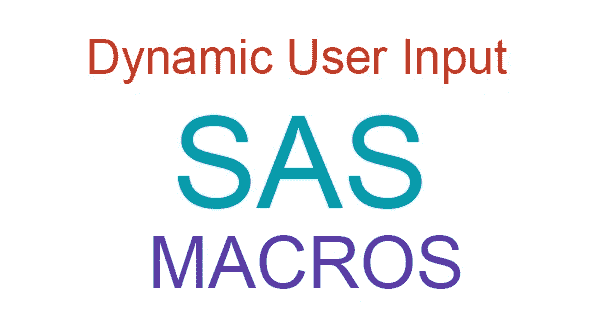

# SAS 中使用宏的动态用户输入

> 原文：<https://medium.com/swlh/dynamic-user-input-using-macros-in-sas-767845adfb49>

宏被认为是 SAS 生态系统的重要组成部分之一。宏的一个最流行的用例是允许 SAS 用户生成可重用的代码，通过改变传递给它的参数可以多次使用这些代码。对于那些熟悉术语*函数*或*方法*的人来说，这可能是一个提醒，它们只不过是可重用的代码块，可以用不同的参数调用它们来获得…