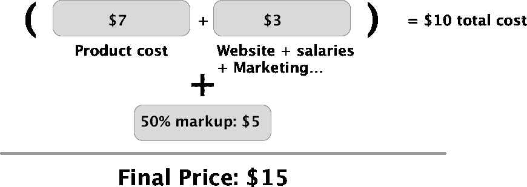
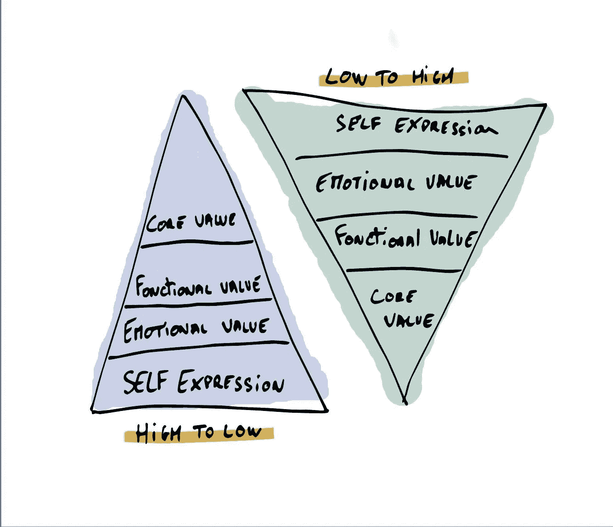
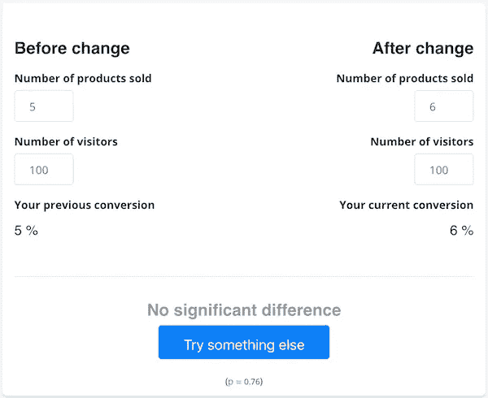

# 电子商务定价策略

> 原文：<https://medium.com/swlh/e-commerce-pricing-strategies-2c86d48ee6ba>

给你的产品定价是电子商务中最具挑战性的事情之一。它会影响你的销售量，你的利润，甚至你的品牌。有许多不同的定价策略，但是，没有一个放之四海而皆准的公式适用于所有不同类型的电子商务企业。

不仅如此，定价是一个过程。你将不得不重复很多次来找到最适合你的。最终目标是为你出售的每件产品找到一个价格，使销售额和利润最大化。

在 PricingBot，我们帮助电子商务公司[监控竞争对手的价格](https://www.pricingbot.co/?utm_source=blog&utm_medium=post&utm_campaign=post2)，我们与客户就他们使用的不同定价策略进行了大量讨论。随着时间的推移，我们已经看到了许多不同的策略和定价因素，在这篇博文中，我们将详细介绍在决定如何为产品定价时需要考虑的不同因素，以及相关的不同策略。

# 定价因素和策略

这个列表并不详尽，每种策略都有其优点和缺点。

# 费用

显然，在决定价格时，首先要考虑的因素之一是产品的价格。当你计算产品的成本时，你可以把一切都考虑进去:生产/购买成本、劳动力成本、促销成本、与产品(电子产品)相关的支持成本、回报率……这些成本会给你一个最低的价格(减去税收)，你必须以这个价格来销售你的产品才能达到收支平衡。传统的定价策略，称为“成本加成”或“基于成本”的策略，是对这一价格进行统一加价。

这里有一个例子，一件 t 恤的固定成本和可变成本为 10 美元，加价 50%。

*优点*

成本基础定价是 ***简单*** 并且可以快速完成。每件产品都有加价，你肯定会有利润，而且你可以证明你的价格是合理的。

*缺点*

它忽略了竞争。成本加成定价可能会产生巨大的影响:你最终要么把产品卖得太低，错失巨额利润，因为它忽略了客户愿意支付的价格，要么卖得太高。

# 品牌宣传

你的品牌定位也应该反映在你的定价中。

*心理定价或价格终结*是一种定价/营销策略，使用略小于整数的“奇数价格”。这是基于有争议的理论，即某些价格会产生深刻的心理影响。例如，9.99 美元可能与 9 美元的支出更相关，而不是 10 美元的支出，尽管更接近 10 美元！

*声望定价*正好相反！声望定价是将奇数价格变成整数价格的事实。一些公司只使用声望定价，因为他们的客户价值是核心/功能价值之外的其他价值，如自我表达、情感价值、社会价值……你不会花 10，000 美元买一块劳力士手表来知道时间，你这么做是因为你热爱这个品牌，因为它是地位的象征等等。这就是为什么劳力士一般定价为整数，而不是 9997.98 美元！高端商品如汽车、珠宝、葡萄酒、奢侈服装品牌的声望定价很常见…

# 价值和独特的销售主张

当有人在你的网站上购物时，他不仅是在购买你卖的产品，他还在购买:

*   顾客服务
*   运输政策(成本、时间)
*   退货政策
*   出色的购买体验(结账、快速网站)
*   很棒的包装

所有这些都取决于产品。例如，在购买衣服时，人们往往对退货政策比对购买电子产品更感兴趣。有时，运输时间本身可能是唯一重要的事情。例如，替换件、电子产品充电器……往往是人们尽快需要的那种产品。

所有这些导致了一种叫做*基于价值的定价*的定价策略。这里的总体目标是根据你的产品为客户提供的价值/好处来销售你的产品，而不是根据它的成本。这是一个迷人的话题，有时，提高价格会导致更高的 ***感知价值*** 基于价值的定价的缺点是，你可能会错过对价格敏感的潜在买家。

# 关于 MSRP 和 MAP 的一个注记

建议零售价或制造商建议零售价是零售商的建议价格。地图定价代表最低广告价格。广告在这里很重要，零售商通常有权以任何价格出售产品，但有时制造商会强制实行最低公开价格。通常，制造商会用批发来奖励顺从的零售商。

美国制造商经常使用地图政策，从理论上讲，它应该通过避免零售商之间的价格战来引导良性竞争。另一方面，MSRP 更多的是教育消费者产品的“公平价格”,并作为零售商计算利润的一种方式。

实际上，在线零售商经常违反该地图。有时你没有选择遵守，因为如果你不遵守，你的制造商可能会根据你签署的地图协议禁止你销售其产品。

# 竞争性定价与 A/B 测试

A/B 测试是一种测试一个独特变量的哪种变化是最有效的方法。它可以用于不同的领域，如改变电子邮件主题以测试打开率，改变网站的颜色/布局并检查对转化率的影响，当然还有对定价的影响。关于定价的 A/B 测试的问题是，对于大多数电子商务公司来说，需要确保我们观察到 A 和 B 之间的真实统计差异的销售量远远高于他们当前的销售数字。

在电子商务中，一个产品页面的典型转化率在 3%到 5%之间(1)。举个例子，你以 4%的转换率卖了一件 19 美元的 t 恤。平均来说，每周有 1000 人访问这个产品页面，销售额为 40。你决定把价格降到 15 美元，看到你做了 50 笔交易，有 1000 人访问了产品页面。万岁，你的转化率提高了 25%……没那么快，不幸的是，数学告诉我们这个结论是错误的。

要回答这个问题:“*给定一件产品 3%的转换率，我要卖出多少才能 95%确定价格变化会影响我的转换率？*“我们可以使用[卡方检验](https://en.wikipedia.org/wiki/Chi-squared_test)。无需深究数学细节，卡方检验可以帮助你确定转换率的差异是否是随机发生的，或者显示真正的统计差异。

[https://www.pricingbot.co/conversion_checker](https://www.pricingbot.co/conversion_checker)

*结论*

一般来说，如果你的某个产品每月没有几百个销量(意味着这个产品页面上有几万个访问者)，那么关于定价的 A/B 测试是没有价值的，没有任何统计意义。

# 基于竞争的定价

这就是基于竞争的定价可以帮助您的原因。如果您没有能力对价格进行 A/B 测试，您仍然可以利用市场上的不同竞争对手，通过监控他们的价格，您可以更好地了解您所在市场的定价动态。这不是一场逐底竞争，你不必把自己放在最便宜的位置，但它会给你一些界限，销售动态。一旦你有了足够的数据，你将能够采取行动，调整你的价格，以销售更多或增加你的利润。

当然，手动完成这项工作是一项耗时的任务，PricingBot 可以帮助您完成这项工作。确定你需要观察的竞争对手可能是一个困难的课题。监控太多的竞争对手往往是无用的，选择正确的是关键，我们将在另一篇博客文章中看到这一点。

我希望你喜欢这篇文章。如果你想得到一些关于定价策略和电子商务的建议，不要犹豫，订阅我们的时事通讯！

来源

1:[https://www . smart insights . com/ecommerce/ecommerce-analytics/ecommerce-conversion-rates/](https://www.smartinsights.com/ecommerce/ecommerce-analytics/ecommerce-conversion-rates/)

*原载于 2019 年 2 月 26 日*[*【www.pricingbot.co*](https://www.pricingbot.co/general/price-monitoring/e-commerce/pricing-strategies/2019/02/05/e-commerce-pricing-strategies/)*。*

## 这篇文章发表在 [The Startup](https://medium.com/swlh) 上，这是 Medium 最大的创业刊物，拥有+428，678 名读者。

## 在此订阅接收[我们的头条新闻](https://growthsupply.com/the-startup-newsletter/)。

