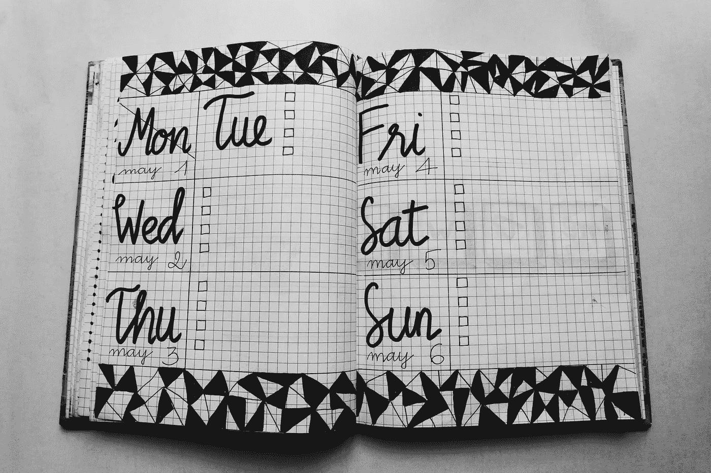

# 每一天都和第二天一样有希望

> 原文：<https://medium.com/swlh/each-day-promises-as-much-as-the-next-72748dca06bc>

Best-laid plans… (Photo by [Bich Tran](https://www.pexels.com/@thngocbich?utm_content=attributionCopyText&utm_medium=referral&utm_source=pexels) from [Pexels](https://www.pexels.com/photo/white-and-black-weekly-planner-on-gray-surface-1059383/?utm_content=attributionCopyText&utm_medium=referral&utm_source=pexels))

# 告诉我为什么我讨厌星期一？

这是星期五早上，一周中我最喜欢的(工作)一天的开始。我去健身房晨练，吃过高蛋白早餐，甚至在这一切开始前，我还进行了十分钟的冥想。

我感觉很好。非常好。周五往往会有这种感觉。