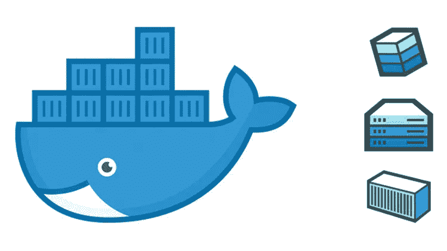

# 轻松停止和删除所有 Docker 容器和图像

> 原文：<https://medium.com/swlh/easily-stop-and-remove-all-docker-containers-and-images-262bbeb62312>

## 清理码头工人。

通常当我尝试新的开发工具时，比如 prisma 或 hasura，我注意到我不断地添加新的 docker 映像、容器等..这些占用了我系统上宝贵的空间，而且真的会增加很快。

我通常不需要在以后回到这些 docker 实例，如果我回来了，通常会有…