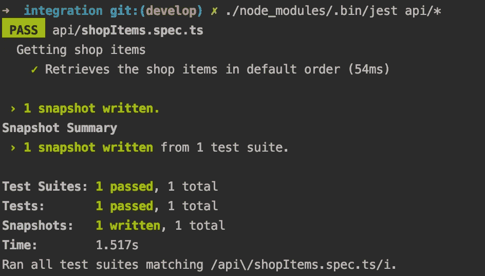
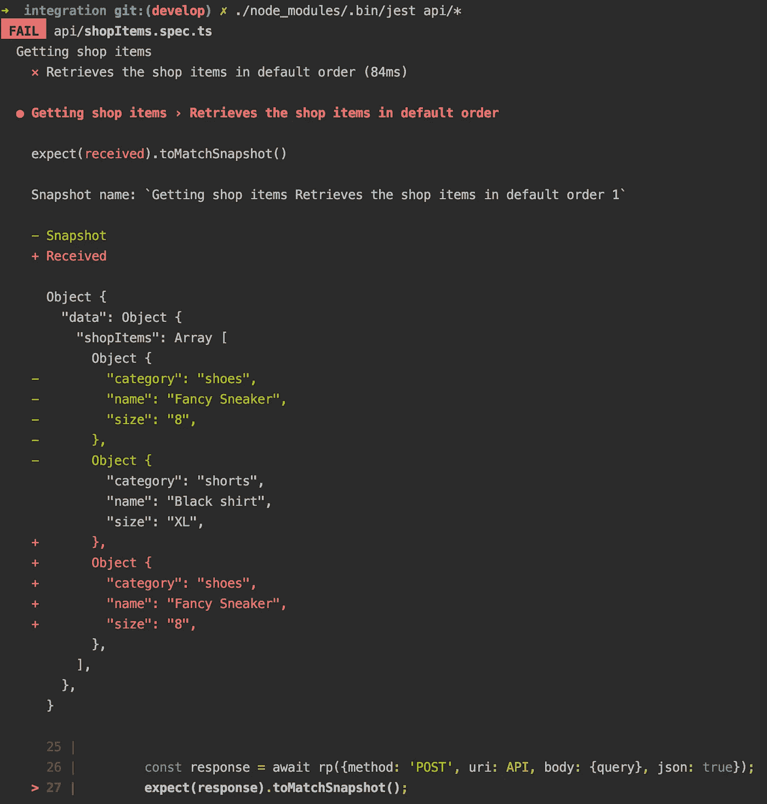
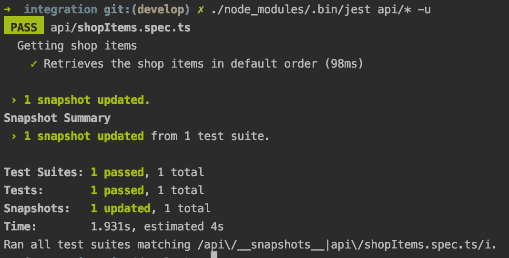

# 用 Jest 轻松集成测试 GraphQL APIs

> 原文：<https://medium.com/swlh/easy-integration-testing-of-graphql-apis-with-jest-63288d0ad8d7>

Photo by [Michał Parzuchowski](https://unsplash.com/@mparzuchowski?utm_source=unsplash&utm_medium=referral&utm_content=creditCopyText) on [Unsplash](https://unsplash.com/search/photos/jenga?utm_source=unsplash&utm_medium=referral&utm_content=creditCopyText)

在现代软件开发中，你肯定知道自动化测试对于软件项目的成功至关重要。但是编写单元测试只是故事的一部分，因为您还需要检查您编写的所有代码是否能够很好地协同工作，以及您的服务作为一个整体实际上做了从业务逻辑角度来看应该做的事情。

本文向您展示了为您的 GraphQL API 编写集成测试的一种(多种)方法。我还将向您介绍一个好的测试是什么样子的，以及我为什么选择这个特定的工具集。这种方法当然也可以用于任何其他微服务或 API 变体。

# 集成测试

当编写*单元测试*时，你总是只测试当前方法中的逻辑。所有对外部方法的调用都应该被嘲笑，所以你实际上并没有写入你的数据库或者真正调用外部服务。*集成测试*有不同的风格:你可能想要模仿一些对外部服务的调用(例如，不提供沙盒服务器的支付 API)，然而，我试图让集成测试系统尽可能接近现实。编写集成测试时，您的目标是以一种您的服务将在以后的生产环境中使用的方式测试您的服务的典型场景(和边缘案例)。

良好的集成测试包括:

*   **隔离:**测试一个场景对另一个场景没有影响，不同集成测试的执行顺序也无关紧要
*   **可重复:**当代码不变时，测试结果总是相同的
*   可以理解:很容易理解特定测试所涵盖的业务案例，以及最终为什么预期的结果是重要的
*   **结构化:**测试文件不应该有太多的行，更复杂的场景应该包含在它自己的测试文件中
*   **简单:**测试应该易于开发团队实现和运行(测试不是许多开发人员最喜欢的任务，所以要尽可能降低门槛)

# 测试数据库和种子数据(例如 MongoDB)

如前所述，您需要确保您的测试可以独立运行并且是可重复的。因此，在执行新的测试场景之前，您需要一个每次都有相同数据集的测试数据库，一个您知道存在某个特定商店商品的数据集，并且您可以编写一个测试来尝试检索 ID 为“xyz”的商品。

创建这个设置听起来工作量很大，但是很容易实现。*首先*您需要一个空的测试数据库，方法是启动一个本地 docker 容器或您的数据库提供商的一个额外的数据库实例。*其次*您从生产数据库创建一个数据库转储，其中包含一些示例数据。对于 MongoDB，可以用一个简单的命令来完成:

只需根据您的数据库设置替换参数。如果您的生产数据库包含大量数据，请特别注意**查询**参数，以便只选择一个子集进行导出。

将数据导入测试数据库就像创建种子文件一样简单。最后，我们可以创建一个 shell 脚本，我们可以随时调用它，在我们的数据库中再次创建完全相同的数据集，如下所示:

> **注意:**始终仔细检查服务器地址或使用生产数据库中不存在的数据库登录，以防止意外删除您的生产数据！

# Jest 与快照的集成测试

首先，你可能会问为什么我们使用 [Jest](https://jestjs.io/) 进行集成测试，有很多其他的工具。我认为重用一个框架有很大的好处，你的开发人员可能已经从单元测试中了解了这个框架，而不必学习另一个框架。这样可以保持较低的准入门槛(对新开发者也是如此)，节省大量时间。此外，Jest 为*快照*提供了一种非常简单快捷的方式来创建集成测试。

假设我们有一个 GraphQL 端点，它返回商店中所有可用的商品。由于我们的种子数据，我们知道会发生什么:

**请求:**

**响应:**

除非我们更改代码或种子数据，否则 API 应该对这个请求返回这个确切的响应。 *Jest 快照*让我们可以轻松检查完整的响应对象。此外，在使用提到的种子脚本运行我们的测试之前，我们需要确保数据集是正确的。总之，我们的第一个测试场景可能是这样的:

## 第一轮

First run creates the snapshot file

第一次运行这个测试时，Jest 会自动创建一个`__snapshots__`文件夹，并在其中创建一个快照文件。仅仅因为控制台显示绿色测试，并不意味着您已经完成了！您必须检查自动生成的快照是否包含您所期望的内容，否则您会认为一个错误的状态是正确的。每次你写了一个新的测试，控制台显示**新的快照**已经写好的时候，这个检查是必要的**。在我们的例子中，快照显示了正确的数据，我们可以将快照文件和我们的测试一起提交到我们的存储库中。**

## 第 n 圈(传球)

在不改变任何代码的情况下再次运行我们的测试是真正的集成测试。Jest 验证来自 API 的响应是否与存储在快照文件中的内容完全匹配。

## 第 n 次运行(失败)

更有趣的情况是当快照不再匹配并且您的测试失败时:

Failing snapshot test after code changes

正如 diff 所示，响应的顺序似乎已经改变，因此不再与我们预期的响应匹配。这可能有两个原因:

*   快照是正确的，你在最近的
    代码变更中引入了一个错误。在这种情况下，测试阻止了一个 bug 的上线，您可以修改您的代码，直到测试再次变绿
*   快照是错误的，因为业务需求已经改变(例如，默认排序现在应该是按名称排序)。在这种情况下，您必须更新快照，通过运行带有`-u`标志的 *Jest* ，并将更新后的快照文件提交到您的存储库中，以确认更改是正确的。

Updating a snapshot after confirming the change is correct

# 从日常生活中学习

使用 Jest 快照是为我们的 GraphQL API 编写集成测试的一种快速方法。然而，如果你做你的研究，你会发现为什么不像这篇博文[中那样使用 Jest 快照](https://blog.usejournal.com/whats-wrong-with-snapshot-tests-37fbe20dfe8e)的许多有效论据。虽然有些观点对于这个用例来说也是正确的，但是我认为用 Jest 快照测试 API 是有点不同的，并且一些缺点是可以避免的。以下是我在实际项目中使用快照的心得:

*   Jest 希望快照完全匹配。由于 GraphQL 只允许我们请求参数的子集，所以您应该只请求那些与您的测试相关的参数。这可以防止测试因为错误的原因而失败。
*   …这也将使您的快照错误更容易阅读，因为差异包含的数据更少。
*   默认情况下，Jest 以*并行*模式运行。如果将两个测试场景(两个`spec.ts`文件)写入同一个数据库集合或表中，可能会产生副作用。为了确保测试的隔离，通过`--runInBand`标志以顺序模式运行 Jest。
*   **最重要的是:**确保您的团队理解快照！测试可以写得非常快，但这是以快照包含大量隐含知识为代价的。您的团队需要更多地考虑失败快照的真正原因及其影响等。之前盲目运行`jest -u`更新快照。

集成测试已经成为我们工具链中的一个重要部分，以防止释放以前在使用单元测试时未被发现的错误。请在评论中留下您对 Jest 快照或其他集成测试工具的体验。