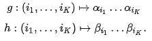
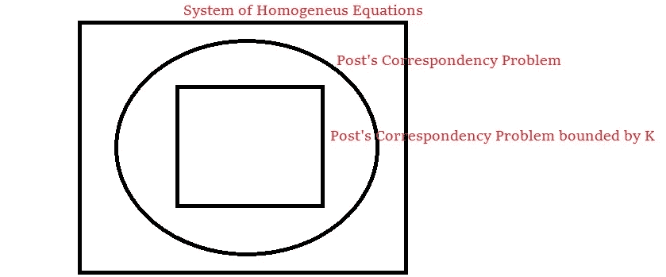

# 帖子走到边上

> 原文：<https://medium.com/swlh/easy-post-for-working-just-in-the-edge-6068b9b07db3>


## 决定它是否可能，甚至是难以解决的

我们可以用计算机计算我们提出的任何东西，这是不正确的。这是 100 年前发现的东西。无论选择什么符号，都有一些问题，你不能确定一个机器可以得出一个答案。

无法用任何算法解决的问题是**不可判定的**问题。也许这就是**邮报**最有趣的遗产:通信的[问题。不可判定的问题可能更容易公式化，也许正因为如此，更容易处理。](https://en.wikipedia.org/wiki/Post_correspondence_problem)

这意味着，如果你有一个带有两个编码***和 ***β*** 的序列 *K* naturals，并且如果你有两个来自同一序列的函数定义 *g* 和 *f* ，它们构成一个带有 ***α*** 和的**字*****

******

***你不能确保有一个*序列*，其中 *g(序列)* = *f(序列)*。***

***试想 *g* 是西班牙语， *h* 是英语， ***α*** 和 ***β*** 可能是他们的字典，从同一个*心态*去理解一个*想法*，那么就没有办法知道两种语言是否能构造出同一个*想法*。考虑到这个概念，我们可以构造一个字典***α****/****β***来获取每个角色扮演的所有对应关系，比如:***α****/****β***= a/baa，ab/aa***

***对于 K = 4，如果我们取 3，2，3，1 = bba ab bba a = bb aa bb baa 为解***

***如你所见，这是同一个字符串，但关联不同。***

# ***输入代码***

***我们可以用这种方式编写任何代码来解决这个不可判定的问题，***

```
*def explodePost(dicc):
    Q = set([])
    newQ = clausure(('', ''), dicc)
    while newQ:
        query = newQ.pop()
        if query in Q:
            continue
        newQ.update(clausure(query, dicc))
        if ('', '') in newQ:
            return True
        Q.add(query)
    return Falsedef clausure(query, dicc):
    R = set([])
    q1, q2 = query
    for x1 in dicc.keys():
        qR = rest(q1+x1, q2+dicc[x1])
        if qR is not None:
            R.add(qR)
    return Rdef rest(str1, str2, CAB = "$_$"):
    if CAB + str1 in CAB + str2:
        return ('', str2[len(str1):])
    if CAB + str2 in CAB + str1:
        return (str1[len(str2):], '')
    return None*
```

***现在你可以想，如果没有可能的代码，你如何构造一个代码？显然，问题是我们不能确保这段代码会完成。但是你可以测试一些东西:***

```
*>>> rest('my cat', 'my dog')
>>> rest('my ', 'my dog')
('', 'dog')
>>> clausure(('', ''), {'a':'baa', 'ab':'aa', 'bba':'bb'})
{('a', '')}
>>> explodePost({'a':'baa', 'ab':'aa', 'bba':'bb'})
True
>>> explodePost({'a':'baa', 'ab':'aa', 'baa':'bb'})
False*
```

***因此，几乎对于某些条目，我们可以确保帖子对应是真还是假。***

## ***为什么它不能工作***

***假设我们构建类似于 *x[Q]y#* 的字符串，其中 *x* 和 *y* 是字母表中的字符串，而 *Q* 表示位于磁带中间的[图灵机](https://en.wikipedia.org/wiki/Turing_machine)中的一个可能的状态寄存器(位置可以是模式 *x[Q]y#* 中的 *len(x)* )。***

***所以，***α****/****β***中的每一个对应都能够代表我们**图灵机**模拟中的任何行为变化。举个例子，***

*   ***如果我们在 Q1 读到字母“a ”,那么向右移动，放上“b ”,然后变成 Q2 → [Q1]a / b[Q2]***
*   ***用{'a '，' b'}字母，从 Q1 向左移动，换成 Q2 → a[Q1]a/[Q2]aa，a[Q1]b/[Q2]ab，b[Q1]a/[Q2]ba，b[Q1]b/[Q2]bb***

***这意味着，如果我们能够解决**帖子的对应**(像 *explodePost* 代码)，那么我们将能够猜测[图灵机是否能够接受特定的条目](https://en.wikipedia.org/wiki/Halting_problem)，考虑到下一步可能是构建一个能够猜测每个代码何时停止的代码，这是不可能的。***

# ***我对 NP 和 P 的保证是什么***

***想象你正在处理一系列的 *K* 元素。该序列是我们将用来确保我们是否构造相同结果的索引*f*(seq)=*g*(seq)。***

```
*def testPost(seq, items):
    A = ''
    B = ''
    for i in seq:
        A += items[i][0]
        B += items[i][1]
    return A == B>>> testPost((2, 1, 2, 0), 
       [('a', 'baa'), ('ab', 'aa'), ('bba', 'bb')])
True*
```

***在线性时间中，如果我们事先放入一个序列，我们可以测试配对条目是否有对应关系。所以，如果我们确定每个序列的最大长度，这个问题就容易验证了。这意味着存在一个**图灵机**线性有界，它将接受那个条目，我们可以用 *K* 不确定的值来配置那个机器，以一种不确定的方式。***

***当我们可以在有限数量的**图灵机**下在多项式时间内接受一个条目时，我们考虑那个问题 **NP** 。如果接受条目的代码在多项式时间内工作，问题将出现在 **P** 中。***

*   ***简易验证*和*可解问题= **NP** 问题***
*   ***轻松解决= **P** 问题***

***事实上，我们总是可以独立于输入建立一个最大值 *K* 。所以在上面的代码中， *testPost* ，有最大数量的*seq*；其中 *seq* 是*项*中定义的**非确定性图灵机**接受条目所需的证书。 *K* 和接受输入所需的代码之间没有关系(反正不需要代码解码 *K* )。所以我们必然推断出 **P** 不同于 **NP** 。***

## ***而且***

***想象我们在字母表中构造一个字符串 **w** 。我们决定以两种不同的方式将字符串分成 K 个子字符串。所以现在我们有 *K* 对子字符串作为 *validEntry* ，它作为 **Post 的对应关系**的一个条目。知道`explodePost(validEntry)`会在有限时间内返回*真*(*explode post(valid entry)*是一个可解的问题)，但如果不知道哪个值是 *K* ，代码就不容易解。***

***假设我们知道 K，我们将得到一个容易解的代码，***

*   ***代码(*K*)； *validEntry* 返回多项式时间内的有效序列。***
*   ***代码(*K*)； *anyEntry* )在多项式时间内返回结果。***

***如果 *anyEntry* 有效，它将返回有效序列，您可以测试是否是有效条目。如果无效，它将返回任何内容，但是考虑到无效字符串，您会注意到这一点，因此您可以生成一个测试，其中:***

*   ***testPost(代码(K；anyEntry)，anyEntry)在多项式时间内返回**岗位对应**。***

***这意味着我们只需要从参数 K 创建一个代码，这个代码将接受任何输入来生成序列。但这是荒谬的:如果我们不能为每一个序列构造一个通用的代码，我们怎么能为每一个长度的序列配置所有的代码呢？***

***所以我看到 **NP** 类出了 **P** 类也有问题。***

# ***结论***

***正如我们所见，许多被认为非常复杂的问题由于这种符号而得以简化。如果你想确定一个条目何时无解，你也可以发明一些技巧。***

***例如:对于条目{a/baa，ab/aa，bba/bb}，您可以将其转换为{$a$/$baa$，$ab$/$aa$，$bba$/$bb$}。因此，每一对都可以通过 2-gram 嵌入到向量中，其中$a$/$baa$可以是{'$a':1，' $b':-1，' ba': -1，' aa':-1}。之后，你用条目的大小来构造你的矩阵。我们能用那个矩阵找到一个像齐次方程组一样的解吗？如果响应不是，则该条目无解。***

******

***如您所见，即使有办法处理 Post 的通信问题，***

*   ***如果齐次方程组失败，后一个方程组将无解。***
*   ***如果被 K 包围的帖子产生了一个解，那么帖子一分享这个解。***

***即使你认为一切都结束了，总有一个代码可以帮助你继续前行。***