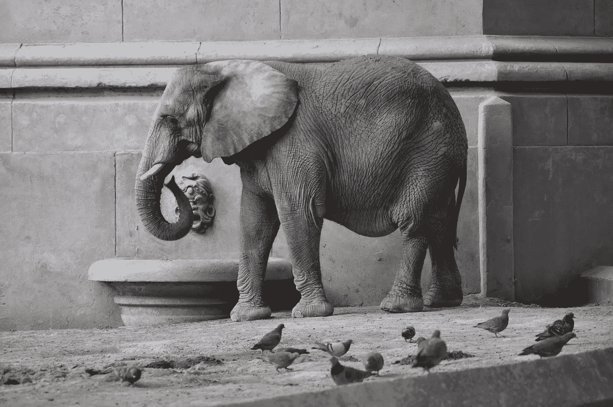

# 一次吃一口(策略)大象

> 原文：<https://medium.com/swlh/eat-the-strategy-elephant-one-bite-at-a-time-a18d4e6688fd>

Photo by [Javier Márquez](https://unsplash.com/@jav0111?utm_source=unsplash&utm_medium=referral&utm_content=creditCopyText) on [Unsplash](https://unsplash.com/search/photos/elephant?utm_source=unsplash&utm_medium=referral&utm_content=creditCopyText)

我的朋友莎拉最近带我去吃饭，就她的新工作征求我的意见。她刚刚接任一家小型非营利机构的执行董事，上任 45 天后，就被她面临的大量工作压得喘不过气来。她负责发展这个组织——提高社区的意识，增加收入和使业务专业化。这将需要大量的工作来…