# 2019 年增长最快的电子商务商店[客户获取研究]

> 原文：<https://medium.com/swlh/ecommerce-case-study-5b28ccdc3bfe>

## 收入增长 8.86 倍—看看这些零售商是如何做到的。

2019 年电商正在爆发。

新的商店、品牌和产品每天都在涌现…

每天我们都会听到一家新的创业公司颠覆一家老掉牙的公司。或者下班后的补锅匠，他的聪明的新发明我们不能没有。

美好的一面是更多的人得到了服务。小众人群可以接触到新产品，这些产品以前从未有过经济可行性。

如果没有今天的电子商务能力，[蹲厕](https://www.facebook.com/squattypotty/)*永远不会*成为现实…

没有实体店面的宠物店 Chewy.com 也无法与拥有 1500 个店面的宠物商店 PetSmart 竞争，后来被他们以 33.5 亿美元的价格收购。

此外，凭借今天的能力，这些新品牌将继续寻找真正的、切实的成功，使他们能够进一步创新他们的新产品和想法。以新的奥拉环为例，这是一种揭示我们睡眠新水平的设备。

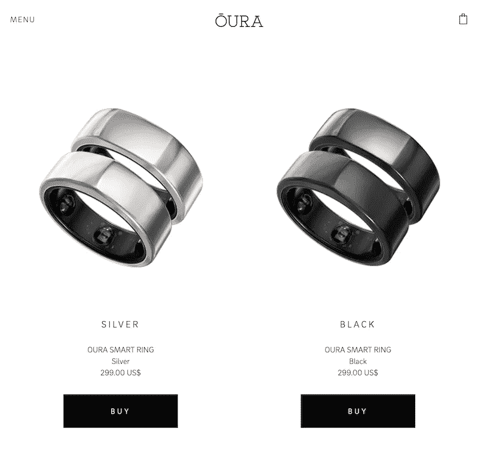

*These hot new gizmos have been known to sell out months in advance.*

# 10 倍的机会

一个精益和吝啬的创业团队，或企业内部企业家 skunkworks，有越来越多的无限机会推出新品牌，磨练产品，并把新的想法推向市场。与商店货架上的产品相比，这些新产品为消费者提供了更多更好的选择。

然而，电子商务的影响不仅仅局限于纯数字业务。**实体店**现在也可以扩大其覆盖范围和内部可见性——比如，当我现在需要一件商品，想看看街上当地商店手头有什么时。

在过去的十年里，电子商务每年增长 15%。然而，现在电子商务已经接近美国零售总额的 10%。*几乎没有触及表面*。

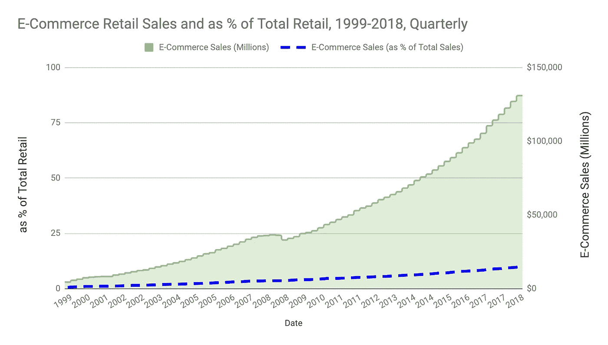

*E-Com growth is accelerating, yet has only reached 10% of retail sales.*

首先，我们看到最普通的商品，如小饰品和 t 恤衫，转移到了网上。我们现在看到专门的购买正在以数字化方式发生，如眼镜，这得益于技术的进步——**增强现实** **产品探索**——以及以顾客为中心的运输和退货政策**的在线购买体验**。

电子商务发展得越快，出现的平台、工具和技术就越多。

充斥市场的插件、小工具和浏览器扩展越多，前景就越混乱。今年，营销人员收到了超过 7，000 个“解决方案”的轰炸。

如果你在电子商务或零售行业工作，**发光物体综合症**每天都会多次威胁你的战略——知道该认真对待哪个是一个挑战。

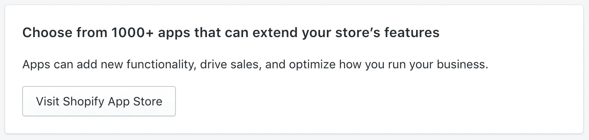

*So many apps… so little time.*

新人想知道最好的起点和做出的选择。

零售商需要不断关注当前的渠道和策略，否则就有在不断变化的平台上被排挤的风险，因为趋势、品牌和声誉会在瞬间发生变化。

今天，希望进入电子商务的公司可以通过了解顶级商店的工作方式并选择未来商店的最佳起点而受益。

**你的商店达到标准了吗？**如果不是，请继续阅读，看看你的商店与这些零售商的不同之处。

你准备好推出新产品了吗？看看现在什么在起作用。

# 警告

行业研究对于了解市场趋势非常有用。

但是**成功的主要标志**是拥有满足市场真实需求的优秀产品或服务。

⚠️无论选择多少正确的技术或营销手段都无法挽救一个糟糕的产品。

# 案例研究方法

为了编写这个案例研究，[我们的团队](http://modernmedia.io/)分析了 [Inc. 5000](https://www.inc.com/inc5000/list/2018/industry/retail) 中增长最快的电子商务商店。我们调查了所有垂直行业、地点和平台的在线自助结账零售商。

我们使用行业标准工具，比如 [Moz](https://moz.com/) 、 [SEMRush](https://www.semrush.com/) 、 [BuiltWith](https://builtwith.com/) 等等，同时对页面、小部件、广告等进行人工检查。

原始数据可通过电子邮件 [hello@modernmedia.io](mailto:hello@modernmedia.io) 获得。

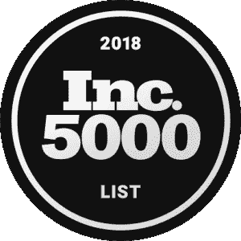

# 2019 年增长最快的商店趋势

首先，我们观察了垂直市场，看看哪个在增长最快的商店列表中占有最高的比例。

然后，我们比较了每个垂直方向的增长率。

**风格&时尚**和**健康&健身**是两个领先的垂直市场。

服装和服饰等时尚产品所占比例最高。从新的主流男女品牌到有趣的新利基市场，如[医用手术服](http://wearfigs.com/)和[肩负抗癌使命的豆豆服](https://loveyourmelon.com/)(即。脱发的人)。

健康与健身显示了**最快的中间值增长。**

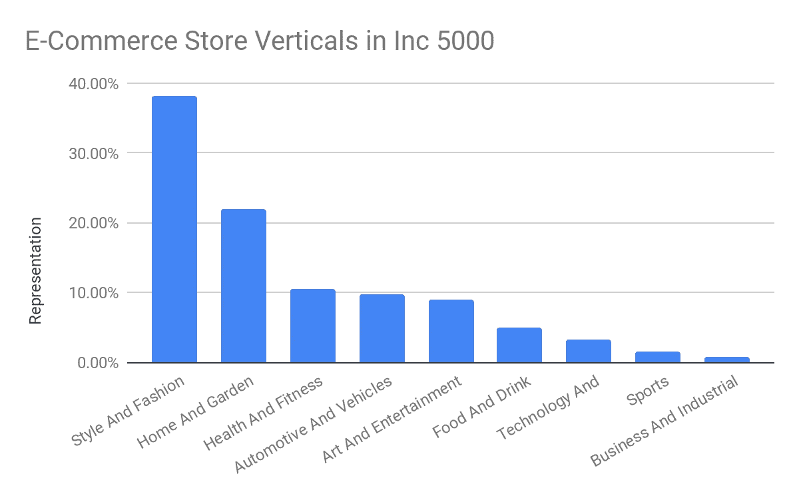

*Feel like you’ve seen hundreds of new ads for yoga pants & gym shorts? You have.*

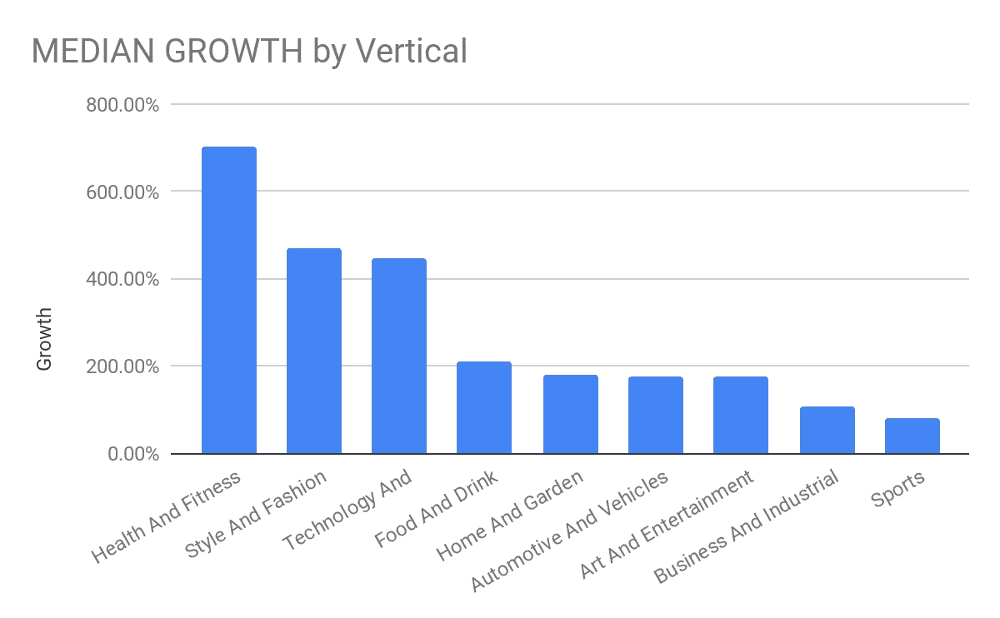

*Health & fitness was the fastest growing — Consumers pull out their wallet to feel, look, and perform better.*

# 电子商务平台

网站是公司进入在线市场时做出的第一个关键技术决策。

这个决定将决定你的选择和网站功能、部件和扩展的限制，你可以把它们集成在一起。

我们发现 [**Shopify**](https://shopify.com/) **是目前增长最快的商店中** **使用最多的电子商务平台**。Shopify 的商店增长中值也是最高的。

[**Magento**](https://magento.com/) 在采用率和店铺增长率方面均位居第二，在收入较高的店铺中确实有很强的代表性。

选择采用率高的平台非常重要，因为每个平台都有自己的支持社区、开发者生态系统、问答论坛和应用商店。采用率越高，你在所有这些领域的选择就越多。

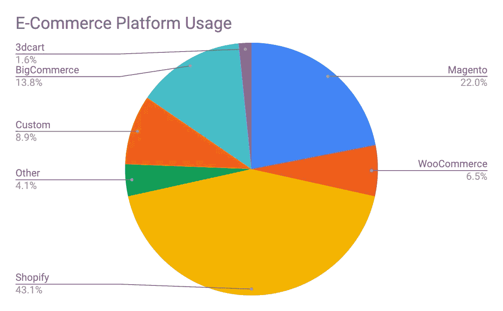

*Shopify is the most used e-commerce platform among the fastest growing retailers.*

*Shopify stores scored the highest median growth*

# 网站部件和技术

随着电子商务的爆炸式增长，新插件和网站扩展的生态系统也随之涌现。

这个[广阔的**科技景观**](https://cdn.chiefmartec.com/wp-content/uploads/2018/04/marketing_technology_landscape_2018_slide.jpg) 每年都在翻倍增长！

那么，选哪个呢？

但是对于一些主要的技术，**我们发现微件的采用是相当分散的**。谷歌分析和脸书像素当然是最受欢迎的，但唯一其他值得注意的部件(即。不包括谷歌字体 API 和其他内置在各种框架中的工具)有[谷歌标签管理器](https://tagmanager.google.com/)、 [Klaviyo](http://klaviyo.com/) 和 [Hotjar](http://hotjar.com/) 。

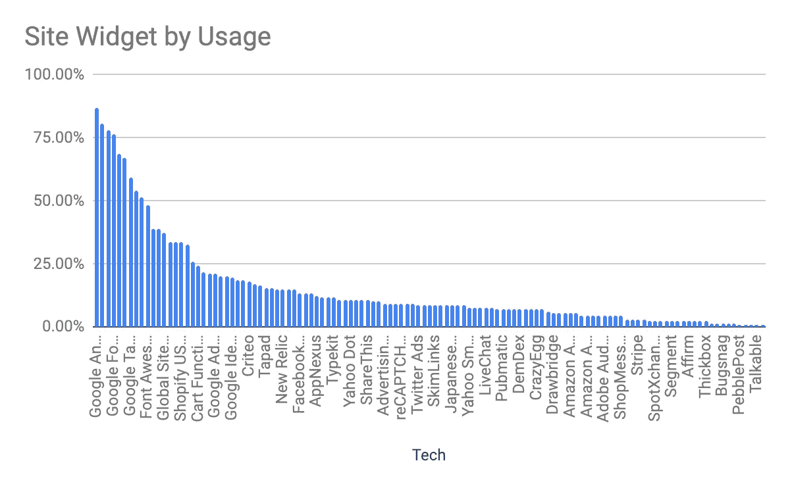

*Widgets were highly fragmented. No wonder sites are always breaking 🤷‍♀️*

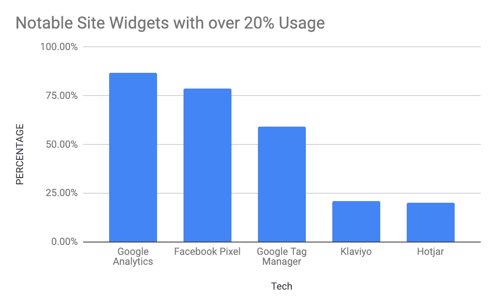

*No surprise on GA & FB Pixels… and why retargeting ads give us daily deja vu.*

# 客户获取

这就是有趣的地方。任何人都可以用漂亮的网站设计开一家新的电子商务商店，但是今天什么能让**获得新客户呢？**

一旦你的商店上线了，你如何到达你的目标市场？你可以拥有世界上最好的产品，选择最好的电子商务平台，但是如果没有人光顾你的商店，收银机是不会响的。

你的电子商务营销计划需要包含哪些内容？

这是发展最快的商店的做法…

# 有机和搜索引擎优化

搜索是一个巨大的渠道。**谷歌**每天处理超过[35 亿次搜索](http://www.internetlivestats.com/google-search-statistics/)。

因此，为了衡量有机流量和 SEO，我们查看了每个零售商的**域权限(DA)** 。

对于增长最快的电子商务商店，我们发现平均和中间域权限分别为 35–37。

如果我们期望看到流行的、快速增长的网站，这是一个相对较低的数字。

这可能是因为 **SEO 排名——和域名权威——需要时间、内容和链接**来建立。网站存在的时间越长，指向它的链接越多，这些链接的权威性，以及谷歌对网站内容的评估，在很大程度上构成了 DA 分数。

> 你的市场营销怎么样？我们可以提供帮助。

电子商务商店通常不被认为是内容丰富的网站。他们可能有一些博客帖子，可能在产品页面上有视频，但他们的重点是他们销售的产品或服务，并帮助客户完成结账过程。

因此，他们可能有更多的页面——目录、类别和产品页面——但与新闻或媒体网站相比，每个页面的内容都比普通页面少。

单薄的内容加上快速增长的事实，意味着他们可能还没有建立起有机排名所需的内容、链接和权威。**内容营销**需要时间。

甚至对于有时间的商店来说……他们的有机排名可以被一个搜索广告瞬间拉低。

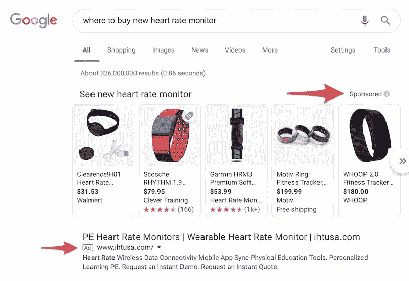

*Organic results are typically pushed down by a handful of ads.*

**搜索引擎需要时间**来抓取一个网站，索引其内容，并在它出现在搜索结果中时评估其性能。用户会点击进入吗？搜索结果满足他们要求了吗？还是他们反弹了又找？这些搜索需要时间来发生和聚集成排名。

由于总体 DA 平均值较低，所以看到**较高的域名授权和较高的增长率之间几乎没有关联也就不足为奇了。**

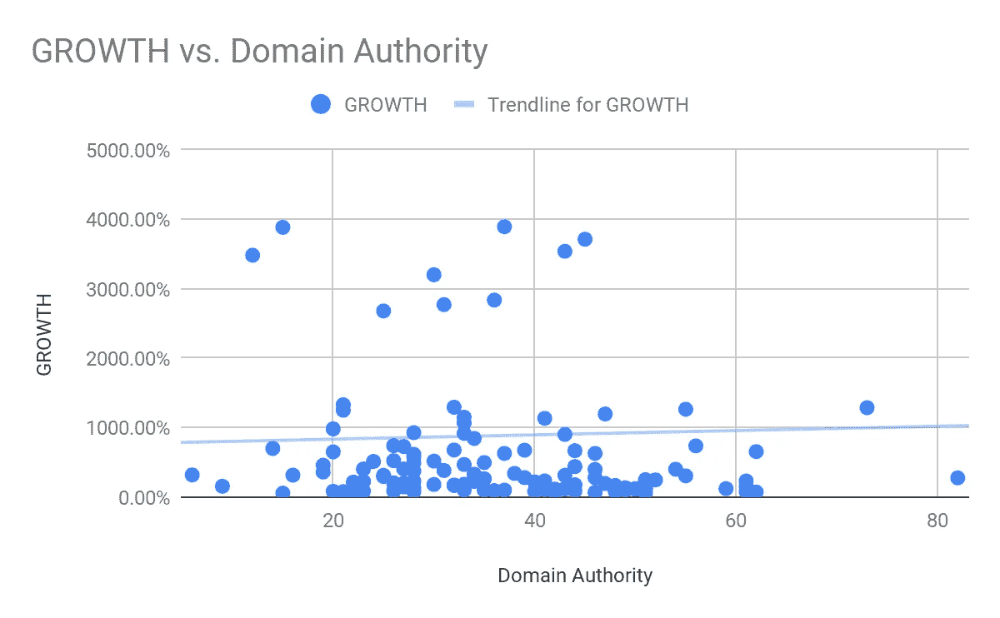

Higher DA had little correlation to store growth.

事实上，深入挖掘入站链接和每一个链接的域名——域名权威的重要因素——我们发现更多的链接和增长之间存在负相关。**联系越多，增长越少**。🙀

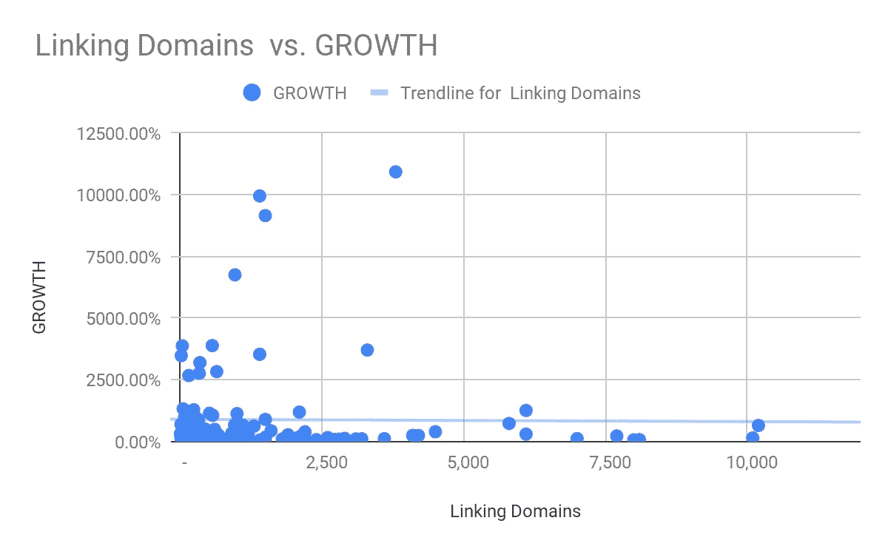

Is link building is dead⁉️

再说一次，有机流量可能是一个巨大的流量来源，你的内容策略对持续成功极其重要…但**域名权威似乎不是这里的增长指标**。

那么，是什么推动了增长呢？…

# 有偿收购

我们研究了增长最快的商店的在线广告，以及它们对脸书、Instagram 和谷歌广告的使用。

对于增长最快的电子商务商店，我们发现 66.67%使用谷歌广告，60.98%使用脸书广告。总体来看， **78.86%的人使用过某种形式的广告**。

这个数字对于排名前 25%的商店来说更具决定性——96.97%的商店做了广告。

广告是将你的信息传递给新观众的最快方式。

对于那些运营脸书和 Instagram 广告的人来说，每个商店的广告数量中位数在 10 到 25 个之间，其中最常见的是脸书 Instagram 上的 25 个以上的广告。

增长和广告的使用也有关联。**做广告的电子商务商店比不做广告的商店增长快 3.67 倍。**

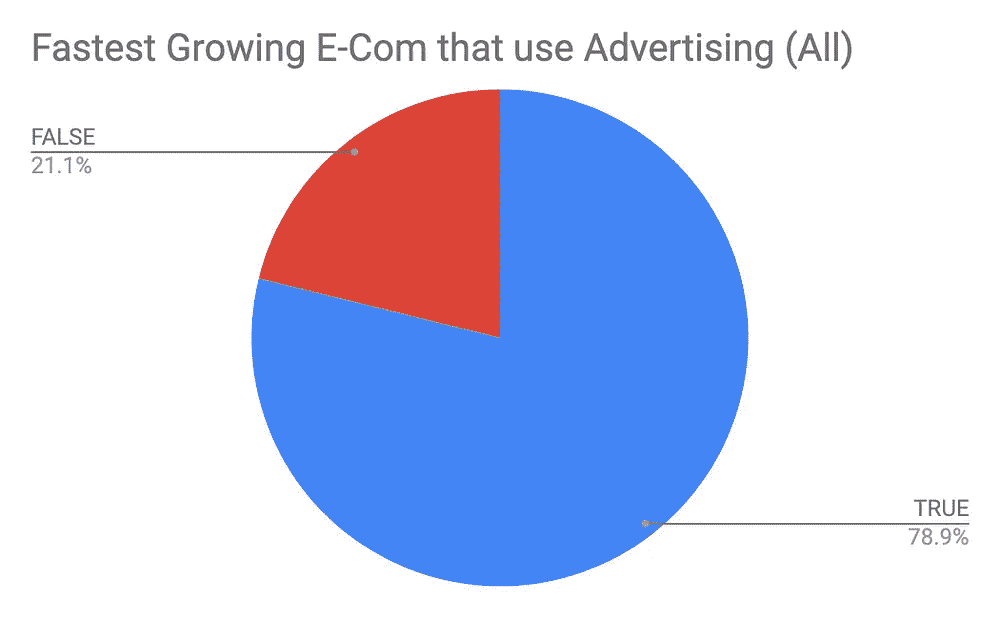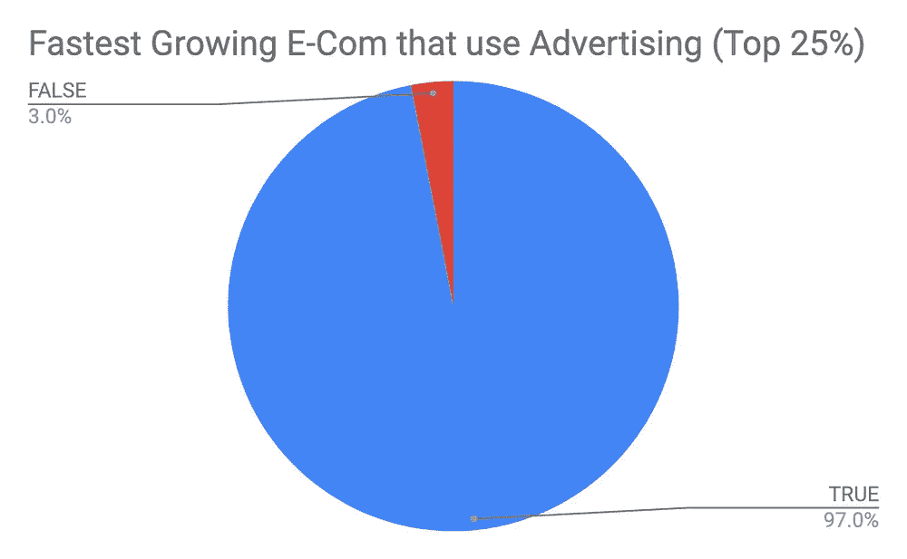

*Advertising was prevalent among fast-growing retailers.*

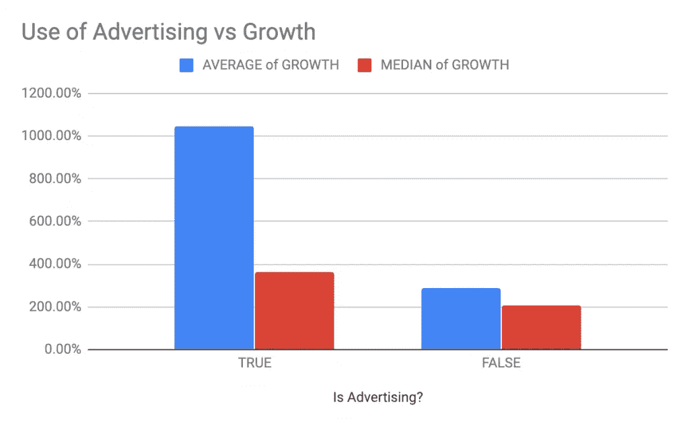

Throw some fuel on that fire 🔥 — Stores that advertise had higher growth.

根据受众的不同，你有不同的方式进入目标市场——比如原生广告(脸书、Instagram、Pinterest)、展示广告(谷歌展示网络——GDN)、搜索广告等等。

> *你的商店在获取顾客方面需要帮助吗？我们已经帮助许多零售商实现了盈利目标。*
> 
> *取得联系！→*[*Anthony @ modern media . io*](mailto:anthony@modernmedia.io)

# 广告增长

广告与增长的相关性可能在一定程度上也与它为公司提供的实时市场反馈有关。

当一个活动由一系列广告发起时，每一个广告和每一次点击都可以与许多互动联系起来——一个赞、一条评论、一次网站访问和一次购买(如果发生的话)。这些数据很快指向了推动最多点击和最多购买的视觉效果和信息。
着眼于这种广告效果反馈的公司可以迭代他们的产品或服务— **磨练他们的产品与市场的契合度，以更好地服务他们的受众**。

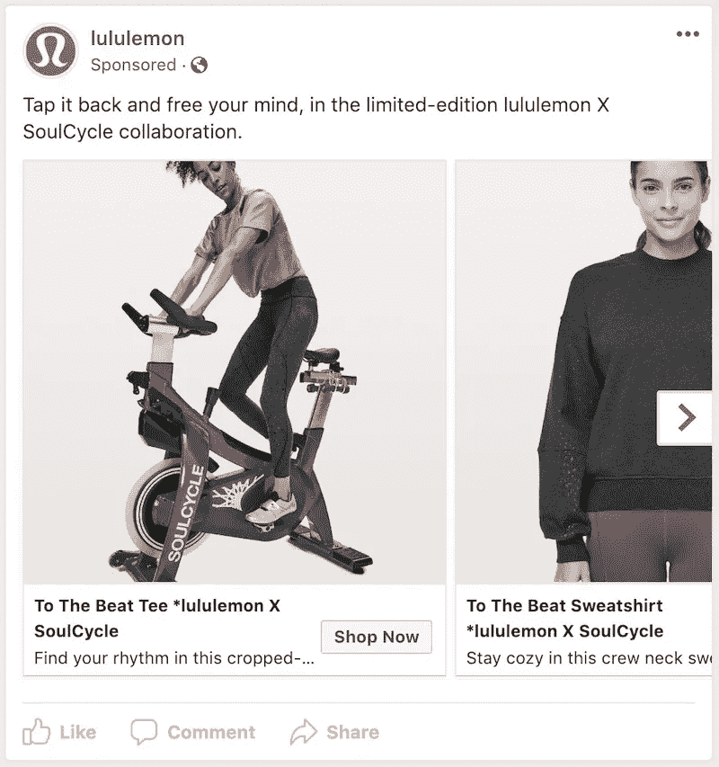

*Does the tee shirt or sweatshirt draw more clicks?*
*Do SoulCycle collabs perform better? #SplitTesting*

这些公司必须能够专注于他们的顶级广告活动，并产生积极的投资回报……否则他们将很快烧完现金并倒闭——尤其是在这些商店运营的规模下。

一旦实现了正回报，收入可以随着投资而增长，假设有足够多的目标受众，那么每增加一美元广告就可以获得利润。

广告也有助于快速测试新市场和新受众。一旦一个活动开始运行，基线绩效建立，就有可能复制该活动，并将其设置为针对不同的关键字、兴趣或人口统计数据。这些新观众的购买倾向是高于还是低于我们的平均水平？

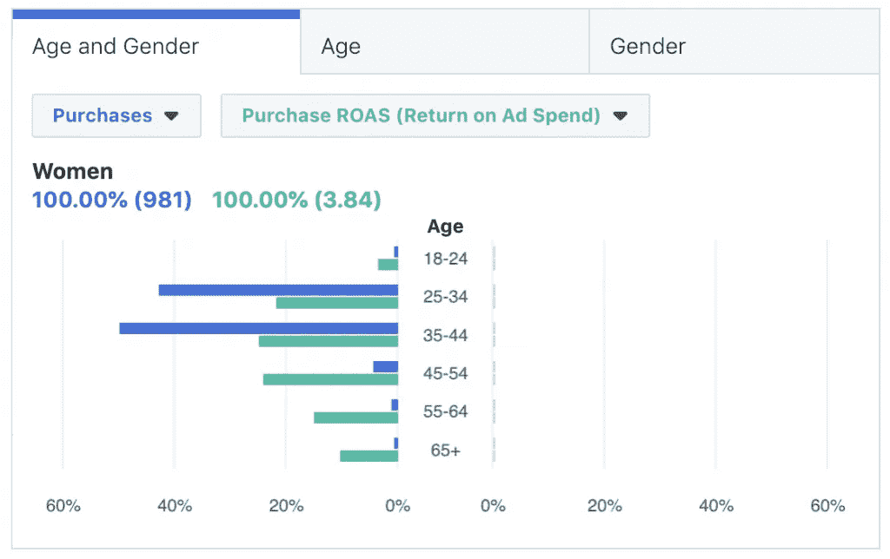

*Younger women are making most of the purchases, but the few purchases made by older women have a very high ROAS… it’s probably worth considering that older demographic. 👵*

类似地，活动目标可以保持不变和重复，同时使用新的广告、图像和消息——可能是新的产品系列或新的季节性目录系列。这些新产品吸引了更多还是更少的顾客？

随着公司的发展，**这是商店进入新市场、开发新产品和服务的方式**。

# 额外收获:社交媒体

> **现已上市！**在[modernmedia.io/ecommerce-growth-study/](http://modernmedia.io/ecommerce-growth-study/)查看更多社交媒体见解

# 扩大你的商店

准备好将此应用于您的商店了吗？你现在知道了最受欢迎的网站平台和插件，也看到了客户获取渠道和增长之间的相关性。希望你已经为你的电子商务营销计划带走了一些想法。

如果你准备成长，看看你的目标市场花费大部分时间的平台上的付费广告机会。

让你的信息出现在你的观众面前，磨练你的广告活动，直到你达到圣杯**广告支出的利润回报(ROAS)** 。

…与此同时，不要让小工具让你的网站崩溃🙃

> 准备好为您的企业进行营销了吗？您可以通过 [anthony@modernmedia.io](mailto:anthony@modernmedia.io) 联系我和我的团队

*最初发表于*[modernmedia.io/ecommerce-growth-study/](http://modernmedia.io/ecommerce-growth-study/)。

## 这篇文章发表在 [The Startup](https://medium.com/swlh) 上，这是 Medium 最大的创业刊物，拥有+415，678 名读者。

## 在这里订阅接收[我们的头条新闻](http://growthsupply.com/the-startup-newsletter/)。

