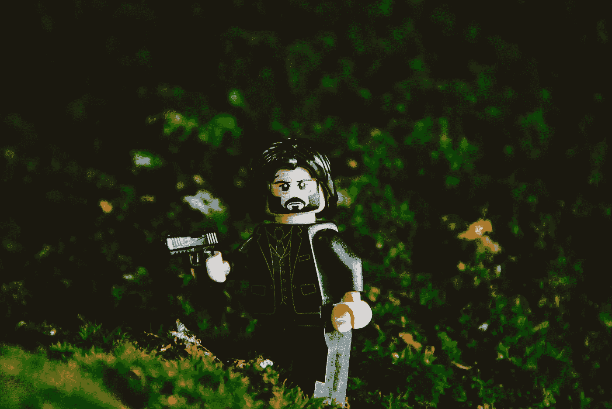

# 疾速追杀和伟大的作品有什么共同之处？

> 原文：<https://medium.com/swlh/editorgoldenrules-117debc595c3>

## 编辑出版界沉默的超级英雄

## 他就像一个秘密编辑，被派来清理作家的肮脏作品

Photo by [Hello I’m Nik 🇬🇧](https://unsplash.com/@helloimnik?utm_source=unsplash&utm_medium=referral&utm_content=creditCopyText) on [Unsplash](https://unsplash.com/search/photos/john-wick?utm_source=unsplash&utm_medium=referral&utm_content=creditCopyText).

文字有时会笨拙地出现在纸上和屏幕上，更像是血迹而不是干净的镜头。