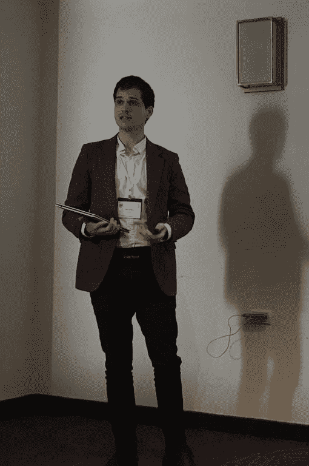

# 教育技术与移情

> 原文：<https://medium.com/swlh/educational-technology-and-empathy-3caf64add4b1>

Teaching kids about empathy through video games

> “你要尽心、尽性、尽性地爱主你的神”(申命记 6:5)。

由 [**青少年移情专家帕兹·格雷斯**](https://www.linkedin.com/in/bajanpaz/)

耶稣用两句话总结了道德——前一句话和“爱你的邻居如你自己”(马太福音 22:36-40)。

这种本质帮助我通过视频游戏向青少年教授伦理和同理心，这是一个与联合国教科文组织生物伦理学教席合作的扶轮社奖学金项目。

犹太法典进一步解释“全心全意”为两种倾向:善与恶(Berachot 54)。此外，英雄中的英雄会让他的邪恶敌人成为朋友(Avot d'Rabbi Natan，第 23 章)，以更好地服务于爱主的目的(Ashlag，2019: 256)。

当我开始教学时，这个概念对我来说很陌生——技术只是为了更好地教那些只对智能手机感兴趣的学生。我希望把他们分散注意力的敌人变成朋友。然后游戏成了他们的帮助英雄，也成了我的帮助英雄。这给了我们共同点。这让我们成了“邻居”。

多达 97 %的美国青少年在电脑、游戏机或便携式设备上玩视频游戏(Lenhart 等人，2008 年)。那些屏幕上发生的许多事情将留在屏幕上，除非在现实世界中处理(Holbert & wilen sky，2014；梅尔佐夫，2007；Okita、Bailenson 和 Schwartz，2007 年)。出于这个原因，美国儿科学会建议和孩子们一起看电视，一起玩游戏，或者至少一起玩。

对在屏幕上看到和学到的东西进行简单的讨论，对现实世界的学习大有帮助。Want 和 Harris (2001)进一步指出，一个失败的机会，然后学习成功，比一开始就成功更有益。游戏可以成为许多学习机会的催化剂。Holbert & Wilensky (2014 年)展示了游戏，以教授科学、技术和数学，甚至 Katsarov 及其团队(2017 年)的伦理学。

让我们一起开始教授移情和技术。

Empathy Expert Paz Grace speaking at UNESCO Conference