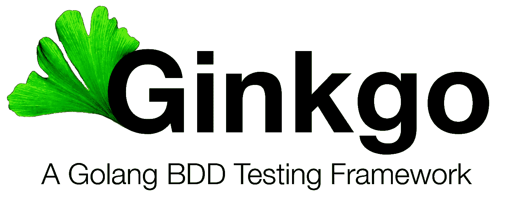

# 有效的银杏/戈美加

> 原文：<https://medium.com/swlh/effective-ginkgo-gomega-b6c28d476a09>

在撰写本文的近四年时间里，我一直在使用[银杏](https://github.com/onsi/ginkgo) BDD 测试库及其首选匹配器库 [Gomega](https://github.com/onsi/gomega) 编写 Go 测试。在那段时间里，我发现了一些在我加入的项目和我开始的项目中反复出现的实践，希望对你有用。我不愿意将这些称为“最佳实践”，而是将这篇文章命名为“有效”，因为尽管这些在大多数情况下对我有效，但它们可能并不有效…