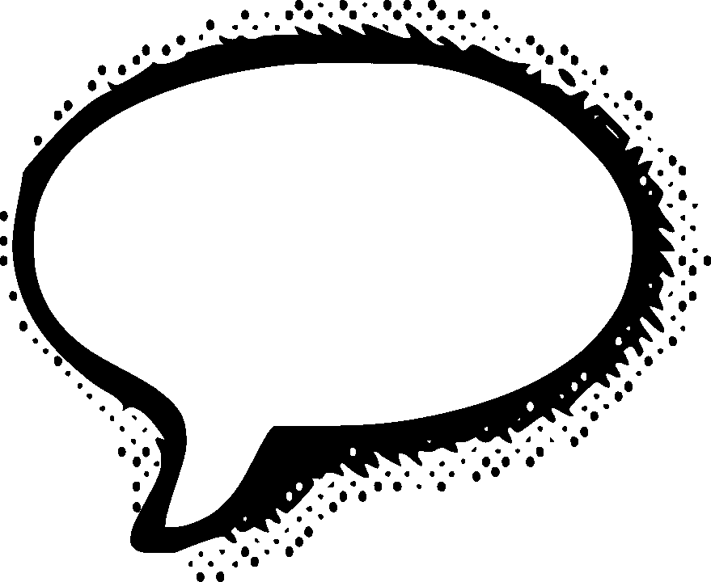

# 有效的公共演讲:写一篇引人入胜的演讲的技巧！

> 原文：<https://medium.com/swlh/effective-public-speaking-how-to-write-a-spellbinding-presentation-70e9b111ce87>

“公众演讲”。这两个词让 98%的人感到恐惧。如果你是那 2%对这些话不感到不舒服的人，我讨厌告诉你这些，但是…你可能是一个超级英雄。

我先说这个:我绝对不是超级英雄。在我出去演讲之前，我仍然会感到紧张，即使在过去的五年里成功地演讲了 30 多次之后，我仍然会感到不舒服。但幸运的是，要成为一名成功的演讲者，你不必完全自信和舒适。在过去的几年里，我一次又一次地将自己推出舒适区，利用曾经扼杀我演讲的紧张情绪，在我所在的社区和更远的地方发表引人入胜的演讲。

无论如何，它们都不是完美的；事实上，在我的最后一次演讲中，当我踩到旁边的笔记本电脑电缆时，我的牛仔裤在一个相当危险的地方裂开了。在 T1 之前，我开始了我的演讲。我已经破烂不堪的神经像我的裤子一样迅速被撕裂，我不得不沉着地抬起视线，以迎接观众们期待的目光，幸运的是，他们没有注意到任何事情出了差错。上演一出戏，没人会知道。

因此，作为一名经验丰富的公众演说家，这里有一些我来之不易的技巧。我把这些给你，希望你能避免我犯的一些错误，如果你有任何成功的故事，请让我知道。

*   **呼吸**

这是人们犯的最基本的错误之一，无论是在演讲前还是在演讲过程中。正如任何瑜伽老师会告诉你的那样，控制你的呼吸是让自己平静下来的一个非常强大的工具。它还可以降低你的心率，改变你的化学组成，帮助你做好准备。当等待开始你的演讲时，试着吸气，同时数到五，呼气时也这样做。重复这三次，看看你感觉如何。即使在潜意识层面，控制自己的呼吸也会给你带来提升——你可能会觉得自己缺乏控制力，因为你坐在那里担心自己比现在的演讲者差。好吧，这是你可以控制的小而有益的东西。在谈话过程中，不要害怕停下来喘口气。你的语言是由你的气息提供动力的，所以不要低估它的价值。

*   **用你的神经作为动力**

好吧，所以你很紧张。这完全正常，我向你保证。然而，紧张和兴奋都是由人类大脑中同一个腺体分泌的激素驱动的。也许你可以欺骗自己，让自己认为你很兴奋，并利用这些积极的感觉。我个人认为，紧张和兴奋是一个硬币的两面，紧张预期会发生不好的事情，兴奋预期会有好的事情。而你有什么理由相信会有不好的事情发生？你将会做一场精彩的演讲，每个人都会在演讲结束时走向你并向你祝贺。想象一下，而不是纠结于人们可能会嘲笑你的事实。有时候，心态的转变能带来多大的不同，这是令人惊讶的。

*   **了解你的风格**

有些人准备演讲时会写下整篇演讲稿，然后练习，甚至把整篇演讲稿都记下来。我做这个。我是偏执狂。有些人可以把要点当作笔记，他们可以简单地围绕这些要点说话，没有固定的结构。有些人根本不需要笔记。但我在这里提出的观点并不是说你应该成为那些“不出名的专业人士”中的一员；而是你要知道自己的风格。如果你是一个杞人忧天者，随身携带笔记作为安全网。只是确保不要逐字逐句地读，因为这是糟糕的演讲风格，会让你的听众睡着。这就把我带到了我的下一个观点…

*   **练习，练习，练习！**

这部分绝对关键。对待你的陈述，就像你在为一场演出排练一样——假装你是一个摇滚明星！当然，你需要熟悉你的材料，你对自己的演讲越自如，你的观众就会越放松，你也会越放松。这是一个轻松的恶性循环。练习还能让你抹去演讲中任何不好的部分，并加入任何瞬间闪现的灵感。在朋友或你信任的人面前做演讲也是一种很好的排练技巧，因为这能让你从观众的角度得到反馈。排练还能让你衡量自己的姿态、肢体语言、面部表情，并让你在材料中有时间停顿，以获得最大的影响，让你的观众记住你的每一句话。

*   **做好一切准备**

当谈到容纳他们的演讲者时，组织者可能是出了名的心不在焉；相信我，我什么都经历过。所以作为一个演讲者，建议你做好一切准备。有一次我去做一个演讲，存放我们幻灯片的笔记本电脑开始遇到技术问题。这意味着我没有任何笔记要写，我不得不根据我所记得的即兴演讲。真是一场噩梦。从那时起，我就确保随身带着 u 盘上的幻灯片副本、带 HDMI 接口的笔记本电脑和笔记的硬拷贝。在准备演讲时，一个人永远不会太多疑，尤其是当你像我一样面对观众时，你会经历与神经相关的大脑空白。

*   **记住:观众不是你的敌人**

当你站起来做演讲时，毫无疑问，你会觉得每个人都在评判你。但是想想你参加过的所有讲座。你有没有恶意地想:“天哪，我希望这个人紧张得说不出话来，做不到。”没有吗？很好。那么你的观众就不会这么想你了。每个人参加这个演讲大概都是为了一个目的——听听你要说什么。每个人都支持你，希望你做得好，这样他们离开活动时会觉得这是值得的。所以一定要让你的观众记住一些东西！

*   **了解你的听众是谁**

只要观众不是你的敌人，他们也不仅仅是为了他们的健康。他们希望听到一个引人入胜、切题的演讲，并提供他们可以在生活中使用的要点。注意你的听众的年龄范围，因为有些笑话可能是不合适的或者超出了他们的理解范围，并且总是注意你在前面讲话的人的名称。一定要为这类听众量身定制你的演讲，因为一个积极参与的听众会在你的演讲中提供有价值的实时反馈，比如眼神交流、点头附和，以及在适当的时候大笑。这真的有助于在你说话的时候增强你的自信——你想知道别人在听你说话，对吗？

*   **了解你的演讲地形**

这听起来像是军队训练手册里的东西，但是知道你正在讲话的房间的位置和原因是一个非常好的主意。会不会有一个讲台，上面放着演讲者的笔记本电脑，这样你就可以看到你的笔记了？你会站在一个看不到笔记的舞台上，还得带一份硬拷贝吗？你会有一个手持麦克风，这样你就可以走来走去，还是你会被限制在一个固定麦克风的立场上讲话？会不会没有麦克风，你还得准备好投射自己的声音？这些都是你想事先问的问题，你最好在演讲前看看活动场地，这样你就可以做好相应的准备，避免任何令人不快的意外！

*   **讲好故事，上节目！**

每个人都喜欢故事，演示文稿只是故事的另一种形式。想想看——你有开头、中间和结尾。你有一个主要观点，你正在通过使用多媒体和轶事向你的观众说明。这是一个故事。因此，你想带你的观众来一次旋风之旅。确保用一句话概括你的陈述，然后从这里开始，确定你对这个主题的观点。也可以随意插入对事物的看法——人们想听听你对你正在谈论的话题的看法；如果他们没有，他们可能只是在 YouTube 上看了一段视频，或者浏览了维基百科的一个页面。故事和讲述故事的人是多媒体的生命线，一个演示文稿就是你不用去看 IMAX 就能得到的多媒体。因此，一定要知道你故事的主要情节点，并精心制作一个坚实的介绍，一个提高知识和期望的中间部分，一个让观众有所收获的结尾。

*   **确保精心准备好你的开场白和结束语**

你有没有读过一本书的第一句话就觉得它不适合你，然后就把它放下了？你曾经对一本书或一部电影的结局失望过吗？这可能看起来有点牵强，但我从经验中发现，有一个扣人心弦的开头和一个发人深省的结尾是抓住观众注意力的好方法，让他们坐起来，听，最重要的是，记住你。不一定要复杂；我的开场白通常是一些修辞性的问题，这些问题不是观众所期待的，但仍然与演讲的主题相关。比如:“你有没有希望自己能拥有控制时间的力量？”对我的开场白帮助很大的一个资源是 https://visme.co/blog/how-to-start-a-presentation/的，它给出了一些伟大的 TED 演讲是如何开始的例子。

同样，强有力的结尾会让观众有一种结束感和满足感。用“好了，就这样吧”来结束一次谈话是完全没问题的。感谢聆听。”—然而，这不会让听众在其他说过同样话的人中记住你的讲话。试着用一个总结性的观点或者一个笑话来结束——一个和你的标题相关的文字游戏通常会很不错。

*   **幻灯片上的文字尽可能少**

这是黄金法则之一。有多少文字杂乱的 PowerPoint 演示文稿你不得不耐着性子看完，既要读大量的文字，又要听演讲者朗读幻灯片？你的观众不是来看书的。如果是的话，他们会抓起一本关于这个话题的书。他们在这里倾听和学习，你可以帮助他们从你的演讲中吸收尽可能多的信息，不要让你的幻灯片被文章弄得乱七八糟。我一般会找一张图说一千个字，我靠笔记来帮助我记住我的内容。幻灯片上只有图片也增加了你的观众与你的互动，因为他们不会费力地同时接受两件事，这对所有参与方都有好处。

**总结**

起初，这看起来似乎很难接受，但是随着时间的推移，你会发现自己自动地做所有这些事情。你还会发现，这些建议实际上可能会稍微简化你的演示文稿写作过程，因为你只需担心将图片放在幻灯片上，并使背景看起来可以接受，而不是将你的演讲写在幻灯片上，然后做笔记。

因此，我要说的是，在你征服公开演讲之山的旅途中一切顺利，记住:世界需要你的演讲，超级英雄！

