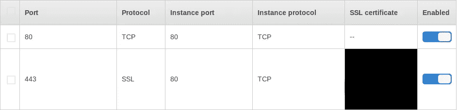

# 使用 TCP 端口时的弹性 Beanstalk HTTPS 重定向

> 原文：<https://medium.com/swlh/elastic-beanstalk-https-redirection-when-using-tcp-ports-84dc155c22ea>

[【链接到解决方案要点】](https://gist.github.com/rharriso/49f6524fb34fc923b4c800b833504c40)

我正在 Elastic Beanstalk 中将一个应用程序部署到 Docker 环境中。该应用程序通过 HTTP(s)端口为 HTTP 和 Web 套接字请求提供服务。

AWS 提供了一个在将 [HTTP 转发到 HTTPS](https://github.com/awsdocs/elastic-beanstalk-samples/blob/master/configuration-files/aws-provided/security-configuration/https-redirect/docker-sc/https-redirect-docker-sc.config) 时有效的配置。然而，为了服务 web 套接字请求，我需要在负载平衡器配置中将 SSL 转发到 TCP。

Forwarding to TCP for Websockets