# 高转化率网站的要素

> 原文：<https://medium.com/swlh/elements-of-high-converting-websites-9e85663cd3ff>

## 多年来我一直痴迷于高转化率。

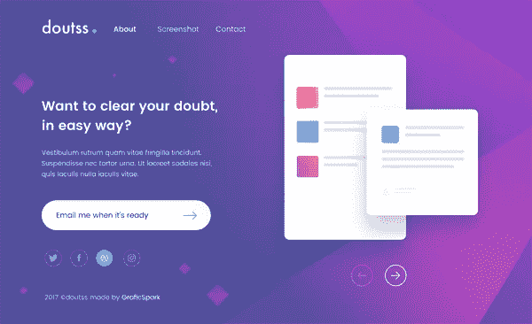

用户激活是将你的访问者转化为用户的过程，方法是让他们完成某个动作，比如给你他们的电子邮件、注册、开始免费试用等等…

简单来说，就是一个过程，从访客登陆你的网站开始，到他完成注册成为用户结束。

所有行业的平均激活率在 0.5%-3%之间。

如果可能的话，你的目标应该是将你的激活率优化到接近 3%。

影响激活率的因素有很多，但最大的两个是流量质量和登陆页转化率。

在这篇文章中，我们将介绍一些重要的因素，我们可以在登录页面上使用这些因素来增加将访问者转化为活跃用户的可能性。

# 写出清晰的价值主张

价值主张是对要交付的价值的承诺。

这是为什么潜在客户应该向你而不是你的竞争对手购买的主要原因。

价值主张不是你的口号。

它应该解释你的产品如何解决问题，客户应该期待什么好处，以及你为什么与竞争对手不同。

什么是好的价值主张？

*   清晰——很容易理解。
*   传达客户将获得的具体结果
*   解释它是如何不同和更好
*   它避免炒作、最高级和商业术语
*   可以在 5 秒钟内阅读并理解

大多数网站在首页的折叠内容上方展示价值主张。

你可以从以下几点开始，并在此基础上进行测试，直到你找到最佳的展示方式:

*   头条。用一句话来说，你提供的最终利益是什么？你可以提到产品和/或顾客。吸引注意力。
*   副标题或 2-3 句话的段落。具体解释你做什么/提供什么，对谁有用，为什么有用。
*   3 个要点。列出主要优势或特点。
*   视觉。图像的传播速度比文字快得多。展示产品、英雄照片或图像来强化你的主要信息。

这几个要素可以给你带来竞争优势，所以你应该投入适当的时间来创造它，并让你的目标受众可以理解。

如果可能，包括客户的棘手问题。

用户读不出你的心思，但能感受到情绪。

现在，让我们来看一些清晰传达的价值主张的优秀例子。

## Evernote

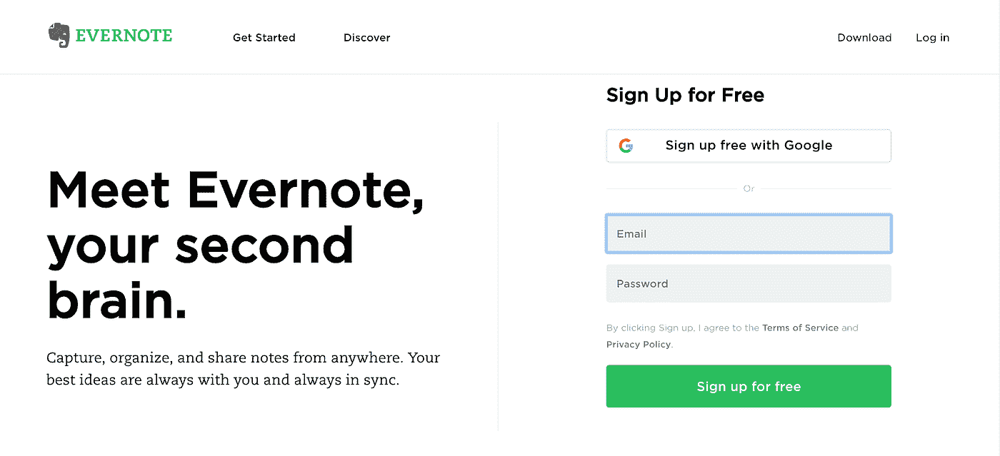

“见见 Evernote，你的第二个大脑。”

这句话切中要害。

关心生产力、组织、笔记和学习的人最大的痛点是围绕容量和记忆。

第二大脑=双倍容量。

有多少次你认为“我想硬盘驱动我的大脑，分享，上传，下载或插入信息。”

是的……我也是。

第二句话明确解释了核心价值观。

“从任何地方捕获、组织和共享笔记。你最好的想法总是和你在一起，并且总是同步的”。

更多的是用 16 个词来表达 7 个核心价值观，强调可访问性，这又是一个巨大的痛点。

行动号召的重点是“免费”，这是一个你无法拒绝的提议。

## 对讲机

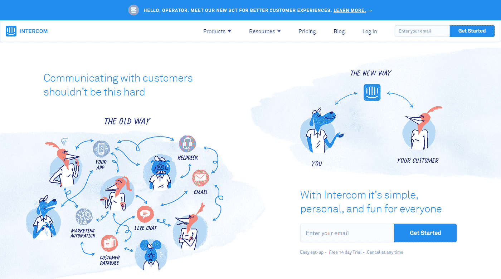

一张图胜过千言万语。

图像讲述了一个故事。

讲故事是品牌传播最重要的部分之一。

多么牛逼的品牌对讲机啊。

这些图形以问题/解决方案为中心，向那些需要改善客户沟通和取得成功的人突出了痛点。

当谈到 SaaS 行业的产品解释和设计时，Intercom 真的是在挑战极限。

我们很多人的家庭作业。

# 包括产品截图

用户会选择那些他们能立即看到会从中受益的东西。

相反，用户不会去找不清楚的东西。

一个不好的产品的第一个信号是一个不展示产品的网站。

阐明你的价值主张，让用户明白你的功能将如何解决他们的问题的最好方法是截图。

截图可以让用户看到你的产品在运行，理解界面是什么样子的，从而更早地做出购买决定。

确保你的截图充满了好东西，精炼而简洁，直截了当，具有只有你的产品才能提供的突出特点，不要看起来很无聊。

让我们来看看一些很棒的产品截图例子:

## 对讲机

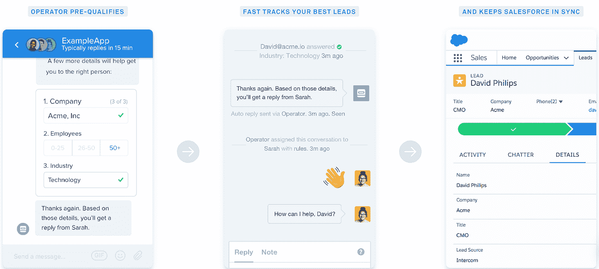

## 帮助童子军

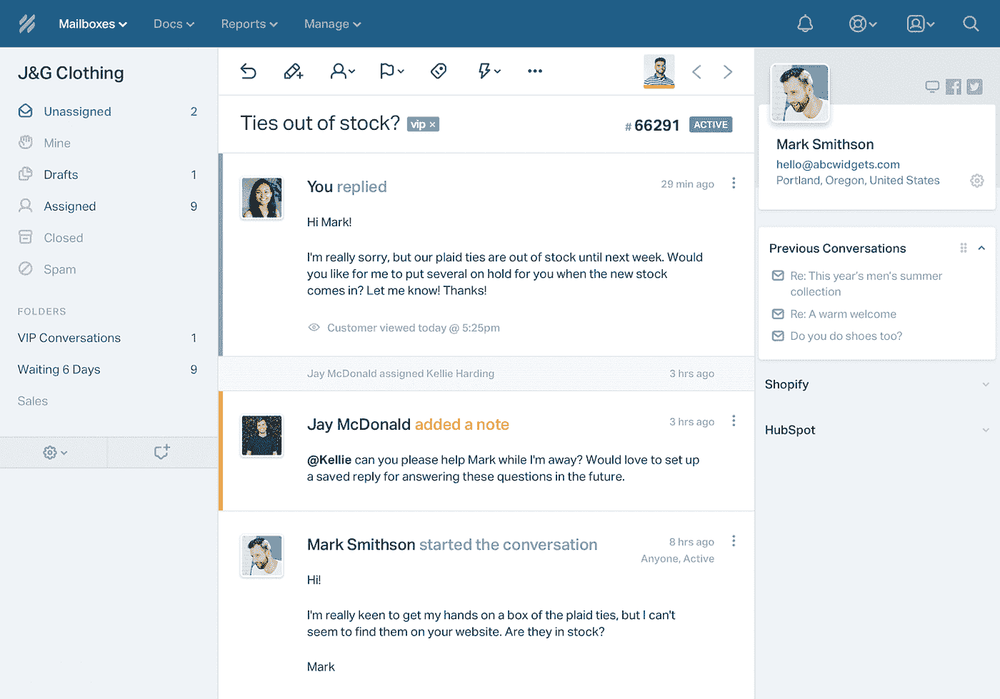

## 流动

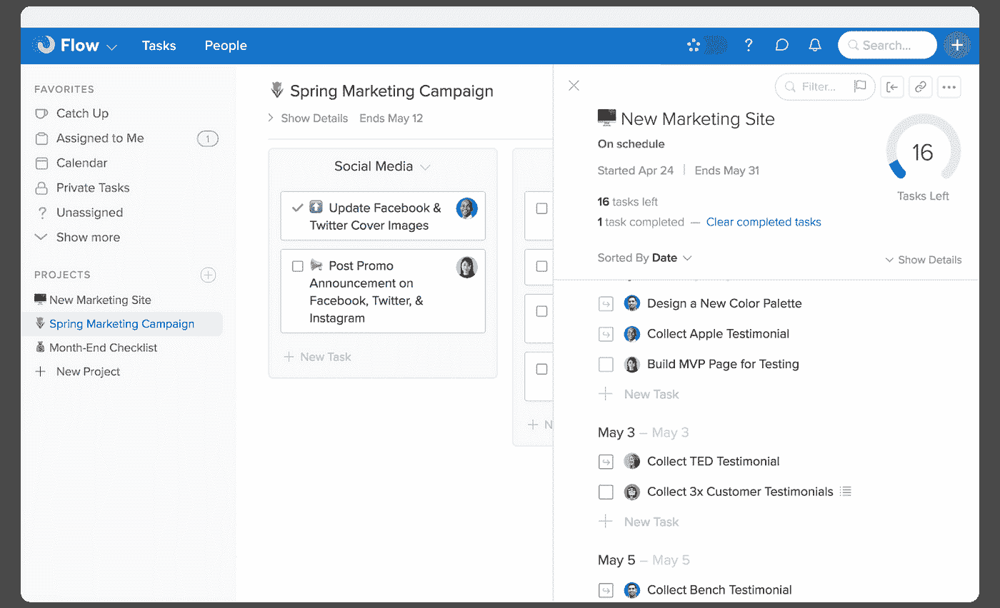

## MailChimp

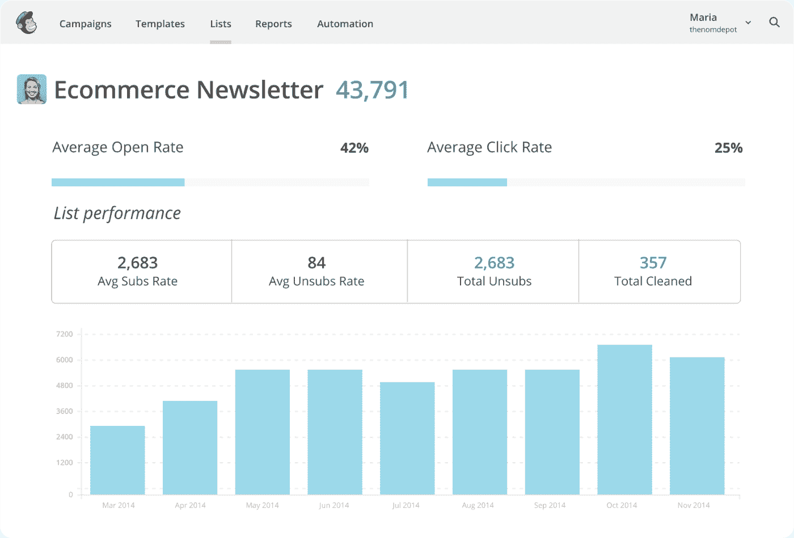

# 有一个伟大的行动号召

行动号召(CTA)是您网站上完成交易的按钮或链接句子。

它旨在告诉你的访问者下一步该做什么。

使用战略性行动号召来引导你的访客完成购买之旅非常重要。

让我们来看看良好行动号召的一些原则:

*   使它们面向行动
*   使用能激起情感或热情的词语
*   给用户一个采取预期行动的理由
*   使用有说服力的文本
*   包括强烈的视觉效果
*   制造一种紧迫感
*   让他们容易找到

## 大本营 CTA

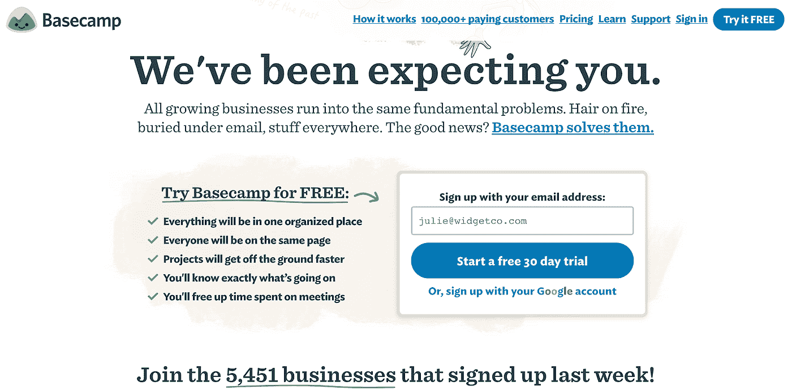

# 包括一个解说视频

一个好的讲解视频是必须的，尤其是如果你的产品的价值很难解释的话。

还记得我们的注意力持续时间只有 8 秒吗？

在你的登陆页面上有一个解释者视频会给你一个很好的机会让用户参与至少一分钟(这对 SEO 有好处),最重要的是解释你的产品的价值。

如果视频做得好，客户甚至可以通过观看来体验 WOW moment。

让我们来看看优秀讲解视频的一些原则:

*   在最初的几秒钟内抓住注意力
*   使用解决方案驱动的方法
*   画外音是必须的
*   不要像其他 90%的人一样使用蹩脚的音乐
*   展示产品用途

精彩讲解视频示例:

## 展开。我

## 道德咖啡连锁店

## 克里斯蒂拍卖行

## Ahrefs

# 出示社会证明

社会证明是一种心理现象，在这种心理现象中，人们在假设他人的行为反映了正确行为的情况下，遵从他人的行为。

营销人员在登录页面中使用社交证明来提高激活率。

你基本上可以把社会证明想象成一个口碑，它几乎就是那么强。

人是被相似的人影响的，就这么简单。

让我们来看看你可以在网页上使用的几种社交证明:

*   客户评价
*   客户/合作伙伴徽标
*   个案研究
*   社交份额计数
*   名人代言
*   媒体提及
*   证书和徽章
*   评级和评论

良好社会证明的例子:

## 风味

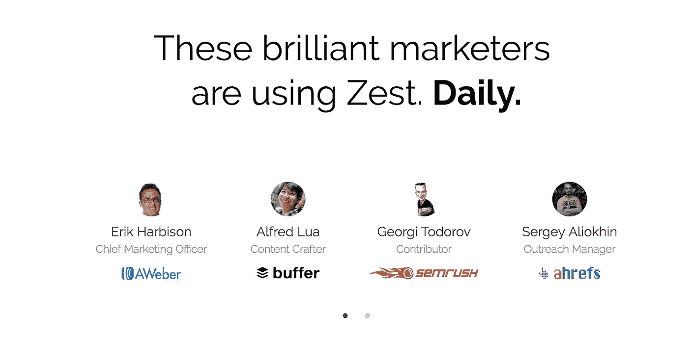

## 特雷罗

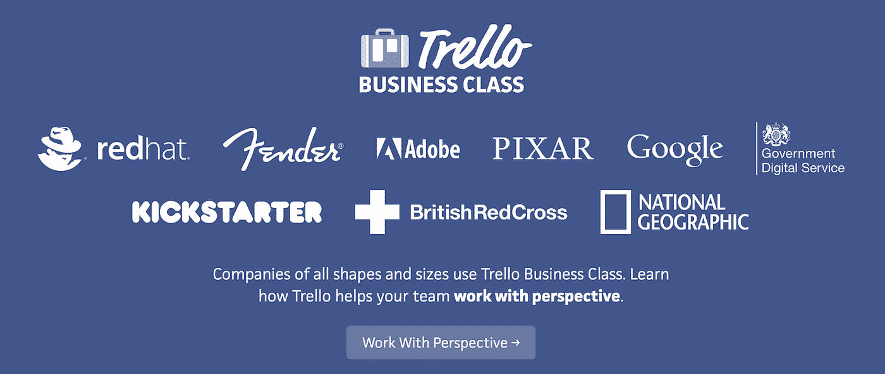

## 阿尔戈利亚

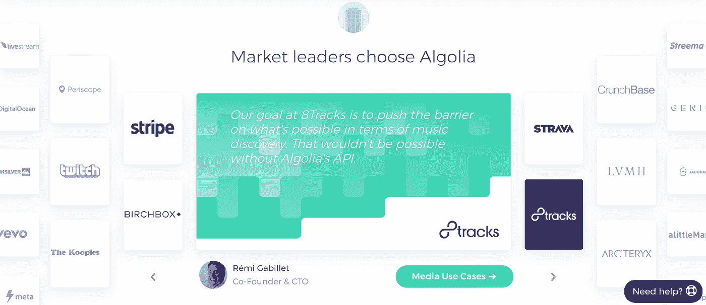

# 教育！

客户教育是提高客户保持率、产品采用率和客户支持的非常重要的组成部分。

培训就是教育你的客户如何使用你的产品。

教学是通过最佳实践、案例研究和更高层次的技能，教育你的客户实现业务目标的最佳方式。

你要教你的用户成为更好的自我，而不仅仅是训练他们使用你的产品。

整个培训过程的目标是向潜在客户提供他们在接触您的产品的特定阶段所需的信息。

让我们来看看几种可以用来教育用户的内容:

*   博客文章
*   电子书
*   网络研讨会
*   教程
*   可操作的内容(清单、备忘单、模板……)
*   帮助部分

# 使用社交登录

社交登录解决了用户注册时面临的最大问题之一——账户疲劳。您应该始终包含此选项。

最受欢迎的社交登录是:

*   [与脸书](https://developers.facebook.com/docs/facebook-login/)
*   [用谷歌](https://developers.google.com/identity/)

你也可以使用登录 API 黑掉’你的竞争对手:)

在与 Trello 竞争的项目管理工具 Zenkit 的案例中，他们更进一步，实现了使用 Trello 选项登录。

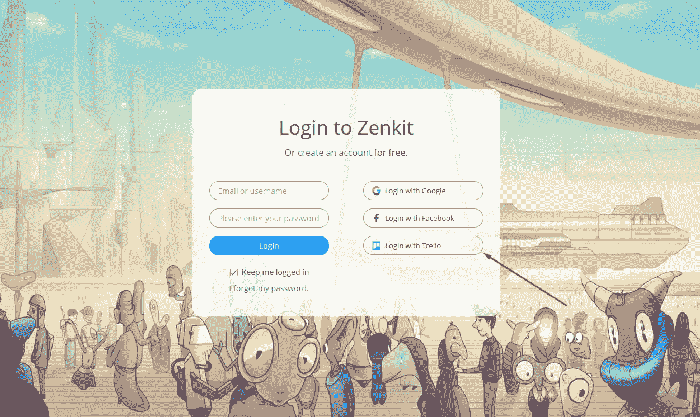

# 摘要

在你的网站上有一个好的转化率对你的获取成本和收入有直接的影响。0.5%和 3%之间的差距是 6 倍的收入和 6 倍的采购支出。确保你优化你的登陆页面，直到你达到 3%。

*   写一个清晰的价值主张，帮助访问者了解你在解决什么问题，以及你如何优于竞争对手。
*   包括截图/gif，向访问者展示他们将如何解决你的产品的问题。
*   拥有以价值为导向的行动号召部分。
*   添加对你的访问者有影响的相关人/公司的社会证明部分。
*   教育你的访问者他们所面临的问题，并帮助他们理解如何用你的产品解决这些问题。
*   使用社交登录减少账号疲劳。

我们( [Team Infinity](https://medium.com/u/b54dfec0a3dc?source=post_page-----9e85663cd3ff--------------------------------) )很幸运地拥有一个登陆页面，在我们推出它时有 18%的转化率。你也可以通过拥有高质量的相关流量和以转换为导向的登陆页面来实现这一目标。

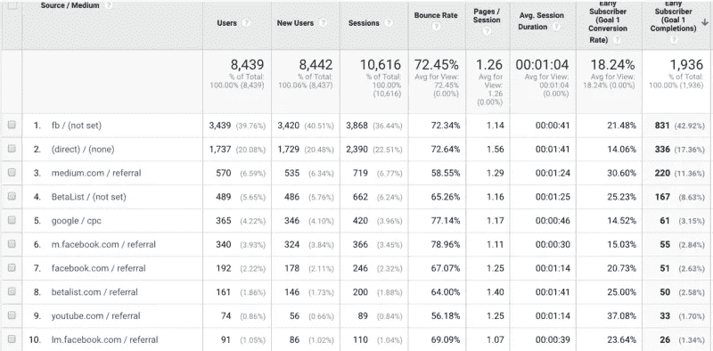

这是一个登陆页面的链接:【https://startinfinity.com 

## 这篇文章发表在[《创业](https://medium.com/swlh)》上，这是 Medium 最大的创业刊物，有+417，678 人关注。

## 在这里订阅接收[我们的头条新闻](http://growthsupply.com/the-startup-newsletter/)。

