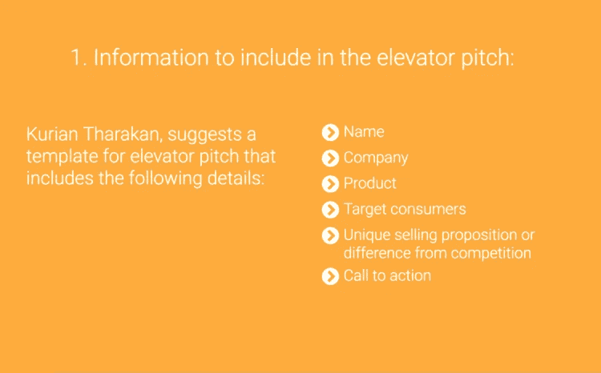
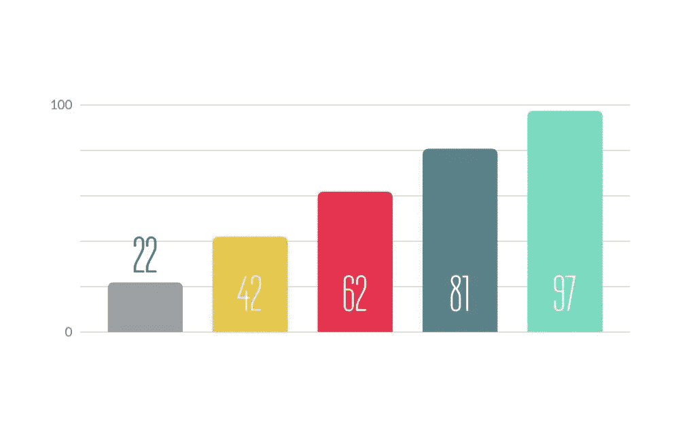

# 电梯营销:从摇篮到坟墓

> 原文：<https://medium.com/swlh/elevator-pitch-from-cradle-to-grave-1429e4cb791a>

## 什么是电梯间推介？

电梯间推介是简洁而有说服力的销售启动。维基百科将电梯间推介定义为对一个想法、产品或公司的简短描述，以一种任何听众都能在短时间内理解的方式解释概念。

*“电梯间推介是一个简洁的 20-30 秒的演讲，旨在说服某人关于一个产品或公司。”*

电梯推销是创造或破坏你良好的第一印象并对公司产生兴趣的绝好机会。在短时间内抓住某人的注意力是一个相当大的挑战。如果提出的时候有漏洞，这可能会让你的商业想法从摇篮到坟墓。以下是为精彩的电梯间推介做准备的过程。

# 构建你的推销的 7 个步骤

1.  问题陈述
2.  解决办法
3.  市场潜力/目标受众
4.  价值主张
5.  创新和独特性
6.  商业模式和牵引
7.  可扩展性和创造就业机会

# 1)问题

当你计划开始你的商业想法时，最重要的事情是确定一个你将要解决的问题。只有当你面前有一个值得解决的问题时，你才开始新的冒险。如果你的产品或服务不能解决非正式的问题；潜在客户有一个问题，你没有一个可行的业务。就这么简单。

> 有更好解决方案的好问题有最好的生意。

你的想法不一定要解决一个巨大的或改变世界的问题！从发明牙刷开始没问题。只要你在解决一个特定客户群的问题，你就可以建立一个企业。

将你的听众的问题浓缩成最简单的形式。理想情况下，你应该能用一两句话描述你正在解决的问题。从你要解决的一个核心问题开始，把扩展留给时间。

## 世界上最热门的创业公司的问题陈述

**优步**:叫车 app。

**Snapchat** :“人啊，大家一起玩吧！”

Airbnb:在 Airbnb，我们正在创造一扇通往开放世界的大门——在这里，每个人都在家里，可以属于任何地方。

**DropBox** :备份一些你的本地文件和文件夹，让它们易于通过互联网访问。

Pinterest :满足你所有兴趣的数字剪贴簿服务。

## 一些问题陈述:

> “在街区里没有适合大学生的好酒馆”
> 
> "从书本中想象人类的消化系统是非常困难的！"(问我怎么想起来的！)
> 
> "拉起你的两轮车"
> 
> “租礼服！”

# 2)解决方案

清晰的问题陈述有助于你将解决方案集中于解决一个问题，而不是将解决方案延伸到解决多个潜在问题。不要做大的假设。你宽泛的假设可能是唯一的例外，也是你泰坦尼克号的冰山。你的解决方案必须像你的问题陈述一样清晰简洁。

> 我们帮助 A 到达 Z

你如何提供帮助很重要。你的解决方案简洁、清晰、不过分、不过分详细和修饰，但涵盖了基本要素:谁、如何、在哪里和为什么。这很重要。

# 3)市场潜力/目标受众

> [找到你的位置并填满它](https://thinkgrowth.org/the-memorable-elevator-pitch-that-vcs-cant-ignore-7ffc313dbf40)

*问题:*已检查 *|解决方法:*已检查 *|找到目标！*

找到正确的受众是解决方案之前的一步，但这一步涉及到将人工受众转化为有机受众。明确你的前提，不要过度假设你的目标受众数量，缓慢而稳定地努力建立你的客户群值得信赖的，可信的和及时的帮助。将市场定义为拥有最大客流量的目标市场。非正规市场显然是一个双赢的局面，但抓住一个正确的音符也同样有道理。有一个现实的“市场规模”数字或你的目标市场。

# 4)价值主张

第一个甜甜圈的竞争者不是其他的甜甜圈。竞争是巧克力和糖果。

你为什么建立这个企业往往是关键。为什么决定了投资者和员工是否同意。你将如何兑现你的承诺？你完成了什么，人们对你的工作有什么评价？包括提供一个实现承诺的行动计划。尽可能地个性化，以适应你的谈话对象和他或她的业务。

> 提供证据、致命的事实、轶事、催化剂回忆录，使你刚才所说的一切变得真实。

# 5)创新和独特性

思考您的解决方案在竞争中提供了哪些优势。为什么你更快，更便宜，或者更好？为什么潜在客户会选择你的解决方案而不是其他人的？描述您在竞争中的主要优势是一项很好的练习，可以确保您正在构建一个独特的解决方案，客户有望选择该解决方案而不是其他解决方案。这些竞争优势还将帮助您将营销重点放在您提供而竞争对手没有的关键价值主张上。

# 6)商业模式和牵引

对于一个好的推销，你需要包括你的商业模式和吸引力。

***商业模式:*** 企业成功运营的计划，确定收入来源、目标客户群、产品和融资细节。

*:拥有一套可衡量的客户或用户数据，用来向潜在投资者证明你的初创公司会取得成功。！！*

**

*Tractions (The Business Forecast)*

*你不一定要展示详细的五年预测，但更重要的是你要了解自己的商业模式。描述你的商业模式应该展示你的企业将如何在经济、社会、文化或其他领域创造、传递和获取价值的基本原理。这听起来可能有点混乱，但作为一个门外汉，你需要知道的是谁支付你的账单，你会有什么样的费用。*

# *7)可扩展性和创造就业机会*

*扩展您的业务意味着您和您的企业应该能够以一种高效、经济的方式处理不断增长的工作量或销售额。*

> *你的业务能在你的基地/总部之外发展吗？*
> 
> *你的业务可以扩展到平行/不同的领域吗？*
> 
> *你的企业在未来能雇佣 x 倍于现在的员工吗？*

*如果所有这些问题的答案都是肯定的，那么恭喜你，你得了 1/7 分！*

*那你怎么衡量呢？:脚踏实地，做市场调查，提升自己的营销水平，雇佣合适的人，登上社交媒体！*

# *电梯营销的要点*

**

1.  *吸引注意力*
2.  *避免行话*
3.  *向你的观众提问*
4.  *专注于你的听众*
5.  *提供证据/结果/统计数据*
6.  *添加情感利益陈述*
7.  *明确的行动号召*
8.  *保持自然*
9.  *额外示例/内容*

# *我喜欢的推荐人:*

*以下是一些很棒的电梯推介: *WeWork，脸书，Snapchat，Airbnb，Buffer，Intercom**

## *[电梯间距](https://drive.google.com/open?id=1slL2vt45P4dByjTT_CpOQi7l2jIRr_EJ)*

*希望这有助于您进行理想的电梯推介。投球愉快！*

**

## *这篇文章发表在 [The Startup](https://medium.com/swlh) 上，这是 Medium 最大的创业刊物，拥有+415，678 名读者。*

## *在这里订阅接收[我们的头条新闻](http://growthsupply.com/the-startup-newsletter/)。*

**