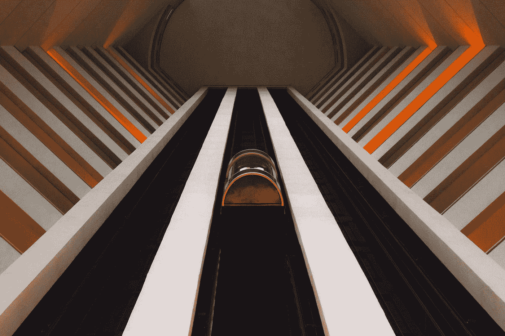
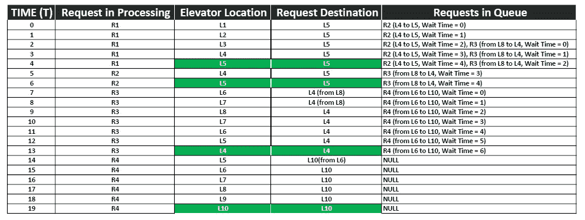
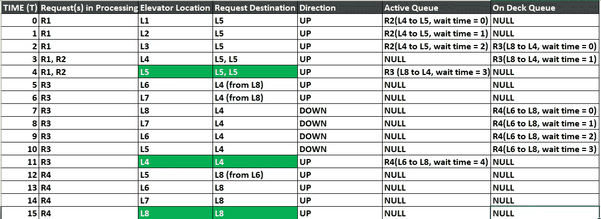

# 电梯和排队:第二部分——多层单电梯系统

> 原文：<https://medium.com/swlh/elevators-and-queuing-part-two-multi-level-single-elevator-system-c992795db55a>

Photo by [Michel Paz](https://unsplash.com/@michelpaz?utm_source=medium&utm_medium=referral) on [Unsplash](https://unsplash.com?utm_source=medium&utm_medium=referral)

在本系列的最后一部分，我谈到了一个两层单电梯系统。在这种特定情况下，目标是最小化每个请求的等待时间，同时最小化行进的距离。

让我们扩展这个系统，让我们仍然使用单个电梯，但是有 10 层。

在这种情况下，需要考虑不同的变量:

*   管理多个请求(决定先回答哪个请求)
*   电梯的方向
*   等待时间(让我们假设每运行一层是请求等待的 1 个时间单位)

让我们考虑一个示例请求序列:
- R1 从 1 级到 5 级，R2 从 4 级到 5 级
-R3(2 个单位时间后)从 8 级到 4 级
-R4(7 个单位时间后)从 6 级到 8 级

现在，让我们使用不同的方法来处理这个序列，并对不同的性能参数进行评级，看看什么是最大化效率的可行解决方案，在本例中是最小化每个请求的等待时间+旅行时间。**我们还假设电梯从 1 层开始。**

**情况 1:条件—请求按顺序接收(FIFO)** FIFO 或先进先出，是不言自明的，第一个请求被接收并完成，然后移动到下一个序列。

每个请求的总时间(行驶时间+等待时间)
- R1: 4 个单位(总距离为 4 个单位)
- R2: 6 个单位(总距离为 1 个单位)
- R3: 11 个单位(总距离为 4 个单位)
- R4: 12 个单位(总距离为 2 个单位)

**情况 2:条件—相同方向的请求首先被处理(修改的 FIFO)**
注意:如果有两个并发请求，第一个被选择用于方向
因此，在这种情况下，电梯将接受请求并保持活动的和某种“甲板上队列”。一旦第一个请求被接受，方向就被设置，任何相反方向的请求都被放入“甲板队列”。一旦活动队列为空，就将“甲板上队列”切换到活动队列，依此类推。

每个请求的总时间(行驶时间+等待时间)
-R1: 4 个单位(总距离为 4 个单位)
-R2: 4 个单位(总距离为 4 个单位)
-R3: 10 个单位(总距离为 4 个单位)
-R4: 8 个单位(总距离为 2 个单位)

**两种情况的比较** 比较每种情况的总次数，我们可以做出第二种策略效果更好的评估。当提出更好的策略时，案例 1 可以用作基准，任何结果比案例 1 差的策略都可以被丢弃。需要注意的关键点是，即使情况 2 看起来更好，但如果只有一个请求需要处理，它也可以有同样的性能。

当系统变得复杂，具有多部电梯和多个楼层时，由于如果使用 FIFO 方法，等待时间会变得明显更长，因此有其他策略来减少等待时间。在这种情况下，统计模型可以证明是有效的。在本系列的下一部分中，我将用一个 10 层楼的双电梯系统来解决这个问题。