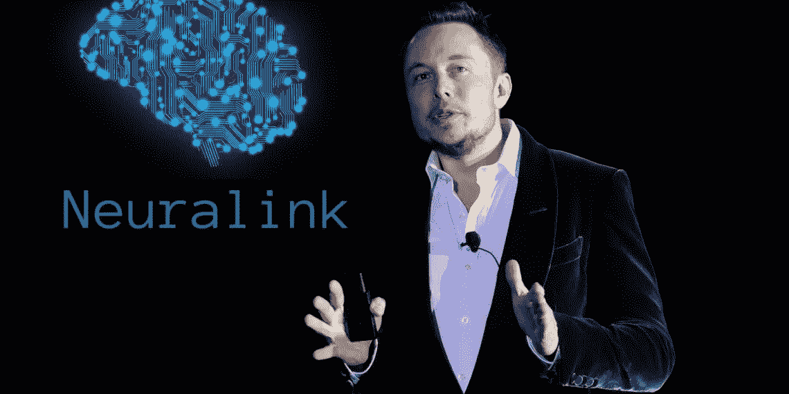

# 埃隆·马斯克希望你和你的技术融合

> 原文：<https://medium.com/swlh/elon-musk-wants-you-to-merge-with-your-technology-63cc8ea6a338>

Neuralink 可能预示着一个生物技术的时代，人类和他们的计算机是一个共生的单位，但这是一个好主意吗？

Photo: [https://tinyurl.com/y5jxxal2](https://tinyurl.com/y5jxxal2)

昨天，关于埃隆·马斯克始于 2016 年的“嘘，嘘”项目 Neuralink，大家终于有了答案。这种雄心勃勃的脑机接口有许多潜在的用途，但计划在 2020 年开始试验，以帮助四肢瘫痪者控制他们的…