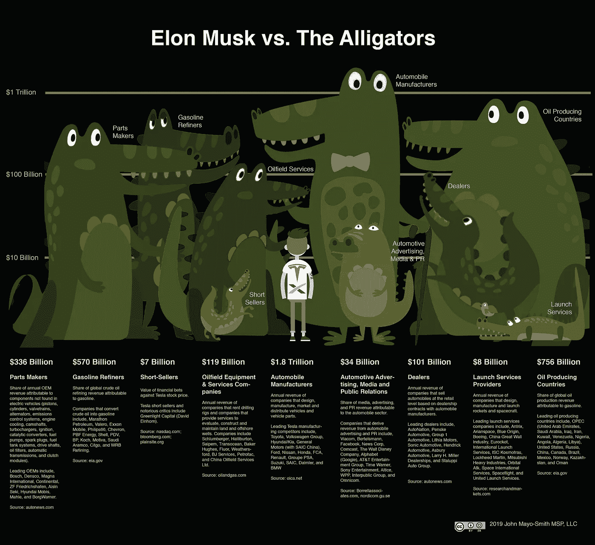

# 埃隆大战短吻鳄(第二部分)

> 原文：<https://medium.com/swlh/elon-vs-the-alligators-part-ii-5142f9ba955>

对埃隆·马斯克的竞争对手、“敌友”和敌人的图解分析。特斯拉和 SpaceX 合在一起，扰乱了 3.6 万亿美元的年收入。鳄鱼高度以对数标度显示了既得利益者的年收入。

为什么是短吻鳄？因为短吻鳄是顶级捕食者。自从地球上大多数石油储藏形成以来，它们已经存在了大约 8000 万年。鳄鱼被激怒时会变得好斗。

Alligator height represents annual revenue of entrenched stakeholders (logarithmic scale).