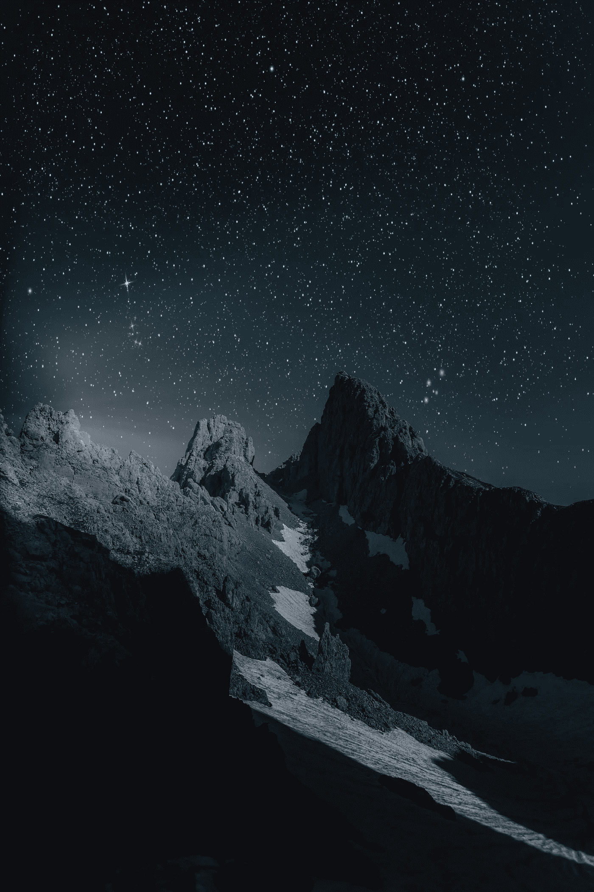

# 拥抱小行星采矿的吮吸

> 原文：<https://medium.com/swlh/embracing-the-suck-of-asteroid-mining-770377b59793>

[eberhard grossgasteiger](https://www.pexels.com/@eberhardgross)

BPM 37093 被认为是一颗接近耗尽的矮星核心，质量约为太阳的 110%。它之所以特别引人注目，是因为它被认为是由钻石组成的——钻石的**太阳质量**。这个物体的“价值”是不可估量的高，因为它打破了经济学中稀缺的基本假设-在地球质量的 363，000 倍，如果我们以某种方式拥有这个物体，也…