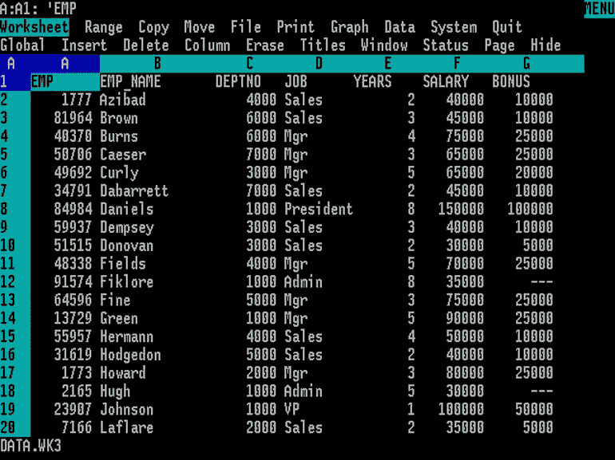

# 对遗留系统感同身受

> 原文：<https://medium.com/swlh/empathy-towards-legacy-systems-94a9b9a49527>

*Image: Wikimedia*

这个故事很常见，你现在工作的公司有一个遗留应用程序，它是 IT 系统的核心。这个系统让你头疼，让你做噩梦。这一遗产已经存在了几十年。在那些年里，它积累了技术债务，这些债务构成了一笔巨额账单。我想给你一个不同的视角，让你对他们更友好。