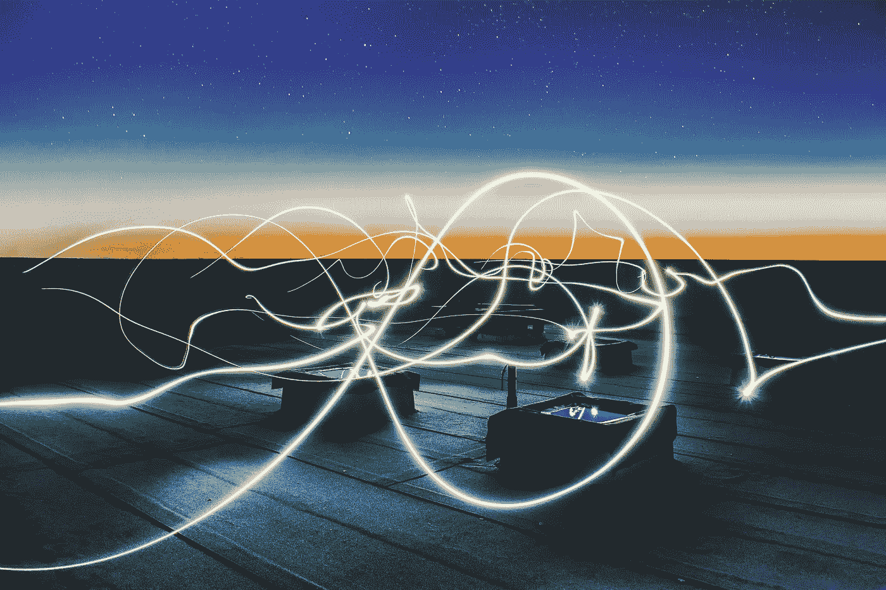

# 员工体验:通向客户体验的运营高速公路

> 原文：<https://medium.com/swlh/employee-experience-operations-highway-to-customer-experience-b2e613dddb37>

## 支持

## 员工也是人

Photo by Mario Purisic On Unsplash

> 通过将员工放在第一位，默认情况下，客户实际上也是第一位的，最终，股东也默认是第一位的。
> 
> 理查德·布兰森

D ing！

这些门通向 16 楼。

我准备好迎接一位演讲会代表，他会陪同我到镇上一家大公司总部的会议室。

相反，迎接我的是一堵贴满黑色字体的象牙色墙:“顾客至上”。

突然之间，我感觉被关掉了。

不要误解我。

我喜欢顾客。在我们当前的经济环境中，没有顾客，这个世界就不会运转。我非常尊重顾客，他们也知道这一点。

然而，不知何故,“顾客至上”这个词让我感到厌烦，因为它已经成为一个流行词，比其他任何东西都更容易被人听到。

这让我开始思考，我意识到我的问题不在于顾客。这是大多数公司定义客户的方式。

## **客户的定义**

Photo by Bobby Ghoshal on Unsplash

根据*韦氏词典*的说法，顾客是指 1)购买商品或服务的人，或者 2)通常具有某种特定显著特征的个人。

每个人都有第一个定义。顾客是让我们带回家的人。

但是第二个定义呢？那不就是人的定义吗？我的意思是，不是每个人都有“一些特定的与众不同的特质”吗？

顾客不仅仅是购买产品或服务的人。它包括每一个最终用户。它包括那些了解产品的人。包括那些了解公司的人。

在所有的客户中，员工是最重要和最关键的。他们是公司赖以生存的生命和血液。

## **公司的心跳**

Photo by Marcelo Ieal on Unsplash

直到最近，我还在一家著名的超市担任杂货库存管理员，以维持生计。一开始是兼职季节性职位，后来变成了 15 个月，利用我的数据分析技能来了解客户行为、库存控制和商店运营。

因为我以前在美国公司工作过，所以我能够识别程序和设备中的痛点，这些痛点阻止我的同事向客户提供我们所知道的最好的服务。相信我，我说还有很多改进的机会。

当高层决定花费 300 万美元对销售大厅进行现代化改造——在我看来，这使它在物理上更加危险——而不是为后台实施更高效的运营系统时，我知道我的时间到了。

有多少次你听说一家公司是多么创新和有爱心，梦想在那里工作，却从员工那里或在幕后发现它完全相反？

一家公司向顾客提供最先进的客户服务，而其员工却忍受着过时的内部技术，勉强维持着业务的运转。

或者另一家公司宣传自己是所有事情的先锋，它的员工一周工作 80 小时，有些人甚至不能上厕所。

最有可能的情况是，客户对产品或服务不满意，就会停止购买。当员工对公司不满意时，他/她就会停止工作。

哪个更糟？当没人想买你的产品，或者没人想在你的公司生产产品的时候？

## **通往客户体验的运营高速公路**

Photo by Federico Beccari on Unsplash

我最近听了很多奥普拉的超级灵魂周日播客。你知道吗？她很聪明。

她说，“你不能给自己没有的东西。”

作为一个公司的员工，如果我不能给我的同事最好的待遇，我就不能给客户最好的待遇。

所以自从离开超市的工作后，我开始以这个问题为生:

> 作为运营团队成员，我如何改善员工体验，以便员工能够提供更好的客户体验？

提升员工体验不仅仅是人力资源部门的责任。这不仅仅是给员工公平的报酬，也不仅仅是提供良好的福利和补偿。

这是每个贡献者和团队成员的责任。

它是:

*   我可以向我的经理提供哪些信息，以便她能够最好地为首席执行官服务？
*   我可以实施哪些系统，以便销售代表可以更好地满足客户的需求？
*   我怎样才能减少生产线上必要的工作，使员工不加班就能完成定额，并按时将产品交付给客户？
*   我该如何领导我的团队，让每个成员都能满足甚至超越所有客户的要求？
*   我能为同行做些什么，让他们更好地为客户服务？

如果我能帮助我的同龄人，那么我的同龄人也能帮助他们的同龄人。如果每个人都努力互相帮助，那么公司的运作就会改善。如果运作像时钟一样正常，那么公司就能向客户提供最好的结果。

## **用心开始**

Photo by Tim Marshall on Unsplash

一家公司的健康并不是从它能向顾客销售得多好开始的。它始于它的人民如何善待它的人民。如果我们不能——或不愿意——为我们的内部人员提供合适的设备、合适的流程、合适的资源，我们如何为客户提供合适的产品？

员工也是人。同事也是人。老板也是人。

顾客只是人。

> 你的员工第一。如果你善待你的员工，你猜怎么着？你的客户回来了，这让你的股东很高兴。从员工开始，剩下的就这样了。
> 
> Herb Kelleher，西南航空公司前首席执行官

长久以来，每个人都把顾客放在一个遥不可及的基座上，而这样做是有害的。

每个人都是我的顾客。包括你。

在某种程度上，我应该把我也包括进去。