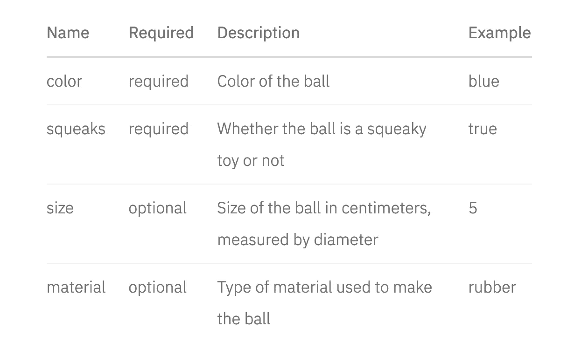
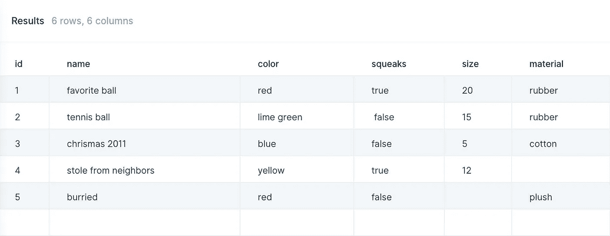
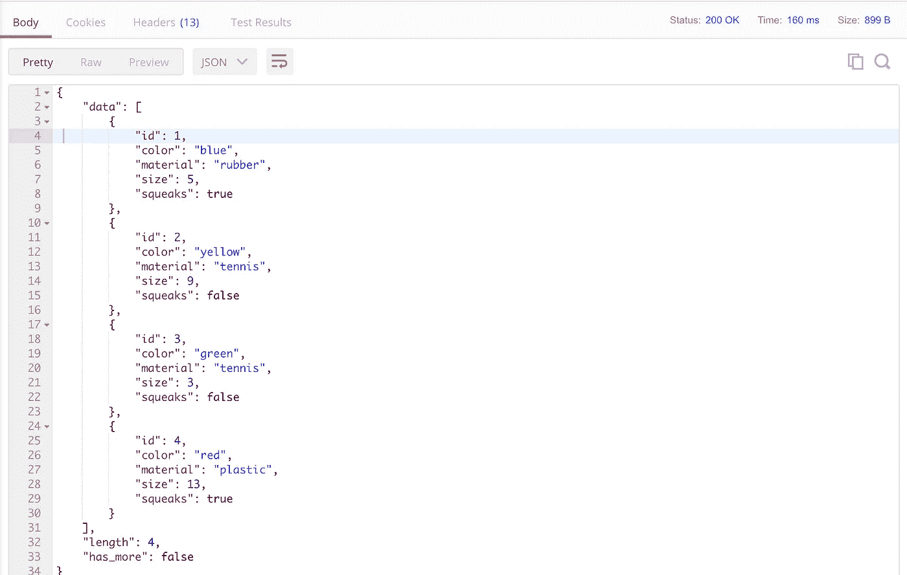

# 通过学习如何在没有代码的情况下使用 API 来增强自己的能力

> 原文：<https://medium.com/swlh/empower-yourself-by-learning-how-to-work-with-apis-without-code-8990ba08444e>

API 非常强大。直到最近，它们大多是为那些想花时间写代码来连接它们的工程师保留的。

我将教你如何快速有效地使用它们——不需要任何代码。在本指南的结尾，你将会用 API 加速你的工作流程，而不需要依赖任何人！

*We’re going to be using the API for* [*Slash the API dog*](https://slashtheapidog.com) *throughout this guide.*

# 步骤 1 —决定您需要什么 API

你在找什么信息或者想换什么信息？

你是想把@ dougthepug 的 Instagram 帖子都抢过来吗？也许你想自动向任何关注你的狗的推特的人发推文(因为即使狗不会说话，它们也有很多话要说)。

如果你试图寻找数据，但不知道从哪里开始，谷歌是你的朋友。搜索“[你感兴趣的东西] API”，看看会出现什么。

# 步骤 2 —找到 API 文档

知名公司提供的 API 应该有关于如何使用它们的完整文档。要找到这些，谷歌“[插入公司] API 文档”或“[插入公司]开发者”。

结果应该会将您带到开发人员门户。寻找标有“文档”、“文档”、“参考”或“技术参考”的链接。

[这里是 Slash API 狗的文档](https://documenter.getpostman.com/view/3296827/RztkN9TU#3e7a2c13-c198-bb1c-48d7-f36688a8e030)。

# 步骤 3 —找到终点

首先要寻找的是合适的端点。应该有一个端点对应于您想要的每种数据类型。一个端点可能看起来像这样:`https://slashtheapidog.com/api/bones/{id}`或者仅仅是`/bones`。

文档应该有一个端点列表。它们可能位于文档的顶层，或者位于名为“参考”、“端点”或“方法”的部分下。

要找到正确的端点，请查找与您要查找的数据对应的名称。如果你想要一份 Slash 挖过的所有洞的清单，`/holes`可能是正确的。每个端点都应该有一个描述来帮助解释它做什么。

# 步骤 4-确定您的请求类型

现在您已经找到了正确的端点，您需要确定发送它的请求的类型。

有 4 种不同类型的请求:

**GET** 您可以根据端点和参数询问有关一个项目或一组项目的特定信息。这相当于要求 Slash 把他的一块骨头或者全部骨头带给你。

Slash likes POST requests the best

**POST**
`POST`请求是你如何告诉 API 去创造新的东西。这类似于让 Slash 给你挖(造)一个新洞。

**PUT**
`PUT`请求是告诉 API 更新之前创建的东西的方式。这类似于让 Slash 对他挖的洞挖得更深(更新)。

**删除**
`DELETE`请求是告诉 API 删除之前创建的东西。这类似于要求 Slash 掩盖(删除)他之前挖的一个洞。

# 第 5 步—了解参数

许多请求需要额外的参数。参数是您的请求的细节。例如，如果你想让 Slash 创建一个新的洞，你需要告诉他把它放在哪里，挖多深。

对于每个端点和请求类型，您所引用的 API 文档应该有一个名为“参数”或“选项”的部分。

Slash 的 API 参数看起来可能是这样的:取回球:`GET [https://slashtheapidog.com/api/balls](https://slashtheapidog.com/api/balls)`

# 第 6 步—格式化您的请求

我们已经得到了我们需要的所有信息，现在我们只需要提出请求！

这里有两种不需要代码就可以连接到 API 的方法。让我们连接 Slash 的 API，通过向`[https://slashtheapidog.com/api/balls](https://slashtheapidog.com/api/balls)`发出`GET`请求来获取他的球列表

**抛物线——如果您想连接并使用无代码的数据**

[抛物线](https://parabola.io/?utm_source=workwithapis-medium&utm_medium=guide&utm_content=step-7-intro)是一个 web 应用程序，允许您轻松连接到 API，然后通过可视化的拖放工具处理数据。

查看为配合他的 API 而构建的抛物线流 Slash 示例:[获取 Slash 的球列表](https://parabola.io/public/flow/15689/api-get-list)

1.  在[https://parabolic . io](https://parabola.io/?utm_source=workwithapis-medium&utm_medium=guide&utm_content=step-7-create-account)创建免费账号。
2.  创造你的第一个心流。
3.  找到 API 导入源，并将其拖到屏幕上。
4.  双击 API 导入以更改其设置。
5.  输入您想要使用的端点，在这种情况下:`[https://slashtheapidog.com/api/balls](https://slashtheapidog.com/api/balls)`
6.  点击“更新设置”,抛物线将发出`GET`请求！您应该会看到响应数据显示在设置右侧的区域中。

Results from the GET request to Slash’s API /balls in Parabola

**Postman——如果你想测试 API 请求，并且不需要对数据做太多处理**

Postman 是一个用于记录和测试 API 的应用程序。

1.  下载邮差:[https://www.getpostman.com/downloads/](https://www.getpostman.com/downloads/)。
2.  创建新请求。
3.  选择请求类型，在本例中:`GET.`
4.  输入您的端点 URL，在本例中为:`[https://slashtheapidog.com/api/balls](https://slashtheapidog.com/api/balls)`
5.  点击发送。
6.  您的回答将显示在底部的回答部分。

Results from the GET request to Slash’s API /balls in Postman

# 第 7 步—使用数据

现在您已经有了一些数据(`GET`)或者已经能够让 API 采取行动(`POST`、`PUT`或`DELETE`)，您可能会想要对这些数据做些什么。API 的真正力量来自于你使用它们的方式。

能够让 Slash 为我们拿一根骨头是很棒的，我们当然想和他一起玩。但是想象 Slash 有数百块骨头，我们的目标是安全地埋葬和记录他所有的骨头。为了有效地做到这一点，我们需要将行动串联起来。

这只是一个例子，但是希望您可以开始理解能够以编程方式使用 API 来构建更复杂的动作和数据链的影响。这可以通过代码或使用如上所述的工具来完成。

希望本指南对你在没有任何代码的情况下使用 API 有所帮助。我很期待看到你的作品。如果你有时间，给我发微博或者回复这里让我知道！

*以上分步指南的完整版本位于*[*WorkWithAPIs.com*](https://workwithapis.com)*——在那里查看更详细的演练，以及你应该知道的重要 API 术语。巨大的礼帽提示为了创作这部指南所付出的辛勤劳动，具体来说来自* [*亚历克斯·亚塞恩*](https://medium.com/u/1b91a9442f65?source=post_page-----8990ba08444e--------------------------------)T22[米歇尔·坎宁安](https://medium.com/u/d07a7516f2f?source=post_page-----8990ba08444e--------------------------------) *。*

## 这篇文章发表在 [The Startup](https://medium.com/swlh) 上，这是 Medium 最大的创业刊物，拥有+424，678 名读者。

## 在这里订阅接收[我们的头条新闻](https://growthsupply.com/the-startup-newsletter/)。

