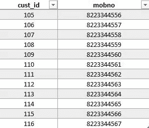
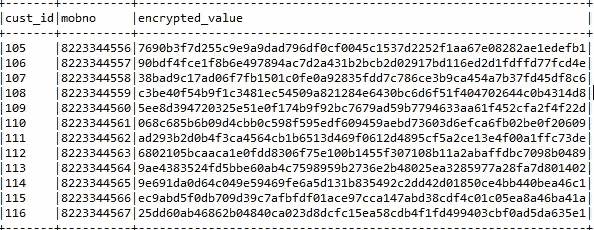

# 加密火花数据帧的列

> 原文：<https://medium.com/swlh/encrypting-column-of-a-spark-dataframe-35d64b0db00f>

## Pyspark 和哈希算法


加密数据意味着将数据转换为密码，这可能很难破解，而且它允许您安全地保护您不想让任何人访问的数据。

在这篇博客中，我将告诉你如何使用安全散列算法加密一个数据，比如一个手机号码，它是个人数据。

假设您有一个. csv 文件中的数据。



sample.csv

> 第一步。从 csv 文件的内容创建一个数据帧。我更喜欢 pyspark，你可以用 Scala 来实现同样的功能。

```
from pyspark import SparkConf, SparkContext, SQLContext
```

我已经在 eclipse-IDE 中开发了代码。如果您使用的是 shell spark，那么上下文已经作为 sc 提供了。

```
conf = \SparkConf().setMaster('local').setAppName('column_encryption')sc = SparkContext(conf=conf)sqlcontext = SQLContext(sc)
```

传递给哈希逻辑的字符串格式必须作为 bytestring 传递，如果不是，我们需要使用。encode()方法将其转换为字节字符串格式。对于 csv 的默认模式，mobno 将被视为整数，对于整数，我们不能使用 encode()，因此将 mobno 的数据类型更改为 string，并根据新模式创建 dataframe。

```
from pyspark.sql.types import StringType, IntegerType, StructType, StructFieldschema1 = StructType([StructField("cust_id", IntegerType(), True),StructField("mobno", StringType(), True),])data = sqlcontext.read.csv('sample.csv', header=True, schema=schema1)
```

> 第二步。写一个函数来定义你的加密算法

```
import hashlibdef encrypt_value(mobno):sha_value = hashlib.sha256(mobno.encode()).hexdigest()return sha_value
```

第三步。创建一个 UDF，传递定义的函数，并调用 UDF，将待加密的列作为参数传递。

```
from pyspark.sql.functions import udfspark_udf = udf(encrypt_value, StringType())data = data.withColumn('encrypted_value',spark_udf('mobno'))data.show(truncate=False)
```

*withColumn()* 将向数据帧添加额外的列。如果需要，可以使用 drop()删除列 *mobno* 。

嘿！您得到了预期的输出。



output

请随意写下你的建议。谢谢！

[](https://medium.com/swlh)

## 这篇文章发表在[《创业](https://medium.com/swlh)》上，这是 Medium 最大的创业刊物，有+421，678 人关注。

## 在这里订阅接收[我们的头条新闻](https://growthsupply.com/the-startup-newsletter/)。

[](https://medium.com/swlh)